# Отчёт по оптимизации: ga_optimize_20260505T224607Z_job7012263

## Метаданные
- метод: `ga`
- датасет: `data/numbers/20_dset_20260505T214657Z_job7012254/train.json`
- оптимум `(B1, B2)`: `(37480, 2545245)`
- objective: `23774.72927544306`
- max_curves_per_n: `260`
- repeats_per_n: `8`
- границы: `B1[500.0, 50000.0]`, `B2[5000.0, 3000000.0]`, `ratio_max=1000.0`

## Ключевые статистики
- `best_eval`: `554`
- `best_eval_fraction`: `0.712082262210797`
- `eval_per_sec`: `0.023473234293975846`
- `evaluation_count`: `778`
- `improvement_percent`: `87.70612446057397`
- `max_plateau_evals`: `417`
- `median_plateau_evals`: `32.0`
- `new_best_count`: `6`
- `new_best_rate`: `0.007712082262210797`
- `p90_plateau_evals`: `301.20000000000005`
- `time_to_best_sec`: `23730.39135951799`
- `time_to_first_improvement_sec`: `1162.231494941996`
- `total_runtime_sec`: `33144.14876332201`

## Флаги внимания

| Флаг | Статус | Текущее значение | Порог | Что это значит | Что делать |
|---|---|---:|---:|---|---|
| `b1_hits_boundary` | ✅ ОК | `0.03598971722365039` | `> 0.10` | Большая доля оценок проходит близко к границам B1. | Расширить диапазон B1, если упор в границу повторяется. |
| `b2_hits_boundary` | ⚠️ ВНИМАНИЕ | `0.20308483290488433` | `> 0.10` | Большая доля оценок проходит близко к границам B2. | Расширить диапазон B2, если упор в границу повторяется. |
| `best_b1_on_boundary` | ✅ ОК | `37480.0` | `within 2% of log-range [500.0, 50000.0]` | Лучший найденный B1 лежит на границе диапазона. | Проверить расширенный диапазон B1 вокруг текущей границы. |
| `best_b2_on_boundary` | ✅ ОК | `2545245.0` | `within 2% of log-range [5000.0, 3000000.0]` | Лучший найденный B2 лежит на границе диапазона. | Проверить расширенный диапазон B2 вокруг текущей границы. |
| `best_ratio_on_boundary` | ✅ ОК | `67.90941835645678` | `within 2% of log-range up to ratio_max=1000.0` | Лучшее отношение B2/B1 находится у верхней границы ratio_max. | Увеличить ratio_max и перепроверить локальный поиск в новой области. |
| `late_best` | ✅ ОК | `0.7159752850789315` | `> 0.85` | Лучшее решение найдено слишком поздно относительно общего времени. | Усилить ранний поиск или пересмотреть бюджет/инициализацию. |
| `low_improvement` | ✅ ОК | `87.70612446057397` | `< 10%` | Итоговый прирост качества слишком мал. | Сузить границы поиска или изменить параметры метода. |
| `low_signal` | ⚠️ ВНИМАНИЕ | `0.007712082262210797` | `< 0.03` | Слишком низкая плотность новых best-событий (слабый сигнал оптимизации). | Перенастроить exploration и сделать переоценку top-k кандидатов. |
| `plateau_too_long` | ⚠️ ВНИМАНИЕ | `0.5359897172236504` | `> 0.50` | Слишком длинное плато: улучшений почти нет на большом участке запуска. | Увеличить exploration или добавить политику рестартов. |
| `ratio_hits_boundary` | ✅ ОК | `0.007712082262210797` | `> 0.10` | Большая доля оценок проходит близко к границе отношения B2/B1. | Увеличить ratio_max, если хорошие точки упираются в ограничение отношения B2/B1. |

## Графики
- [`ga_optimize_20260505T224607Z_job7012263_b1_b2_trajectory.png`](plots/ga_optimize_20260505T224607Z_job7012263_b1_b2_trajectory.png)
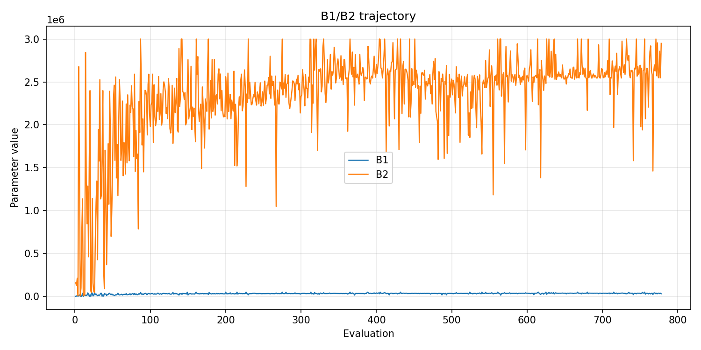
- [`ga_optimize_20260505T224607Z_job7012263_b1_ratio_heatmap.png`](plots/ga_optimize_20260505T224607Z_job7012263_b1_ratio_heatmap.png)
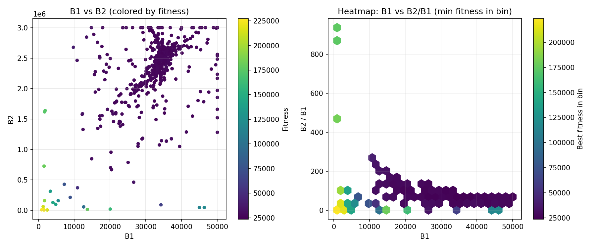
- [`ga_optimize_20260505T224607Z_job7012263_jump_plot.png`](plots/ga_optimize_20260505T224607Z_job7012263_jump_plot.png)
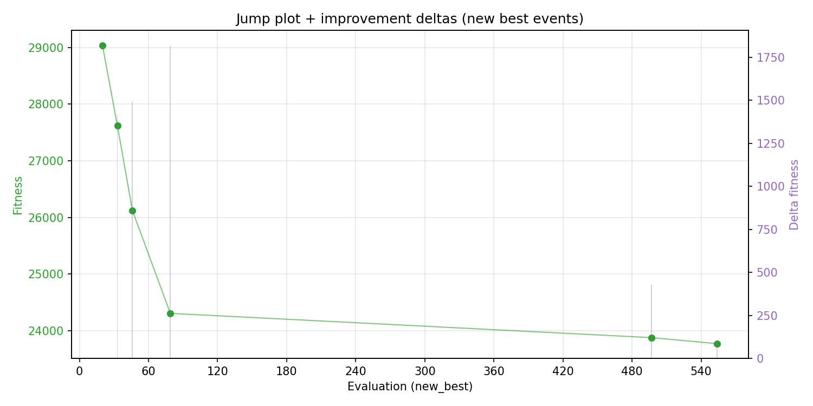
- [`ga_optimize_20260505T224607Z_job7012263_progress_by_phase.png`](plots/ga_optimize_20260505T224607Z_job7012263_progress_by_phase.png)
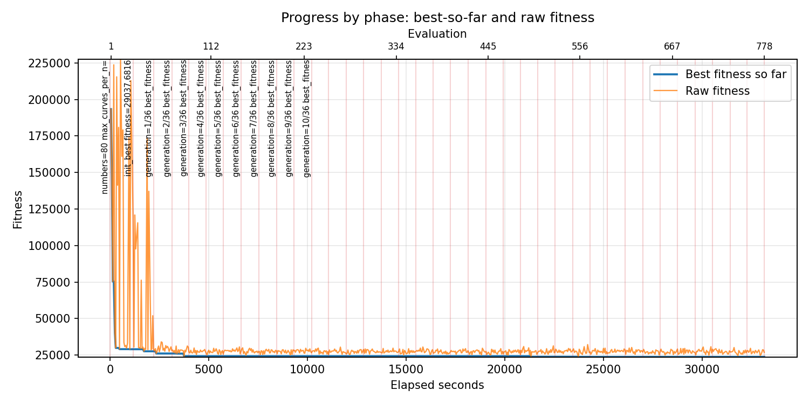
- [`ga_optimize_20260505T224607Z_job7012263_time_efficiency.png`](plots/ga_optimize_20260505T224607Z_job7012263_time_efficiency.png)
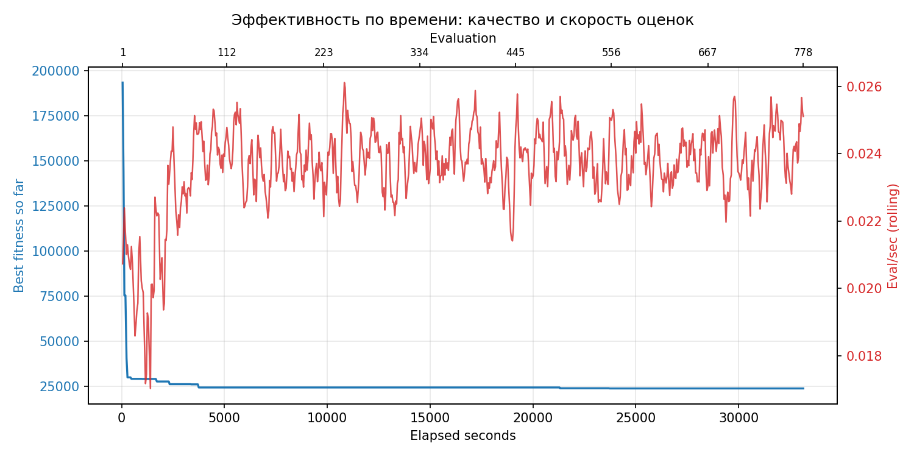

## Таблицы

## Validation runs

### Validation run `20260506T075907Z`
- validation file: [`ga_validate_20260506T075907Z_job7012264.json`](ga_validate_20260506T075907Z_job7012264.json)
- dataset: `data/numbers/20_dset_20260505T214657Z_job7012254/control.json`
- method: `ga`
- optimized params: `(B1, B2)=(37480, 2545245)`
- baseline params: `(B1, B2)=(11000, 1900000)`
- max_curves_per_n: `600`
- repeats_per_n: `80`
- curve_timeout_sec: `None`
- workers: `56`
- seed: `42`
- optimized_mean_score: `27203.357063031242`
- baseline_mean_score: `36482.86392127331`
- relative_improvement_pct: `25.435247842018093`
- optimized_mean_time_sec: `2.5087958625531246`
- baseline_mean_time_sec: `3.1702512358773314`
- time_improvement_pct: `20.864446509431183`
- optimized_mean_curves: `42.30796875`
- baseline_mean_curves: `95.60703125`
- curves_improvement_pct: `55.74805723297679`
- optimized_mean_success_rate: `1.0`
- baseline_mean_success_rate: `0.99765625`
- success_rate_delta_pp: `0.23437499999999778`
- trace plots:
  - score_trace_plot: [`ga_validate_20260506T075907Z_job7012264_score_trace.png`](plots/ga_validate_20260506T075907Z_job7012264_score_trace.png)
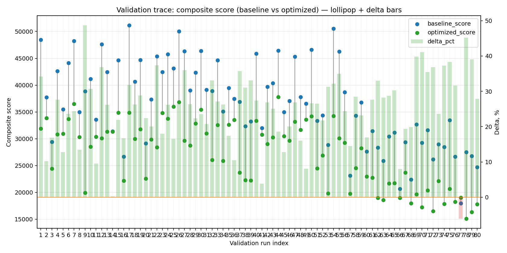
  - score_distribution_plot: [`ga_validate_20260506T075907Z_job7012264_score_distribution.png`](plots/ga_validate_20260506T075907Z_job7012264_score_distribution.png)
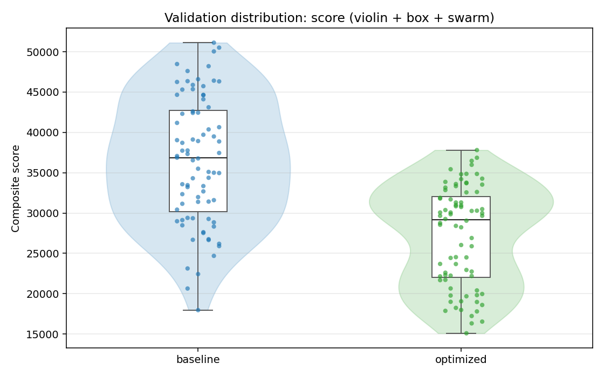
  - success_trace_plot: [`ga_validate_20260506T075907Z_job7012264_success_trace.png`](plots/ga_validate_20260506T075907Z_job7012264_success_trace.png)
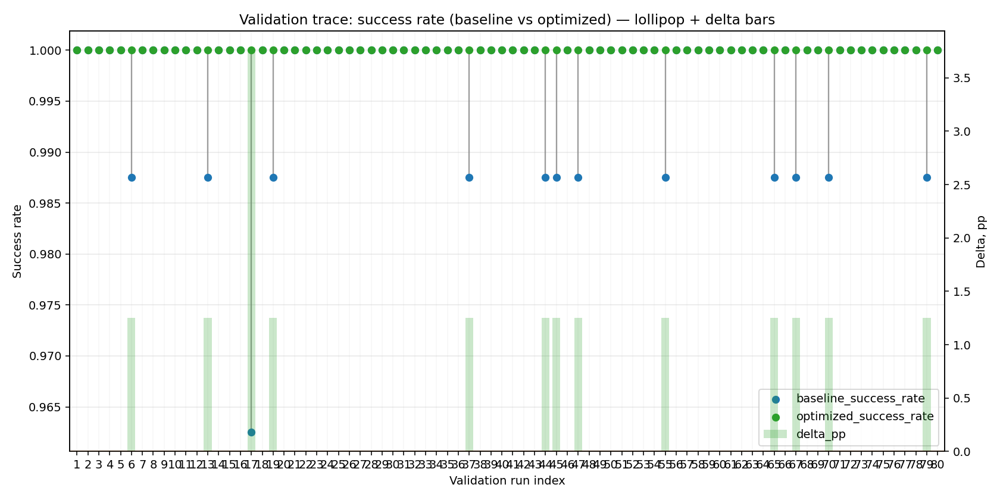
  - success_distribution_plot: [`ga_validate_20260506T075907Z_job7012264_success_distribution.png`](plots/ga_validate_20260506T075907Z_job7012264_success_distribution.png)
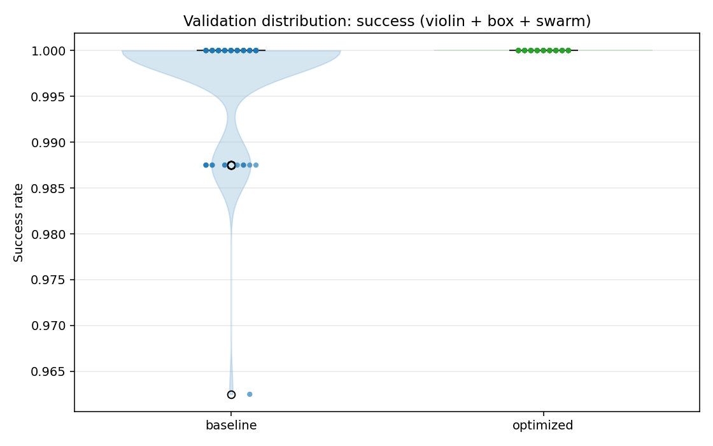
  - time_trace_plot: [`ga_validate_20260506T075907Z_job7012264_time_trace.png`](plots/ga_validate_20260506T075907Z_job7012264_time_trace.png)
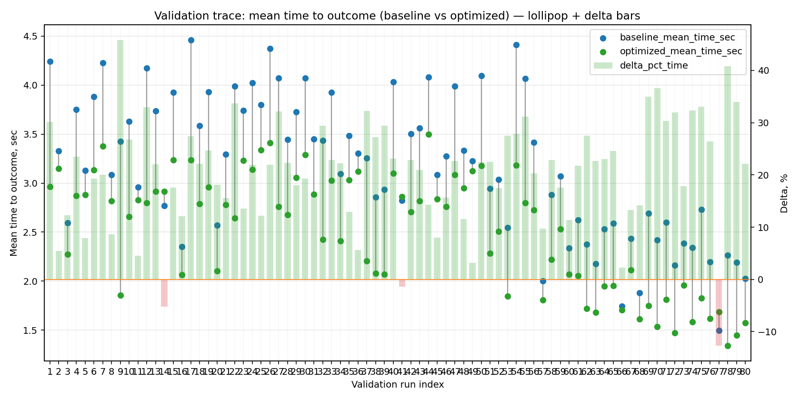
  - time_distribution_plot: [`ga_validate_20260506T075907Z_job7012264_time_distribution.png`](plots/ga_validate_20260506T075907Z_job7012264_time_distribution.png)
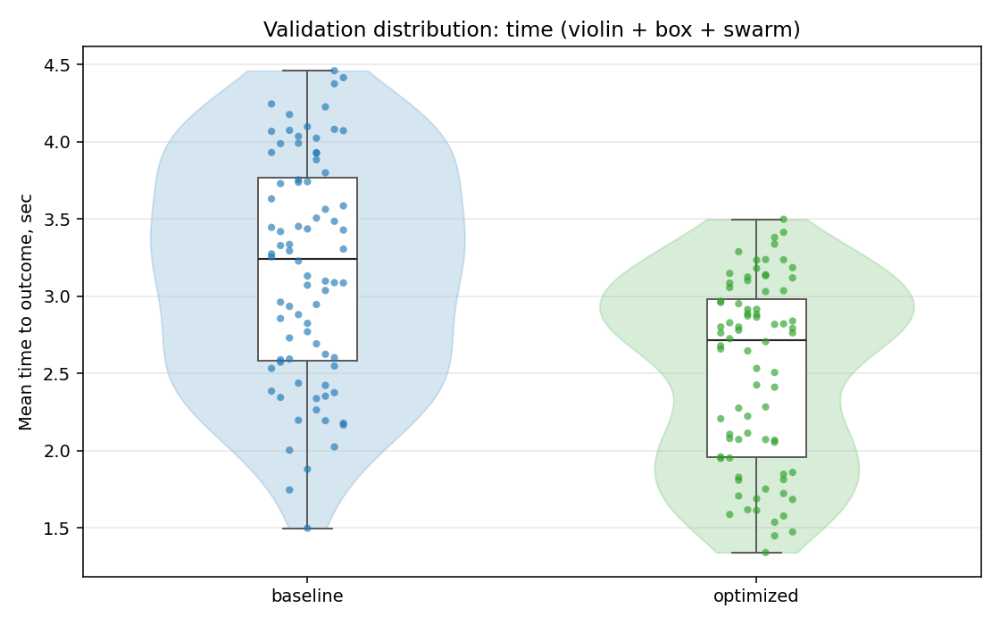
  - curves_trace_plot: [`ga_validate_20260506T075907Z_job7012264_curves_trace.png`](plots/ga_validate_20260506T075907Z_job7012264_curves_trace.png)
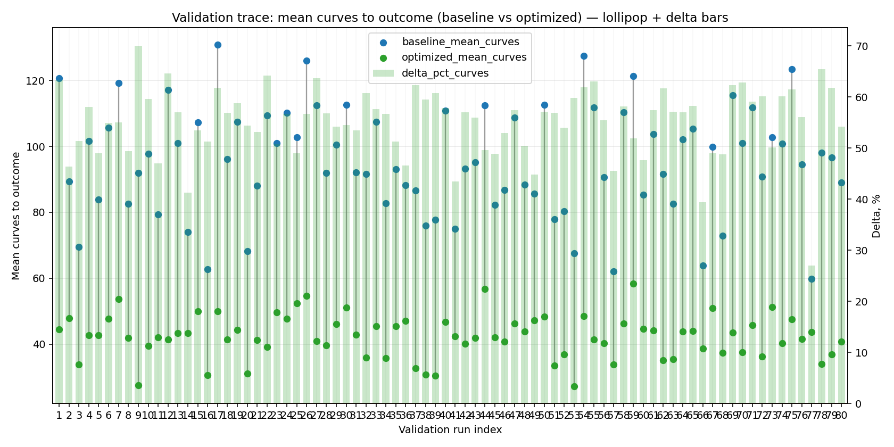
  - curves_distribution_plot: [`ga_validate_20260506T075907Z_job7012264_curves_distribution.png`](plots/ga_validate_20260506T075907Z_job7012264_curves_distribution.png)
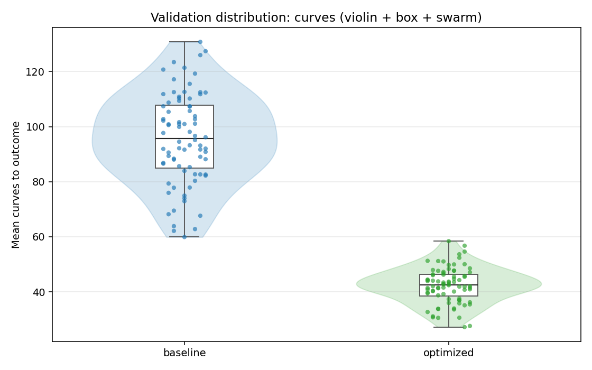

---
