# Отчёт по оптимизации: pso_optimize_20260505T214714Z_job7012259

## Метаданные
- метод: `pso`
- датасет: `data/numbers/20_dset_20260505T214657Z_job7012254/train.json`
- оптимум `(B1, B2)`: `(49999, 3000000)`
- objective: `24832.54100751201`
- max_curves_per_n: `260`
- repeats_per_n: `8`
- границы: `B1[500.0, 50000.0]`, `B2[5000.0, 3000000.0]`, `ratio_max=1000.0`

## Ключевые статистики
- `best_eval`: `68`
- `best_eval_fraction`: `0.11447811447811448`
- `eval_per_sec`: `0.02236227661140842`
- `evaluation_count`: `594`
- `improvement_percent`: `86.86135126807146`
- `max_plateau_evals`: `526`
- `median_plateau_evals`: `6.0`
- `new_best_count`: `8`
- `new_best_rate`: `0.013468013468013467`
- `p90_plateau_evals`: `123.6000000000001`
- `time_to_best_sec`: `3292.5620933389873`
- `time_to_first_improvement_sec`: `1019.7639039229834`
- `total_runtime_sec`: `26562.604501436`

## Флаги внимания

| Флаг | Статус | Текущее значение | Порог | Что это значит | Что делать |
|---|---|---:|---:|---|---|
| `b1_hits_boundary` | ⚠️ ВНИМАНИЕ | `0.8905723905723906` | `> 0.10` | Большая доля оценок проходит близко к границам B1. | Расширить диапазон B1, если упор в границу повторяется. |
| `b2_hits_boundary` | ⚠️ ВНИМАНИЕ | `0.9023569023569024` | `> 0.10` | Большая доля оценок проходит близко к границам B2. | Расширить диапазон B2, если упор в границу повторяется. |
| `best_b1_on_boundary` | ⚠️ ВНИМАНИЕ | `49999.0` | `within 2% of log-range [500.0, 50000.0]` | Лучший найденный B1 лежит на границе диапазона. | Проверить расширенный диапазон B1 вокруг текущей границы. |
| `best_b2_on_boundary` | ⚠️ ВНИМАНИЕ | `3000000.0` | `within 2% of log-range [5000.0, 3000000.0]` | Лучший найденный B2 лежит на границе диапазона. | Проверить расширенный диапазон B2 вокруг текущей границы. |
| `best_ratio_on_boundary` | ✅ ОК | `60.00120002400048` | `within 2% of log-range up to ratio_max=1000.0` | Лучшее отношение B2/B1 находится у верхней границы ratio_max. | Увеличить ratio_max и перепроверить локальный поиск в новой области. |
| `late_best` | ✅ ОК | `0.12395479114862357` | `> 0.85` | Лучшее решение найдено слишком поздно относительно общего времени. | Усилить ранний поиск или пересмотреть бюджет/инициализацию. |
| `low_improvement` | ✅ ОК | `86.86135126807146` | `< 10%` | Итоговый прирост качества слишком мал. | Сузить границы поиска или изменить параметры метода. |
| `low_signal` | ⚠️ ВНИМАНИЕ | `0.013468013468013467` | `< 0.03` | Слишком низкая плотность новых best-событий (слабый сигнал оптимизации). | Перенастроить exploration и сделать переоценку top-k кандидатов. |
| `plateau_too_long` | ⚠️ ВНИМАНИЕ | `0.8855218855218855` | `> 0.50` | Слишком длинное плато: улучшений почти нет на большом участке запуска. | Увеличить exploration или добавить политику рестартов. |
| `ratio_hits_boundary` | ✅ ОК | `0.003367003367003367` | `> 0.10` | Большая доля оценок проходит близко к границе отношения B2/B1. | Увеличить ratio_max, если хорошие точки упираются в ограничение отношения B2/B1. |

## Графики
- [`pso_optimize_20260505T214714Z_job7012259_b1_b2_trajectory.png`](plots/pso_optimize_20260505T214714Z_job7012259_b1_b2_trajectory.png)
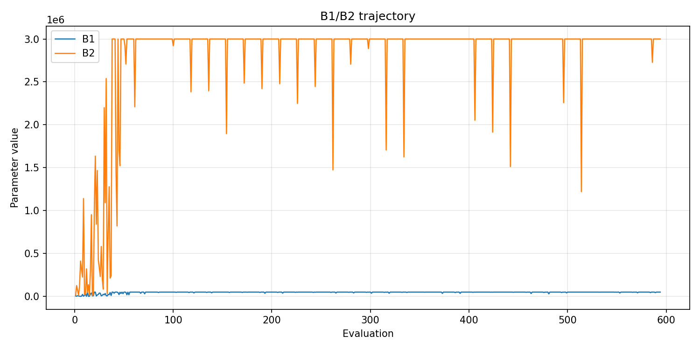
- [`pso_optimize_20260505T214714Z_job7012259_b1_ratio_heatmap.png`](plots/pso_optimize_20260505T214714Z_job7012259_b1_ratio_heatmap.png)
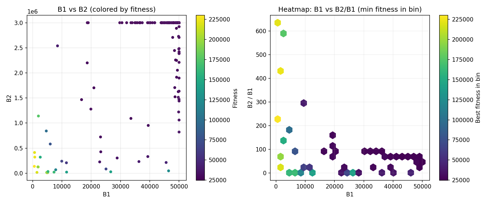
- [`pso_optimize_20260505T214714Z_job7012259_jump_plot.png`](plots/pso_optimize_20260505T214714Z_job7012259_jump_plot.png)
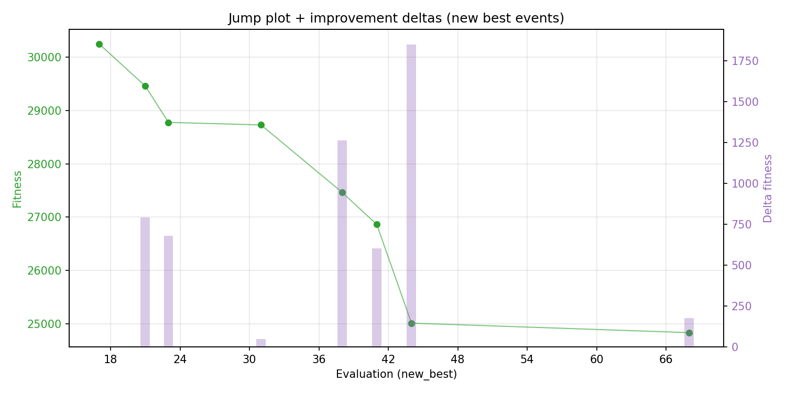
- [`pso_optimize_20260505T214714Z_job7012259_progress_by_phase.png`](plots/pso_optimize_20260505T214714Z_job7012259_progress_by_phase.png)
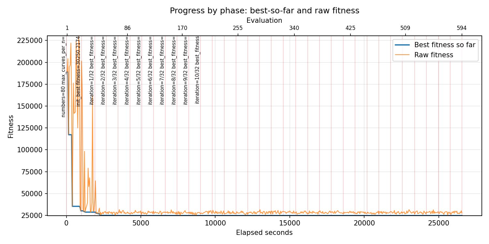
- [`pso_optimize_20260505T214714Z_job7012259_time_efficiency.png`](plots/pso_optimize_20260505T214714Z_job7012259_time_efficiency.png)
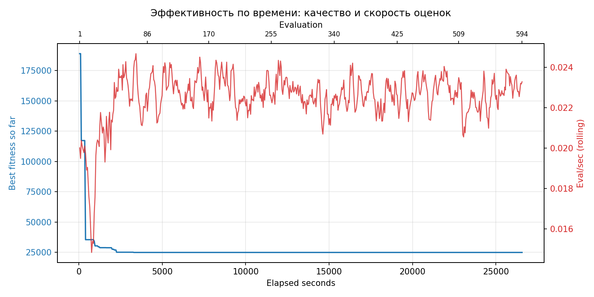

## Таблицы

## Validation runs

### Validation run `20260506T051020Z`
- validation file: [`pso_validate_20260506T051020Z_job7012260.json`](pso_validate_20260506T051020Z_job7012260.json)
- dataset: `data/numbers/20_dset_20260505T214657Z_job7012254/control.json`
- method: `pso`
- optimized params: `(B1, B2)=(49999, 3000000)`
- baseline params: `(B1, B2)=(11000, 1900000)`
- max_curves_per_n: `600`
- repeats_per_n: `80`
- curve_timeout_sec: `None`
- workers: `56`
- seed: `42`
- optimized_mean_score: `27875.715438517836`
- baseline_mean_score: `36731.76448502524`
- relative_improvement_pct: `24.11005616165765`
- optimized_mean_time_sec: `2.600912950101783`
- baseline_mean_time_sec: `3.1916201985025237`
- time_improvement_pct: `18.50806836846986`
- optimized_mean_curves: `37.33171875`
- baseline_mean_curves: `96.31125`
- curves_improvement_pct: `61.23846513257797`
- optimized_mean_success_rate: `1.0`
- baseline_mean_success_rate: `0.996875`
- success_rate_delta_pp: `0.31250000000000444`
- trace plots:
  - score_trace_plot: [`pso_validate_20260506T051020Z_job7012260_score_trace.png`](plots/pso_validate_20260506T051020Z_job7012260_score_trace.png)
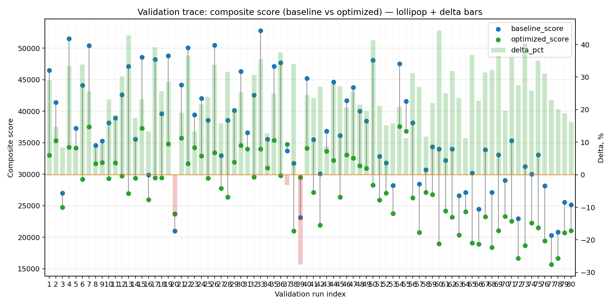
  - score_distribution_plot: [`pso_validate_20260506T051020Z_job7012260_score_distribution.png`](plots/pso_validate_20260506T051020Z_job7012260_score_distribution.png)
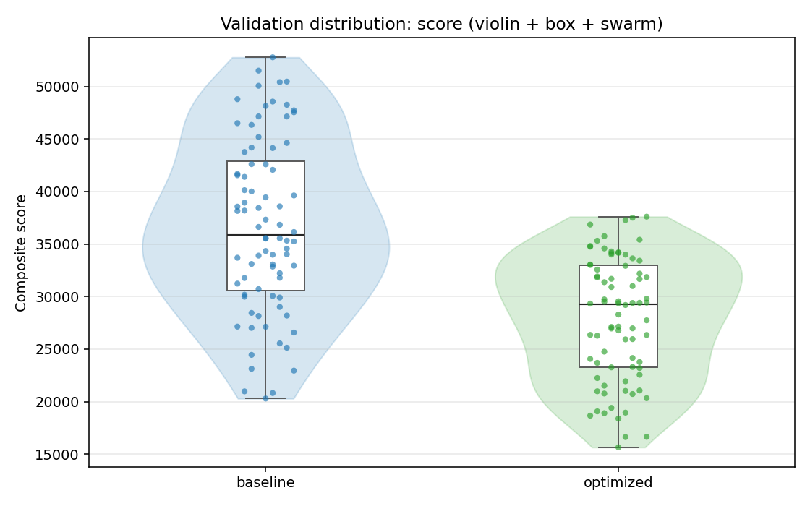
  - success_trace_plot: [`pso_validate_20260506T051020Z_job7012260_success_trace.png`](plots/pso_validate_20260506T051020Z_job7012260_success_trace.png)
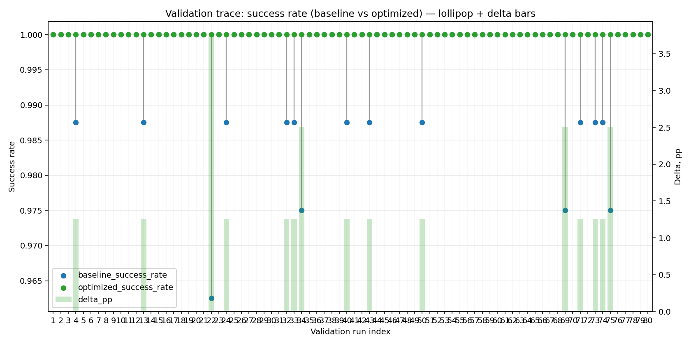
  - success_distribution_plot: [`pso_validate_20260506T051020Z_job7012260_success_distribution.png`](plots/pso_validate_20260506T051020Z_job7012260_success_distribution.png)
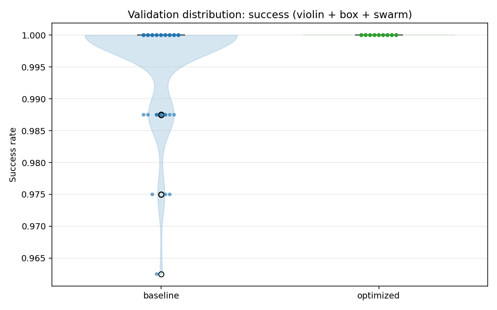
  - time_trace_plot: [`pso_validate_20260506T051020Z_job7012260_time_trace.png`](plots/pso_validate_20260506T051020Z_job7012260_time_trace.png)
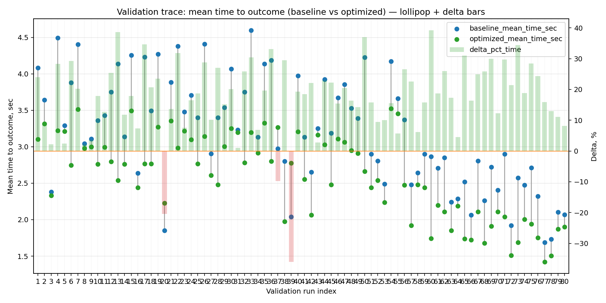
  - time_distribution_plot: [`pso_validate_20260506T051020Z_job7012260_time_distribution.png`](plots/pso_validate_20260506T051020Z_job7012260_time_distribution.png)
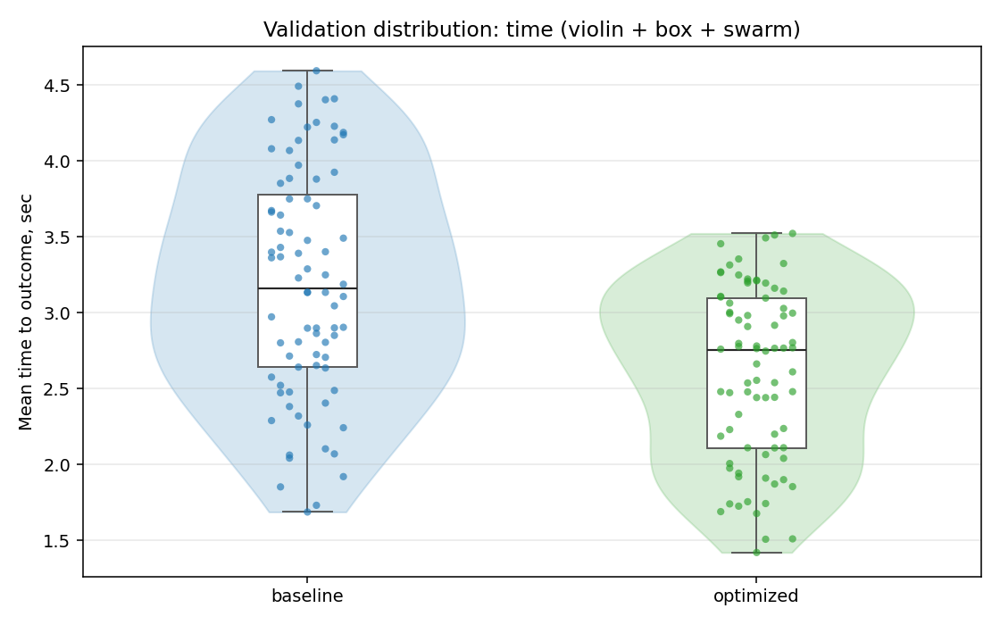
  - curves_trace_plot: [`pso_validate_20260506T051020Z_job7012260_curves_trace.png`](plots/pso_validate_20260506T051020Z_job7012260_curves_trace.png)
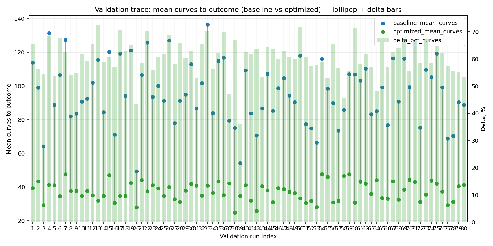
  - curves_distribution_plot: [`pso_validate_20260506T051020Z_job7012260_curves_distribution.png`](plots/pso_validate_20260506T051020Z_job7012260_curves_distribution.png)
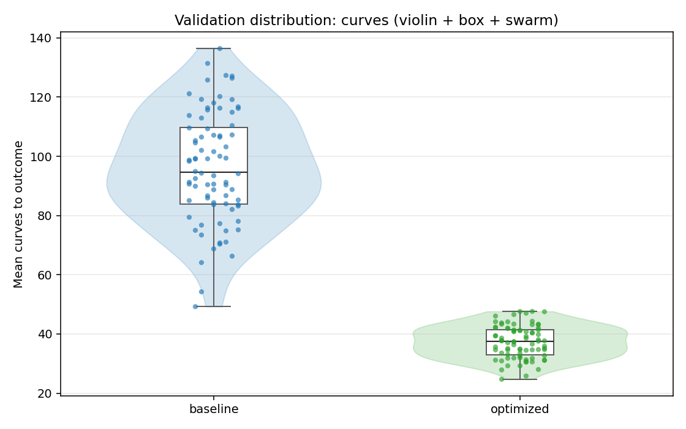

---
