# Отчёт по оптимизации: de_optimize_20260509T075247Z_job7040940

## Метаданные
- метод: `de`
- датасет: `data/numbers/20_dset_20260509T075225Z_job7040939/train.json`
- оптимум `(B1, B2)`: `(33362, 2032277)`
- objective: `25032.696339084545`
- max_curves_per_n: `260`
- repeats_per_n: `8`
- границы: `B1[100.0, 100000.0]`, `B2[10000.0, 5000000.0]`, `ratio_max=5000.0`

## Ключевые статистики
- `best_eval`: `101`
- `best_eval_fraction`: `0.42083333333333334`
- `eval_per_sec`: `0.020970851535976977`
- `evaluation_count`: `240`
- `improvement_percent`: `86.0802111094464`
- `max_plateau_evals`: `139`
- `median_plateau_evals`: `1.0`
- `new_best_count`: `10`
- `new_best_rate`: `0.041666666666666664`
- `p90_plateau_evals`: `49.0`
- `time_to_best_sec`: `5449.366556825997`
- `time_to_first_improvement_sec`: `50.160341242997674`
- `total_runtime_sec`: `11445.512106768001`

## Флаги внимания

| Флаг | Статус | Текущее значение | Порог | Что это значит | Что делать |
|---|---|---:|---:|---|---|
| `b1_hits_boundary` | ✅ ОК | `0.008333333333333333` | `> 0.10` | Большая доля оценок проходит близко к границам B1. | Расширить диапазон B1, если упор в границу повторяется. |
| `b2_hits_boundary` | ✅ ОК | `0.020833333333333332` | `> 0.10` | Большая доля оценок проходит близко к границам B2. | Расширить диапазон B2, если упор в границу повторяется. |
| `best_b1_on_boundary` | ✅ ОК | `33362.0` | `within 2% of log-range [100.0, 100000.0]` | Лучший найденный B1 лежит на границе диапазона. | Проверить расширенный диапазон B1 вокруг текущей границы. |
| `best_b2_on_boundary` | ✅ ОК | `2032277.0` | `within 2% of log-range [10000.0, 5000000.0]` | Лучший найденный B2 лежит на границе диапазона. | Проверить расширенный диапазон B2 вокруг текущей границы. |
| `best_ratio_on_boundary` | ✅ ОК | `60.915922306816135` | `within 2% of log-range up to ratio_max=5000.0` | Лучшее отношение B2/B1 находится у верхней границы ratio_max. | Увеличить ratio_max и перепроверить локальный поиск в новой области. |
| `late_best` | ✅ ОК | `0.4761138257504142` | `> 0.85` | Лучшее решение найдено слишком поздно относительно общего времени. | Усилить ранний поиск или пересмотреть бюджет/инициализацию. |
| `low_improvement` | ✅ ОК | `86.0802111094464` | `< 10%` | Итоговый прирост качества слишком мал. | Сузить границы поиска или изменить параметры метода. |
| `low_signal` | ✅ ОК | `0.041666666666666664` | `< 0.03` | Слишком низкая плотность новых best-событий (слабый сигнал оптимизации). | Перенастроить exploration и сделать переоценку top-k кандидатов. |
| `plateau_too_long` | ⚠️ ВНИМАНИЕ | `0.5791666666666667` | `> 0.50` | Слишком длинное плато: улучшений почти нет на большом участке запуска. | Увеличить exploration или добавить политику рестартов. |
| `ratio_hits_boundary` | ✅ ОК | `0.03333333333333333` | `> 0.10` | Большая доля оценок проходит близко к границе отношения B2/B1. | Увеличить ratio_max, если хорошие точки упираются в ограничение отношения B2/B1. |

## Графики
- [`de_optimize_20260509T075247Z_job7040940_b1_b2_trajectory.png`](plots/de_optimize_20260509T075247Z_job7040940_b1_b2_trajectory.png)
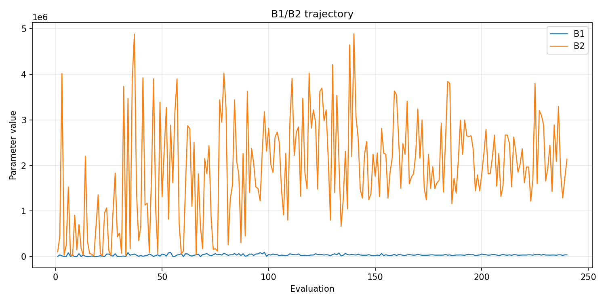
- [`de_optimize_20260509T075247Z_job7040940_b1_ratio_heatmap.png`](plots/de_optimize_20260509T075247Z_job7040940_b1_ratio_heatmap.png)
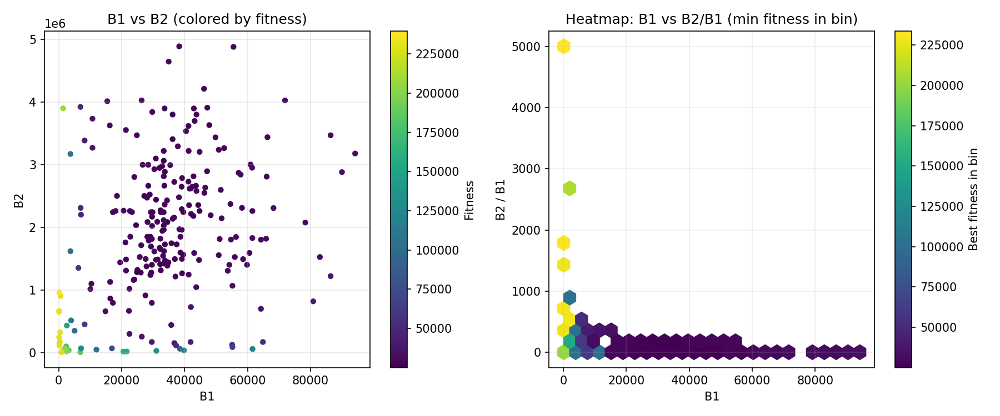
- [`de_optimize_20260509T075247Z_job7040940_jump_plot.png`](plots/de_optimize_20260509T075247Z_job7040940_jump_plot.png)
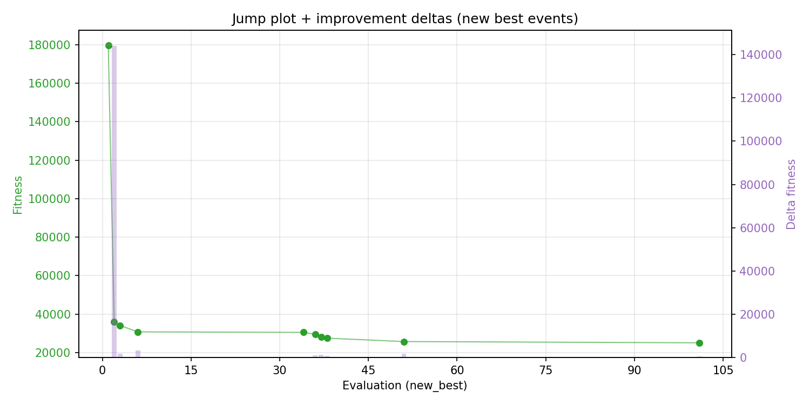
- [`de_optimize_20260509T075247Z_job7040940_progress_by_phase.png`](plots/de_optimize_20260509T075247Z_job7040940_progress_by_phase.png)
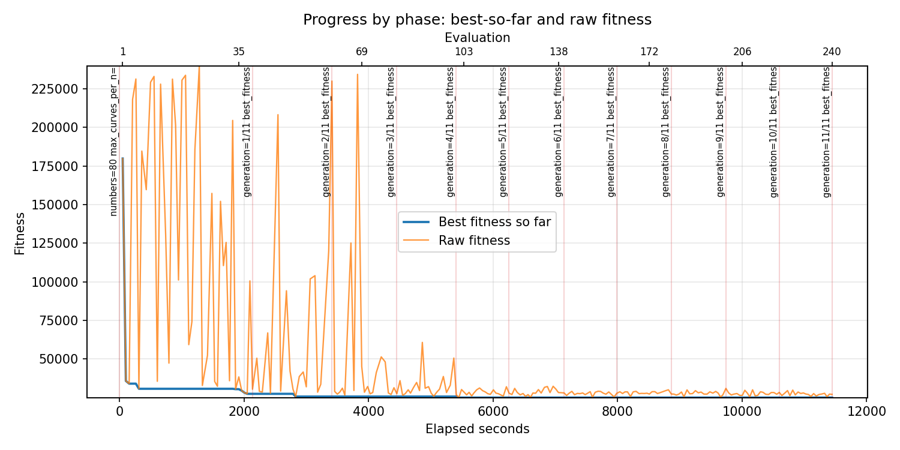
- [`de_optimize_20260509T075247Z_job7040940_time_efficiency.png`](plots/de_optimize_20260509T075247Z_job7040940_time_efficiency.png)
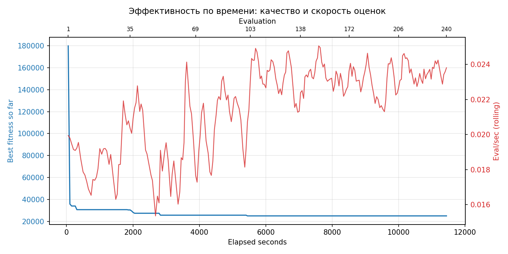

## Таблицы

## Validation runs

### Validation run `20260509T110350Z`
- validation file: [`de_validate_20260509T110350Z_job7040941.json`](de_validate_20260509T110350Z_job7040941.json)
- dataset: `data/numbers/20_dset_20260509T075225Z_job7040939/control.json`
- method: `de`
- optimized params: `(B1, B2)=(33362, 2032277)`
- baseline params: `(B1, B2)=(11000, 1900000)`
- max_curves_per_n: `600`
- repeats_per_n: `80`
- curve_timeout_sec: `None`
- workers: `56`
- seed: `666`
- optimized_mean_score: `28121.096917552983`
- baseline_mean_score: `36479.350377874165`
- relative_improvement_pct: `22.91228701646704`
- optimized_mean_time_sec: `2.5671120355052985`
- baseline_mean_time_sec: `3.1651748815374163`
- time_improvement_pct: `18.895096429604592`
- optimized_mean_curves: `48.999531250000004`
- baseline_mean_curves: `96.55203125`
- curves_improvement_pct: `49.25064691479496`
- optimized_mean_success_rate: `1.0`
- baseline_mean_success_rate: `0.9979687500000001`
- success_rate_delta_pp: `0.2031249999999929`
- trace plots:
  - score_trace_plot: [`de_validate_20260509T110350Z_job7040941_score_trace.png`](plots/de_validate_20260509T110350Z_job7040941_score_trace.png)
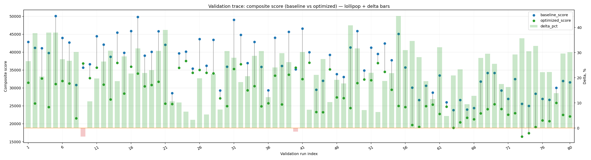
  - score_distribution_plot: [`de_validate_20260509T110350Z_job7040941_score_distribution.png`](plots/de_validate_20260509T110350Z_job7040941_score_distribution.png)
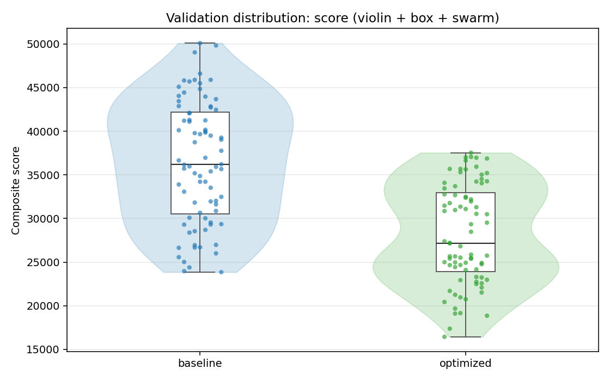
  - success_trace_plot: [`de_validate_20260509T110350Z_job7040941_success_trace.png`](plots/de_validate_20260509T110350Z_job7040941_success_trace.png)
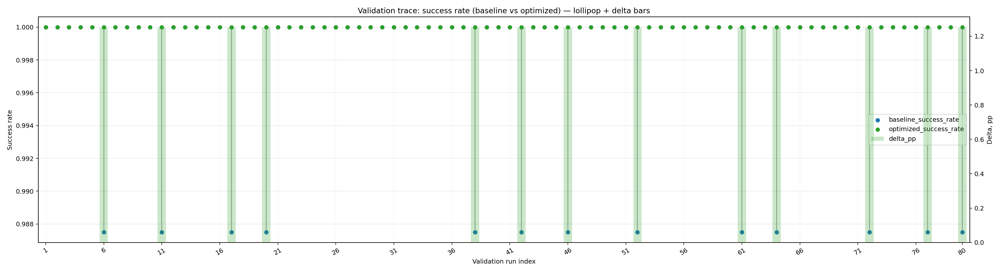
  - success_distribution_plot: [`de_validate_20260509T110350Z_job7040941_success_distribution.png`](plots/de_validate_20260509T110350Z_job7040941_success_distribution.png)
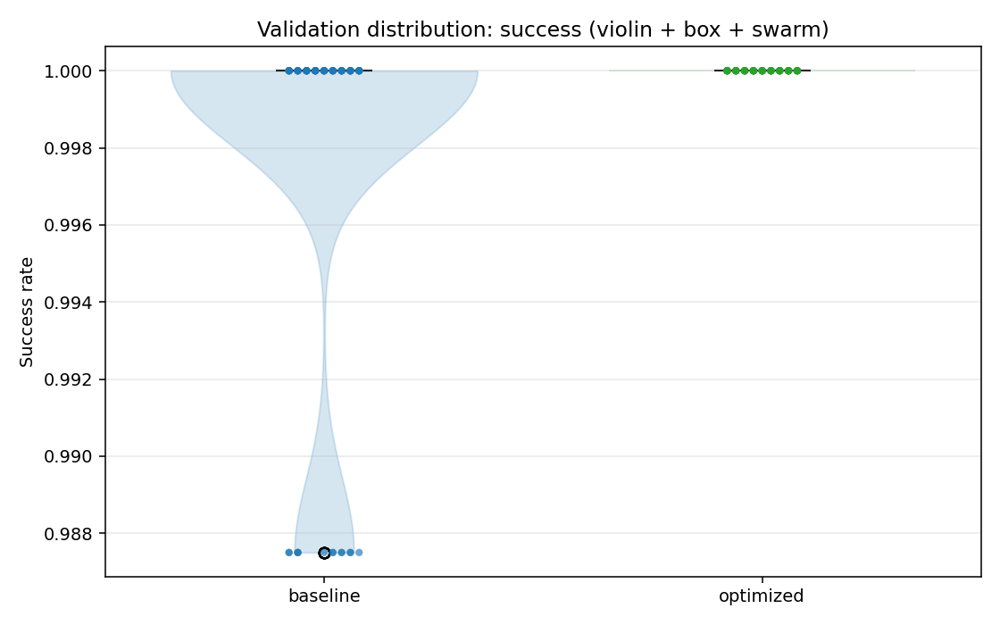
  - time_trace_plot: [`de_validate_20260509T110350Z_job7040941_time_trace.png`](plots/de_validate_20260509T110350Z_job7040941_time_trace.png)
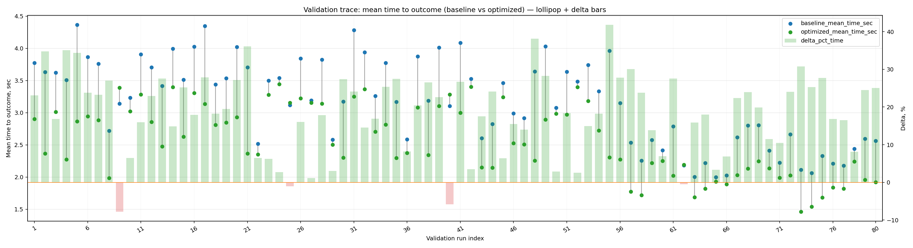
  - time_distribution_plot: [`de_validate_20260509T110350Z_job7040941_time_distribution.png`](plots/de_validate_20260509T110350Z_job7040941_time_distribution.png)
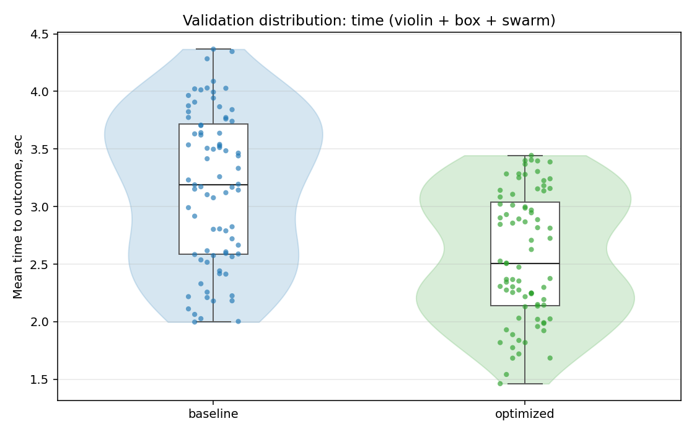
  - curves_trace_plot: [`de_validate_20260509T110350Z_job7040941_curves_trace.png`](plots/de_validate_20260509T110350Z_job7040941_curves_trace.png)
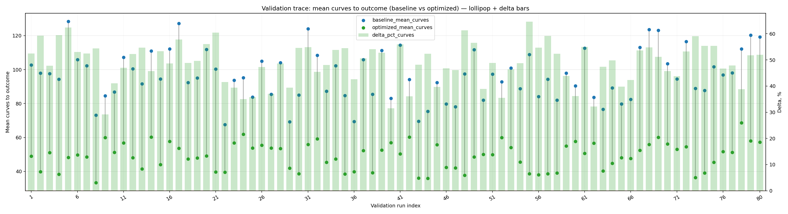
  - curves_distribution_plot: [`de_validate_20260509T110350Z_job7040941_curves_distribution.png`](plots/de_validate_20260509T110350Z_job7040941_curves_distribution.png)
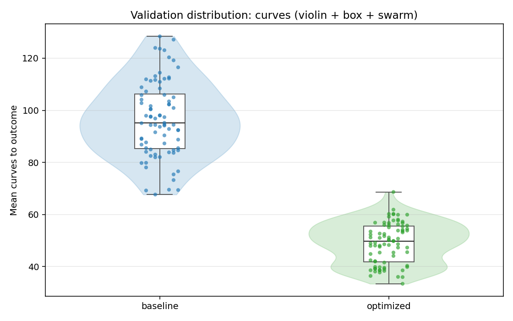

---
