# Отчёт по оптимизации: ga_optimize_20260518T233820Z_job7101777

## Метаданные
- метод: `ga`
- датасет: `data/numbers/20_dset_20260518T233806Z_job7101768/train.json`
- оптимум `(B1, B2)`: `(37035, 3399282)`
- objective: `24336.839159025076`
- max_curves_per_n: `260`
- repeats_per_n: `8`
- границы: `B1[100.0, 1000000.0]`, `B2[10000.0, 100000000.0]`, `ratio_max=1000.0`

## Ключевые статистики
- `best_eval`: `462`
- `best_eval_fraction`: `0.5938303341902313`
- `eval_per_sec`: `0.02126160726768518`
- `evaluation_count`: `778`
- `improvement_percent`: `88.19236676114983`
- `max_plateau_evals`: `316`
- `median_plateau_evals`: `47.0`
- `new_best_count`: `7`
- `new_best_rate`: `0.008997429305912597`
- `p90_plateau_evals`: `257.2`
- `time_to_best_sec`: `22158.24986690405`
- `time_to_first_improvement_sec`: `1997.512044467032`
- `total_runtime_sec`: `36595.16976772802`

## Флаги внимания

| Флаг | Статус | Текущее значение | Порог | Что это значит | Что делать |
|---|---|---:|---:|---|---|
| `b1_hits_boundary` | ✅ ОК | `0.0012853470437017994` | `> 0.10` | Большая доля оценок проходит близко к границам B1. | Расширить диапазон B1, если упор в границу повторяется. |
| `b2_hits_boundary` | ✅ ОК | `0.0012853470437017994` | `> 0.10` | Большая доля оценок проходит близко к границам B2. | Расширить диапазон B2, если упор в границу повторяется. |
| `best_b1_on_boundary` | ✅ ОК | `37035.0` | `within 2% of log-range [100.0, 1000000.0]` | Лучший найденный B1 лежит на границе диапазона. | Проверить расширенный диапазон B1 вокруг текущей границы. |
| `best_b2_on_boundary` | ✅ ОК | `3399282.0` | `within 2% of log-range [10000.0, 100000000.0]` | Лучший найденный B2 лежит на границе диапазона. | Проверить расширенный диапазон B2 вокруг текущей границы. |
| `best_ratio_on_boundary` | ✅ ОК | `91.78566221142162` | `within 2% of log-range up to ratio_max=1000.0` | Лучшее отношение B2/B1 находится у верхней границы ratio_max. | Увеличить ratio_max и перепроверить локальный поиск в новой области. |
| `late_best` | ✅ ОК | `0.6054965725680176` | `> 0.85` | Лучшее решение найдено слишком поздно относительно общего времени. | Усилить ранний поиск или пересмотреть бюджет/инициализацию. |
| `low_improvement` | ✅ ОК | `88.19236676114983` | `< 10%` | Итоговый прирост качества слишком мал. | Сузить границы поиска или изменить параметры метода. |
| `low_signal` | ⚠️ ВНИМАНИЕ | `0.008997429305912597` | `< 0.03` | Слишком низкая плотность новых best-событий (слабый сигнал оптимизации). | Перенастроить exploration и сделать переоценку top-k кандидатов. |
| `plateau_too_long` | ✅ ОК | `0.40616966580976865` | `> 0.50` | Слишком длинное плато: улучшений почти нет на большом участке запуска. | Увеличить exploration или добавить политику рестартов. |
| `ratio_hits_boundary` | ✅ ОК | `0.017994858611825194` | `> 0.10` | Большая доля оценок проходит близко к границе отношения B2/B1. | Увеличить ratio_max, если хорошие точки упираются в ограничение отношения B2/B1. |

## Графики
- [`ga_optimize_20260518T233820Z_job7101777_b1_b2_trajectory.png`](plots/ga_optimize_20260518T233820Z_job7101777_b1_b2_trajectory.png)
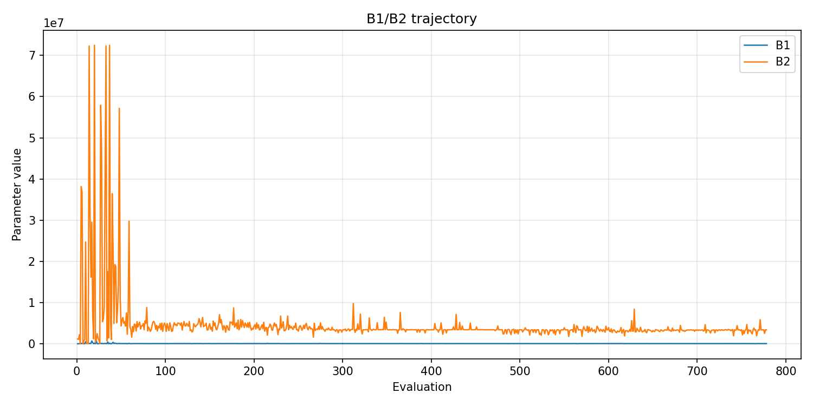
- [`ga_optimize_20260518T233820Z_job7101777_b1_ratio_heatmap.png`](plots/ga_optimize_20260518T233820Z_job7101777_b1_ratio_heatmap.png)
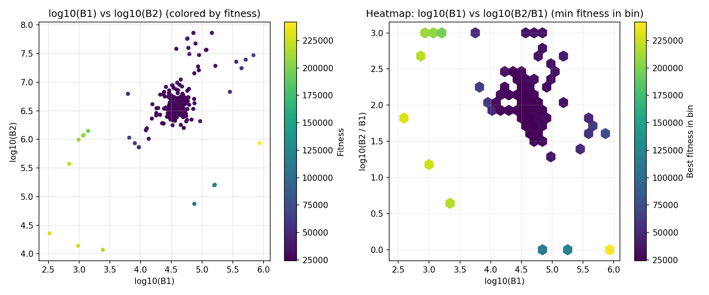
- [`ga_optimize_20260518T233820Z_job7101777_jump_plot.png`](plots/ga_optimize_20260518T233820Z_job7101777_jump_plot.png)
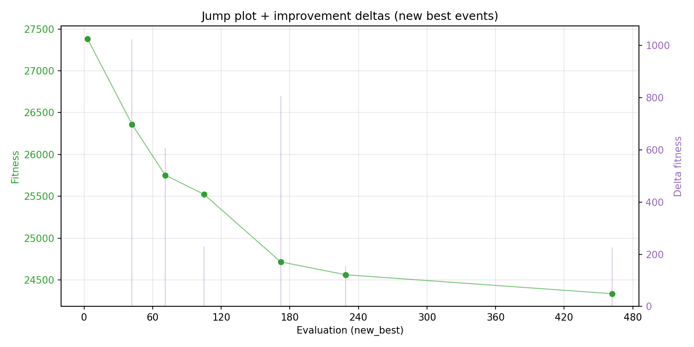
- [`ga_optimize_20260518T233820Z_job7101777_progress_by_phase.png`](plots/ga_optimize_20260518T233820Z_job7101777_progress_by_phase.png)
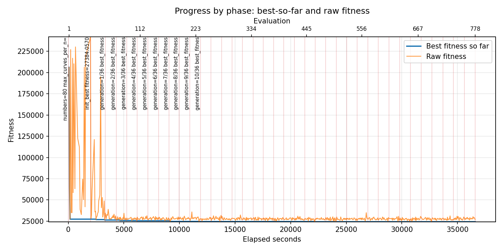
- [`ga_optimize_20260518T233820Z_job7101777_time_efficiency.png`](plots/ga_optimize_20260518T233820Z_job7101777_time_efficiency.png)
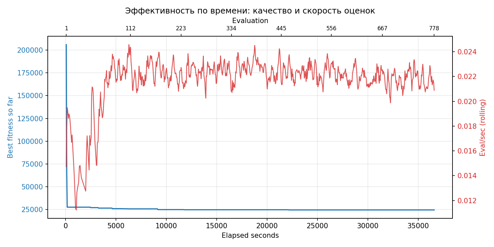

## Таблицы

## Validation runs

### Validation run `20260519T094838Z`
- validation file: [`ga_validate_20260519T094838Z_job7101778.json`](ga_validate_20260519T094838Z_job7101778.json)
- dataset: `data/numbers/20_dset_20260518T233806Z_job7101768/control.json`
- method: `ga`
- optimized params: `(B1, B2)=(37035, 3399282)`
- baseline params: `(B1, B2)=(11000, 1900000)`
- max_curves_per_n: `600`
- repeats_per_n: `80`
- curve_timeout_sec: `None`
- workers: `56`
- seed: `42`
- optimized_mean_score: `27486.25588747467`
- baseline_mean_score: `35516.9543051748`
- relative_improvement_pct: `22.610887039179655`
- optimized_mean_time_sec: `2.5424474637474668`
- baseline_mean_time_sec: `3.0833602742674793`
- time_improvement_pct: `17.542964895612737`
- optimized_mean_curves: `41.235625`
- baseline_mean_curves: `93.66703125000001`
- curves_improvement_pct: `55.97637242292763`
- optimized_mean_success_rate: `1.0`
- baseline_mean_success_rate: `0.9974999999999999`
- success_rate_delta_pp: `0.2500000000000058`
- trace plots:
  - score_trace_plot: [`ga_validate_20260519T094838Z_job7101778_score_trace.png`](plots/ga_validate_20260519T094838Z_job7101778_score_trace.png)
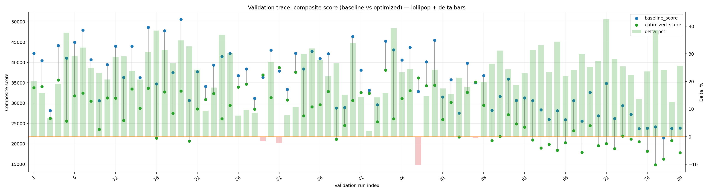
  - score_distribution_plot: [`ga_validate_20260519T094838Z_job7101778_score_distribution.png`](plots/ga_validate_20260519T094838Z_job7101778_score_distribution.png)
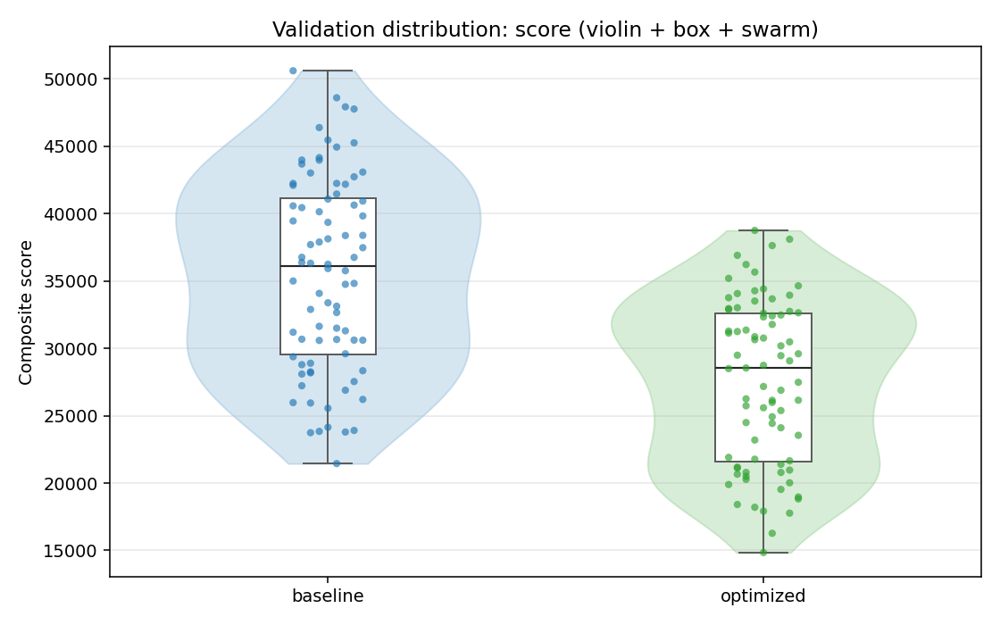
  - success_trace_plot: [`ga_validate_20260519T094838Z_job7101778_success_trace.png`](plots/ga_validate_20260519T094838Z_job7101778_success_trace.png)
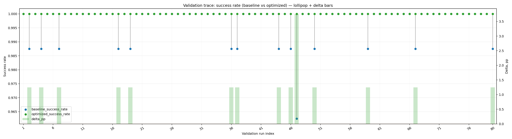
  - success_distribution_plot: [`ga_validate_20260519T094838Z_job7101778_success_distribution.png`](plots/ga_validate_20260519T094838Z_job7101778_success_distribution.png)
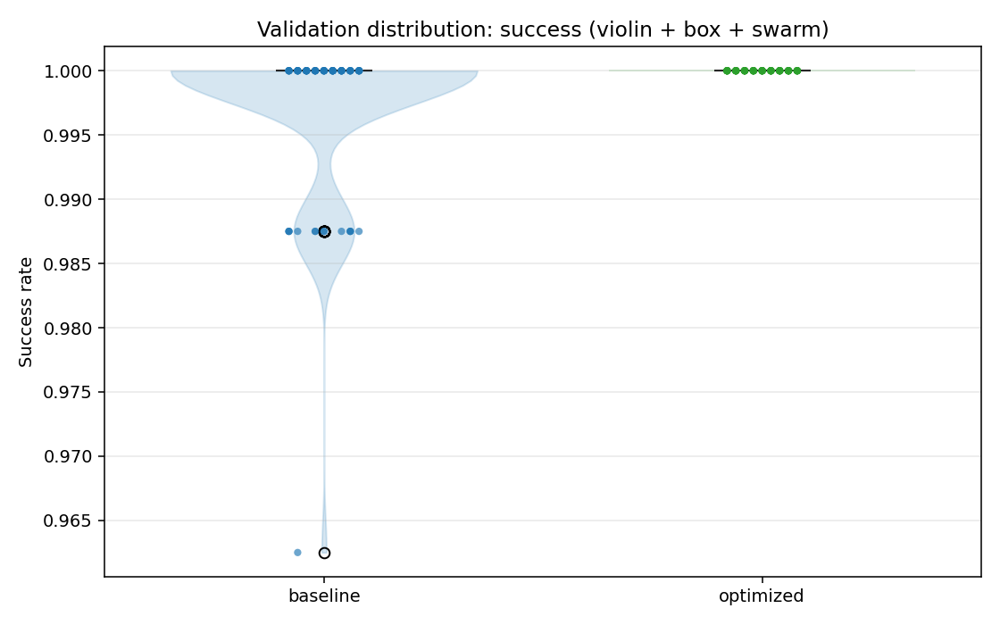
  - time_trace_plot: [`ga_validate_20260519T094838Z_job7101778_time_trace.png`](plots/ga_validate_20260519T094838Z_job7101778_time_trace.png)
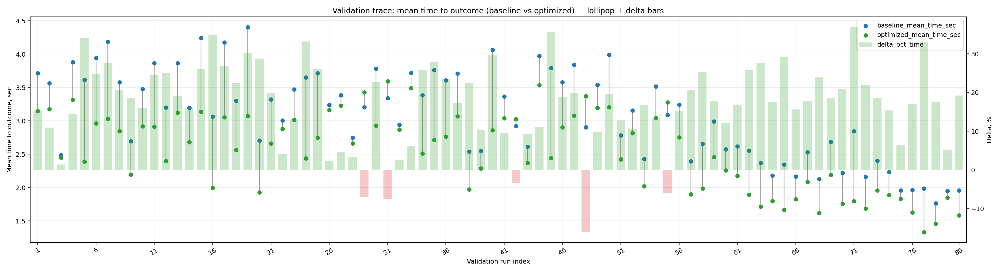
  - time_distribution_plot: [`ga_validate_20260519T094838Z_job7101778_time_distribution.png`](plots/ga_validate_20260519T094838Z_job7101778_time_distribution.png)
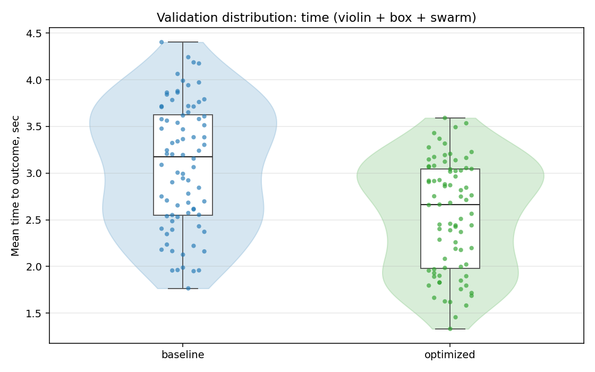
  - curves_trace_plot: [`ga_validate_20260519T094838Z_job7101778_curves_trace.png`](plots/ga_validate_20260519T094838Z_job7101778_curves_trace.png)
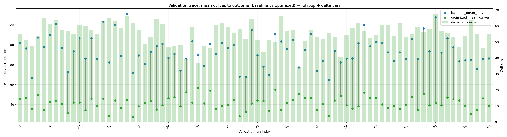
  - curves_distribution_plot: [`ga_validate_20260519T094838Z_job7101778_curves_distribution.png`](plots/ga_validate_20260519T094838Z_job7101778_curves_distribution.png)
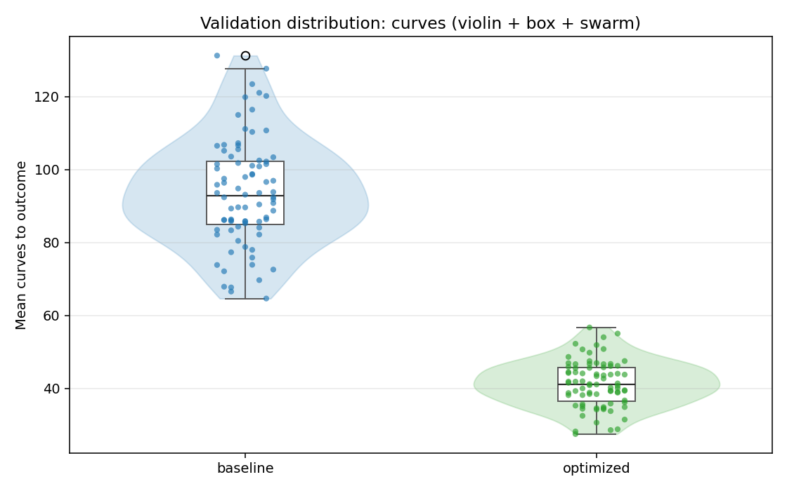

---
