# Отчёт по оптимизации: pso_optimize_20260518T233821Z_job7101773

## Метаданные
- метод: `pso`
- датасет: `data/numbers/20_dset_20260518T233806Z_job7101768/train.json`
- оптимум `(B1, B2)`: `(46568, 4510472)`
- objective: `24666.43823397685`
- max_curves_per_n: `260`
- repeats_per_n: `8`
- границы: `B1[100.0, 1000000.0]`, `B2[10000.0, 100000000.0]`, `ratio_max=1000.0`

## Ключевые статистики
- `best_eval`: `224`
- `best_eval_fraction`: `0.3771043771043771`
- `eval_per_sec`: `0.018316777311503853`
- `evaluation_count`: `594`
- `improvement_percent`: `79.53699278016411`
- `max_plateau_evals`: `370`
- `median_plateau_evals`: `16.5`
- `new_best_count`: `11`
- `new_best_rate`: `0.018518518518518517`
- `p90_plateau_evals`: `65.70000000000002`
- `time_to_best_sec`: `14864.652678692008`
- `time_to_first_improvement_sec`: `1694.9081208150092`
- `total_runtime_sec`: `32431.85767174801`

## Флаги внимания

| Флаг | Статус | Текущее значение | Порог | Что это значит | Что делать |
|---|---|---:|---:|---|---|
| `b1_hits_boundary` | ✅ ОК | `0.011784511784511785` | `> 0.10` | Большая доля оценок проходит близко к границам B1. | Расширить диапазон B1, если упор в границу повторяется. |
| `b2_hits_boundary` | ✅ ОК | `0.0016835016835016834` | `> 0.10` | Большая доля оценок проходит близко к границам B2. | Расширить диапазон B2, если упор в границу повторяется. |
| `best_b1_on_boundary` | ✅ ОК | `46568.0` | `within 2% of log-range [100.0, 1000000.0]` | Лучший найденный B1 лежит на границе диапазона. | Проверить расширенный диапазон B1 вокруг текущей границы. |
| `best_b2_on_boundary` | ✅ ОК | `4510472.0` | `within 2% of log-range [10000.0, 100000000.0]` | Лучший найденный B2 лежит на границе диапазона. | Проверить расширенный диапазон B2 вокруг текущей границы. |
| `best_ratio_on_boundary` | ✅ ОК | `96.85775639924411` | `within 2% of log-range up to ratio_max=1000.0` | Лучшее отношение B2/B1 находится у верхней границы ratio_max. | Увеличить ratio_max и перепроверить локальный поиск в новой области. |
| `late_best` | ✅ ОК | `0.45833491344040034` | `> 0.85` | Лучшее решение найдено слишком поздно относительно общего времени. | Усилить ранний поиск или пересмотреть бюджет/инициализацию. |
| `low_improvement` | ✅ ОК | `79.53699278016411` | `< 10%` | Итоговый прирост качества слишком мал. | Сузить границы поиска или изменить параметры метода. |
| `low_signal` | ⚠️ ВНИМАНИЕ | `0.018518518518518517` | `< 0.03` | Слишком низкая плотность новых best-событий (слабый сигнал оптимизации). | Перенастроить exploration и сделать переоценку top-k кандидатов. |
| `plateau_too_long` | ⚠️ ВНИМАНИЕ | `0.622895622895623` | `> 0.50` | Слишком длинное плато: улучшений почти нет на большом участке запуска. | Увеличить exploration или добавить политику рестартов. |
| `ratio_hits_boundary` | ✅ ОК | `0.04882154882154882` | `> 0.10` | Большая доля оценок проходит близко к границе отношения B2/B1. | Увеличить ratio_max, если хорошие точки упираются в ограничение отношения B2/B1. |

## Графики
- [`pso_optimize_20260518T233821Z_job7101773_b1_b2_trajectory.png`](plots/pso_optimize_20260518T233821Z_job7101773_b1_b2_trajectory.png)
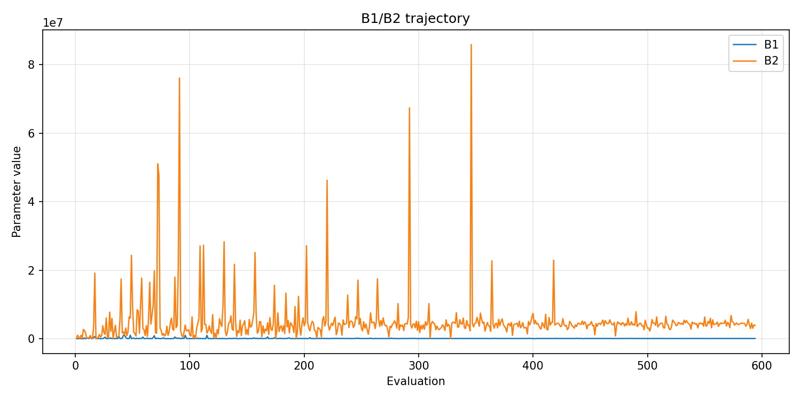
- [`pso_optimize_20260518T233821Z_job7101773_b1_ratio_heatmap.png`](plots/pso_optimize_20260518T233821Z_job7101773_b1_ratio_heatmap.png)
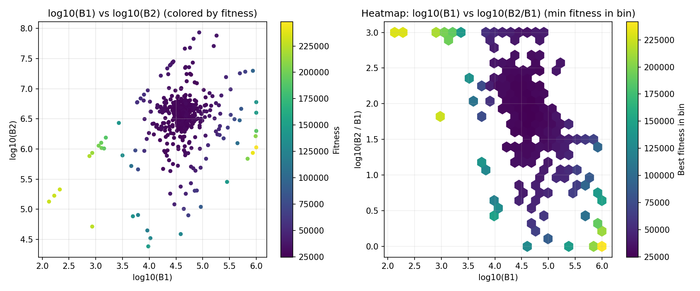
- [`pso_optimize_20260518T233821Z_job7101773_jump_plot.png`](plots/pso_optimize_20260518T233821Z_job7101773_jump_plot.png)
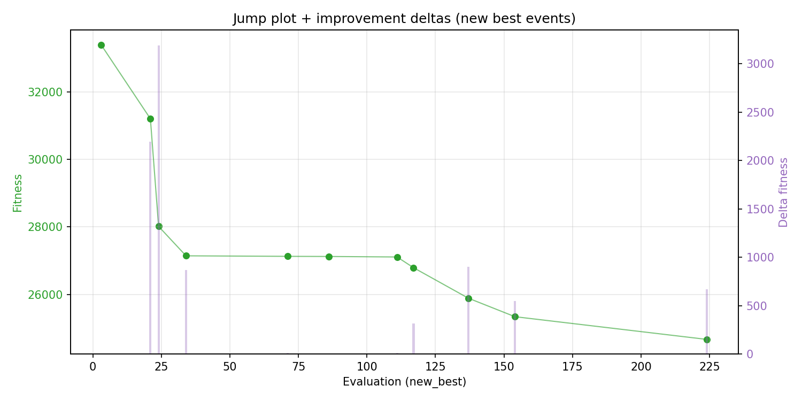
- [`pso_optimize_20260518T233821Z_job7101773_progress_by_phase.png`](plots/pso_optimize_20260518T233821Z_job7101773_progress_by_phase.png)
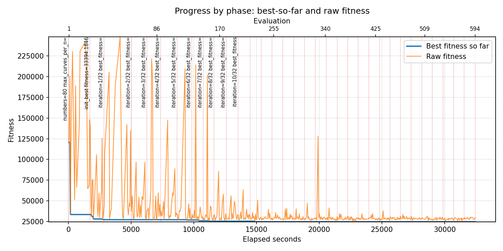
- [`pso_optimize_20260518T233821Z_job7101773_time_efficiency.png`](plots/pso_optimize_20260518T233821Z_job7101773_time_efficiency.png)
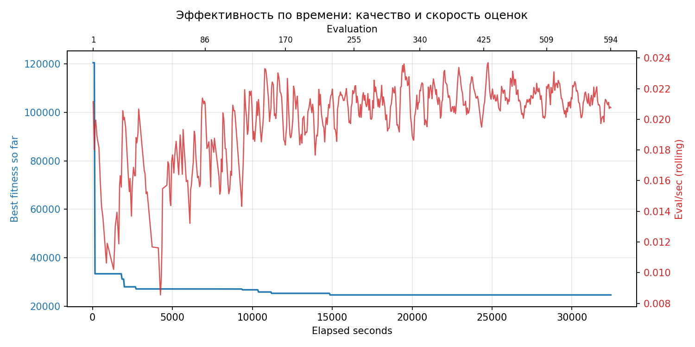

## Таблицы

## Validation runs

### Validation run `20260519T083934Z`
- validation file: [`pso_validate_20260519T083934Z_job7101774.json`](pso_validate_20260519T083934Z_job7101774.json)
- dataset: `data/numbers/20_dset_20260518T233806Z_job7101768/control.json`
- method: `pso`
- optimized params: `(B1, B2)=(46568, 4510472)`
- baseline params: `(B1, B2)=(11000, 1900000)`
- max_curves_per_n: `600`
- repeats_per_n: `80`
- curve_timeout_sec: `None`
- workers: `56`
- seed: `42`
- optimized_mean_score: `27866.34717571164`
- baseline_mean_score: `35597.383277414694`
- relative_improvement_pct: `21.717989891150594`
- optimized_mean_time_sec: `2.614422217571164`
- baseline_mean_time_sec: `3.0900695777414695`
- time_improvement_pct: `15.392771852016224`
- optimized_mean_curves: `34.4425`
- baseline_mean_curves: `93.93375`
- curves_improvement_pct: `63.33320026082212`
- optimized_mean_success_rate: `1.0`
- baseline_mean_success_rate: `0.9979687500000001`
- success_rate_delta_pp: `0.2031249999999929`
- trace plots:
  - score_trace_plot: [`pso_validate_20260519T083934Z_job7101774_score_trace.png`](plots/pso_validate_20260519T083934Z_job7101774_score_trace.png)
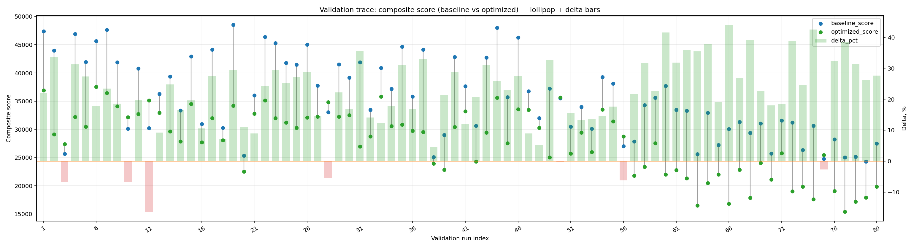
  - score_distribution_plot: [`pso_validate_20260519T083934Z_job7101774_score_distribution.png`](plots/pso_validate_20260519T083934Z_job7101774_score_distribution.png)
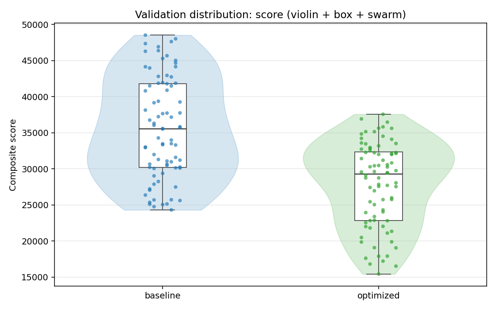
  - success_trace_plot: [`pso_validate_20260519T083934Z_job7101774_success_trace.png`](plots/pso_validate_20260519T083934Z_job7101774_success_trace.png)
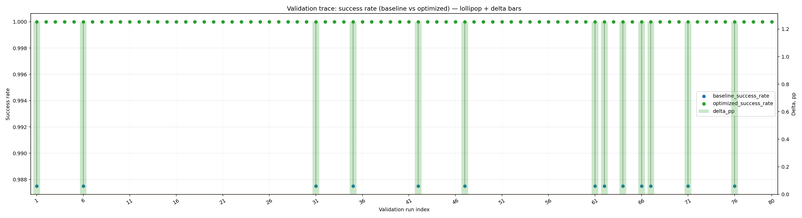
  - success_distribution_plot: [`pso_validate_20260519T083934Z_job7101774_success_distribution.png`](plots/pso_validate_20260519T083934Z_job7101774_success_distribution.png)
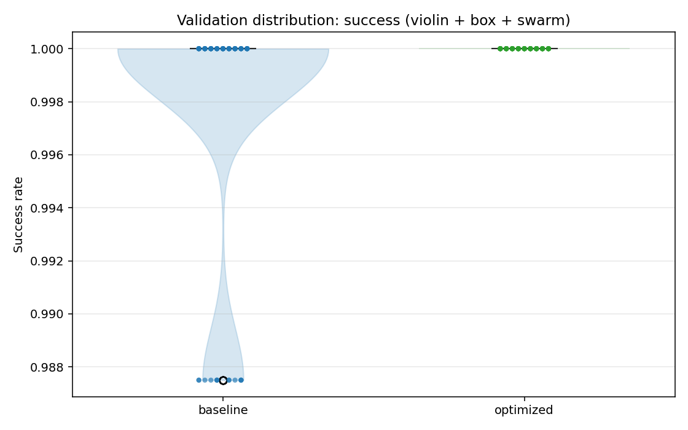
  - time_trace_plot: [`pso_validate_20260519T083934Z_job7101774_time_trace.png`](plots/pso_validate_20260519T083934Z_job7101774_time_trace.png)
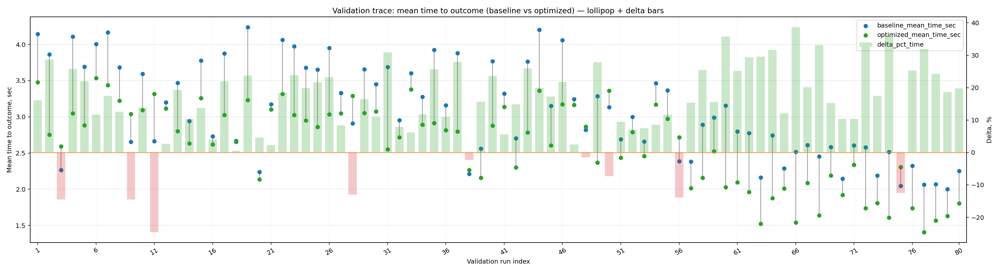
  - time_distribution_plot: [`pso_validate_20260519T083934Z_job7101774_time_distribution.png`](plots/pso_validate_20260519T083934Z_job7101774_time_distribution.png)
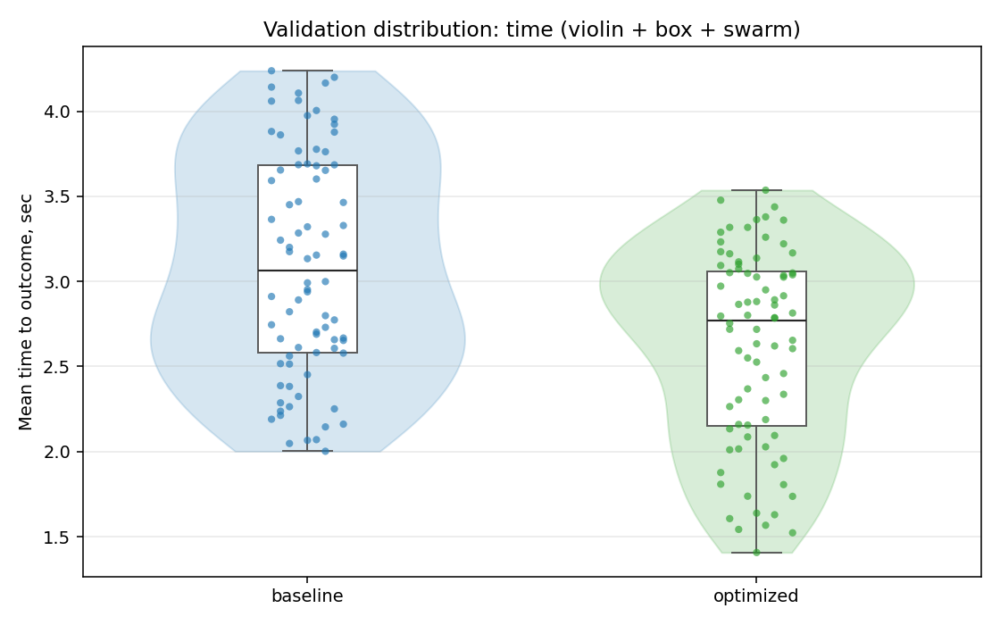
  - curves_trace_plot: [`pso_validate_20260519T083934Z_job7101774_curves_trace.png`](plots/pso_validate_20260519T083934Z_job7101774_curves_trace.png)
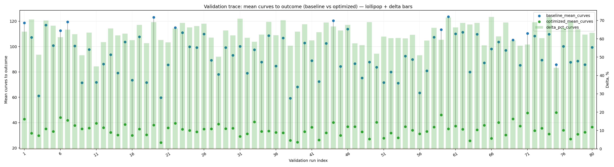
  - curves_distribution_plot: [`pso_validate_20260519T083934Z_job7101774_curves_distribution.png`](plots/pso_validate_20260519T083934Z_job7101774_curves_distribution.png)
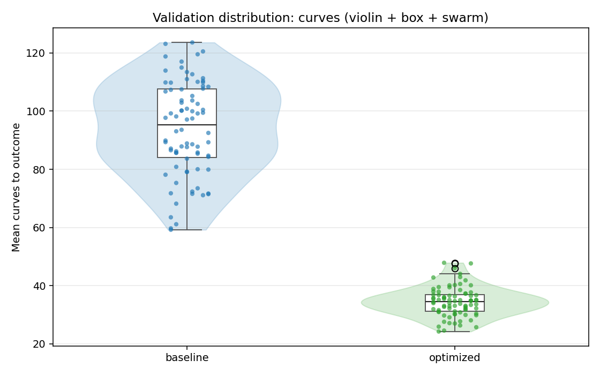

---
