# Отчёт по оптимизации: rs_optimize_20260518T233821Z_job7101771

## Метаданные
- метод: `rs`
- датасет: `data/numbers/20_dset_20260518T233806Z_job7101768/train.json`
- оптимум `(B1, B2)`: `(35198, 3921020)`
- objective: `27409.584536783877`
- max_curves_per_n: `260`
- repeats_per_n: `8`
- границы: `B1[100.0, 1000000.0]`, `B2[10000.0, 100000000.0]`, `ratio_max=1000.0`

## Ключевые статистики
- `best_eval`: `78`
- `best_eval_fraction`: `0.4875`
- `eval_per_sec`: `0.012806308251360712`
- `evaluation_count`: `160`
- `improvement_percent`: `74.30935039573801`
- `max_plateau_evals`: `82`
- `median_plateau_evals`: `6.0`
- `new_best_count`: `9`
- `new_best_rate`: `0.05625`
- `p90_plateau_evals`: `33.39999999999998`
- `time_to_best_sec`: `5842.441008585971`
- `time_to_first_improvement_sec`: `44.64856860000873`
- `total_runtime_sec`: `12493.842632828979`

## Флаги внимания

| Флаг | Статус | Текущее значение | Порог | Что это значит | Что делать |
|---|---|---:|---:|---|---|
| `b1_hits_boundary` | ✅ ОК | `0.025` | `> 0.10` | Большая доля оценок проходит близко к границам B1. | Расширить диапазон B1, если упор в границу повторяется. |
| `b2_hits_boundary` | ✅ ОК | `0.03125` | `> 0.10` | Большая доля оценок проходит близко к границам B2. | Расширить диапазон B2, если упор в границу повторяется. |
| `best_b1_on_boundary` | ✅ ОК | `35198.0` | `within 2% of log-range [100.0, 1000000.0]` | Лучший найденный B1 лежит на границе диапазона. | Проверить расширенный диапазон B1 вокруг текущей границы. |
| `best_b2_on_boundary` | ✅ ОК | `3921020.0` | `within 2% of log-range [10000.0, 100000000.0]` | Лучший найденный B2 лежит на границе диапазона. | Проверить расширенный диапазон B2 вокруг текущей границы. |
| `best_ratio_on_boundary` | ✅ ОК | `111.39894312176828` | `within 2% of log-range up to ratio_max=1000.0` | Лучшее отношение B2/B1 находится у верхней границы ratio_max. | Увеличить ratio_max и перепроверить локальный поиск в новой области. |
| `late_best` | ✅ ОК | `0.46762562810214203` | `> 0.85` | Лучшее решение найдено слишком поздно относительно общего времени. | Усилить ранний поиск или пересмотреть бюджет/инициализацию. |
| `low_improvement` | ✅ ОК | `74.30935039573801` | `< 10%` | Итоговый прирост качества слишком мал. | Сузить границы поиска или изменить параметры метода. |
| `low_signal` | ✅ ОК | `0.05625` | `< 0.03` | Слишком низкая плотность новых best-событий (слабый сигнал оптимизации). | Перенастроить exploration и сделать переоценку top-k кандидатов. |
| `plateau_too_long` | ⚠️ ВНИМАНИЕ | `0.5125` | `> 0.50` | Слишком длинное плато: улучшений почти нет на большом участке запуска. | Увеличить exploration или добавить политику рестартов. |
| `ratio_hits_boundary` | ⚠️ ВНИМАНИЕ | `0.3375` | `> 0.10` | Большая доля оценок проходит близко к границе отношения B2/B1. | Увеличить ratio_max, если хорошие точки упираются в ограничение отношения B2/B1. |

## Графики
- [`rs_optimize_20260518T233821Z_job7101771_b1_b2_trajectory.png`](plots/rs_optimize_20260518T233821Z_job7101771_b1_b2_trajectory.png)
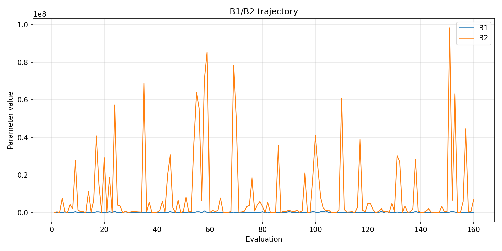
- [`rs_optimize_20260518T233821Z_job7101771_b1_ratio_heatmap.png`](plots/rs_optimize_20260518T233821Z_job7101771_b1_ratio_heatmap.png)
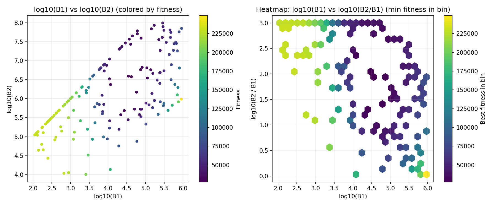
- [`rs_optimize_20260518T233821Z_job7101771_jump_plot.png`](plots/rs_optimize_20260518T233821Z_job7101771_jump_plot.png)
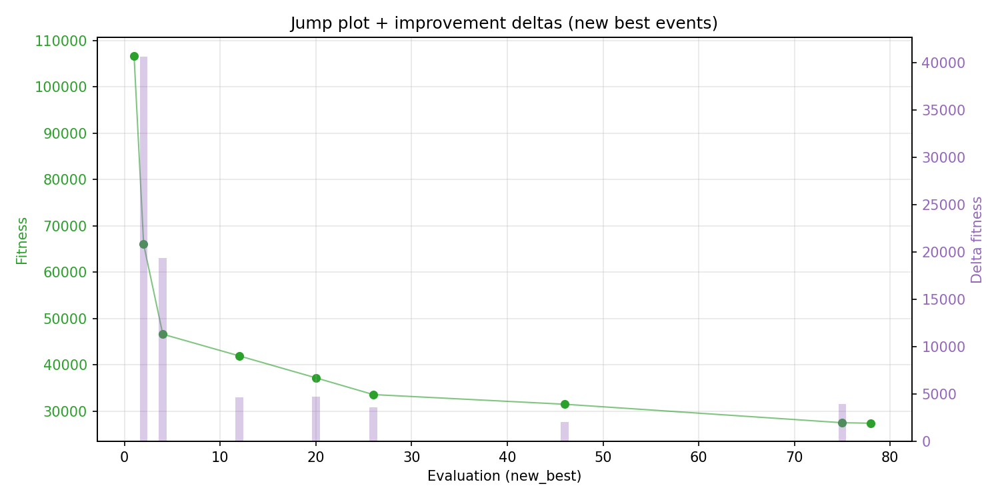
- [`rs_optimize_20260518T233821Z_job7101771_progress_by_phase.png`](plots/rs_optimize_20260518T233821Z_job7101771_progress_by_phase.png)
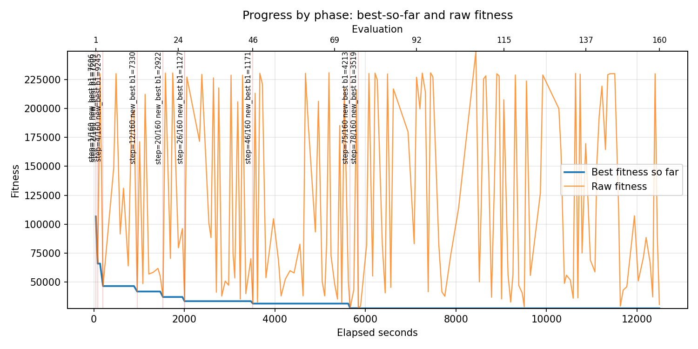
- [`rs_optimize_20260518T233821Z_job7101771_time_efficiency.png`](plots/rs_optimize_20260518T233821Z_job7101771_time_efficiency.png)
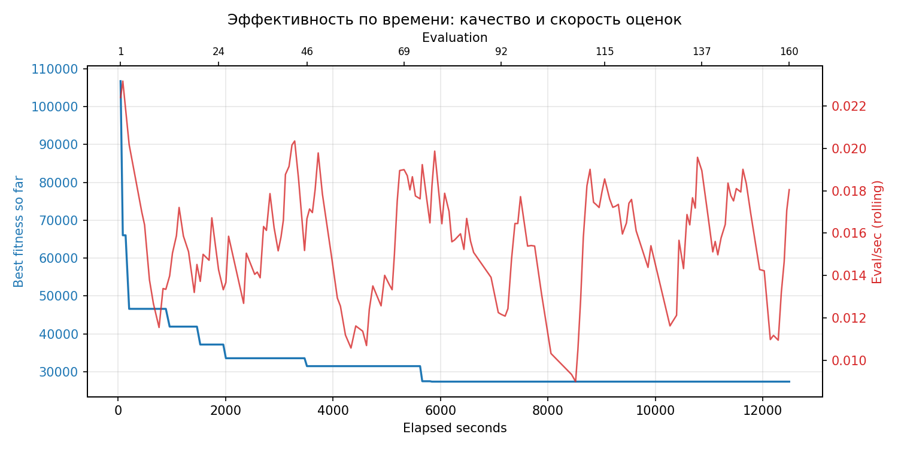

## Таблицы

## Validation runs

### Validation run `20260519T030706Z`
- validation file: [`rs_validate_20260519T030706Z_job7101772.json`](rs_validate_20260519T030706Z_job7101772.json)
- dataset: `data/numbers/20_dset_20260518T233806Z_job7101768/control.json`
- method: `rs`
- optimized params: `(B1, B2)=(35198, 3921020)`
- baseline params: `(B1, B2)=(11000, 1900000)`
- max_curves_per_n: `600`
- repeats_per_n: `80`
- curve_timeout_sec: `None`
- workers: `56`
- seed: `42`
- optimized_mean_score: `28737.693815577182`
- baseline_mean_score: `36227.17014271752`
- relative_improvement_pct: `20.67364438799781`
- optimized_mean_time_sec: `2.672935006557718`
- baseline_mean_time_sec: `3.145582639271752`
- time_improvement_pct: `15.025757925198196`
- optimized_mean_curves: `40.166875`
- baseline_mean_curves: `95.426875`
- curves_improvement_pct: `57.90821505996083`
- optimized_mean_success_rate: `1.0`
- baseline_mean_success_rate: `0.9981249999999999`
- success_rate_delta_pp: `0.1875000000000071`
- trace plots:
  - score_trace_plot: [`rs_validate_20260519T030706Z_job7101772_score_trace.png`](plots/rs_validate_20260519T030706Z_job7101772_score_trace.png)
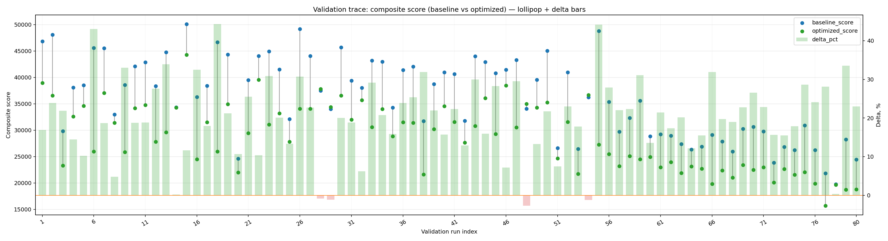
  - score_distribution_plot: [`rs_validate_20260519T030706Z_job7101772_score_distribution.png`](plots/rs_validate_20260519T030706Z_job7101772_score_distribution.png)
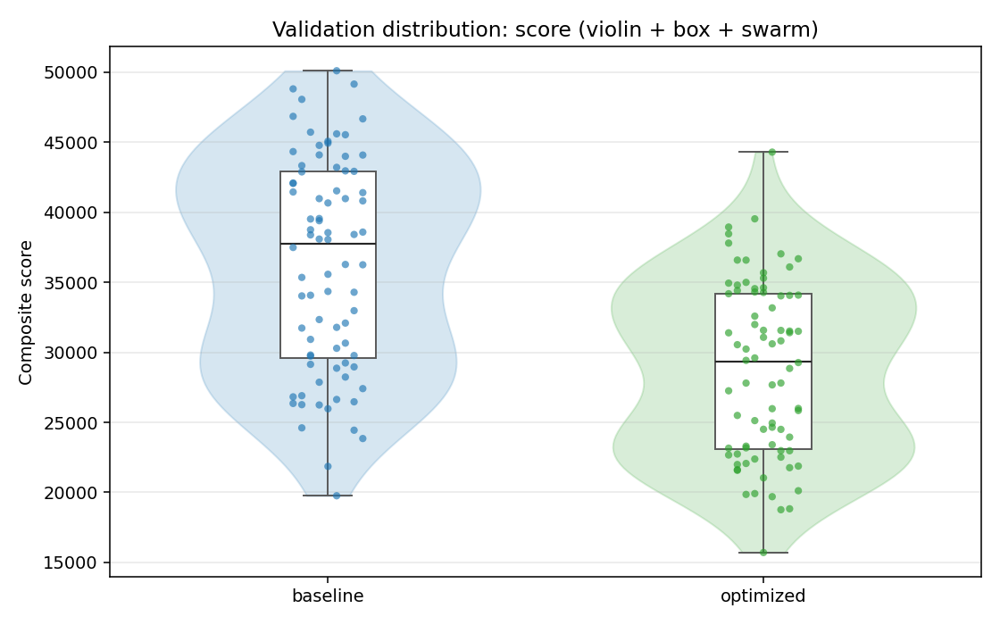
  - success_trace_plot: [`rs_validate_20260519T030706Z_job7101772_success_trace.png`](plots/rs_validate_20260519T030706Z_job7101772_success_trace.png)
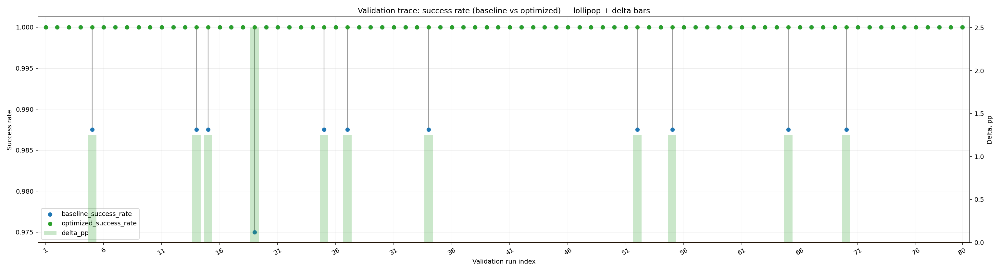
  - success_distribution_plot: [`rs_validate_20260519T030706Z_job7101772_success_distribution.png`](plots/rs_validate_20260519T030706Z_job7101772_success_distribution.png)
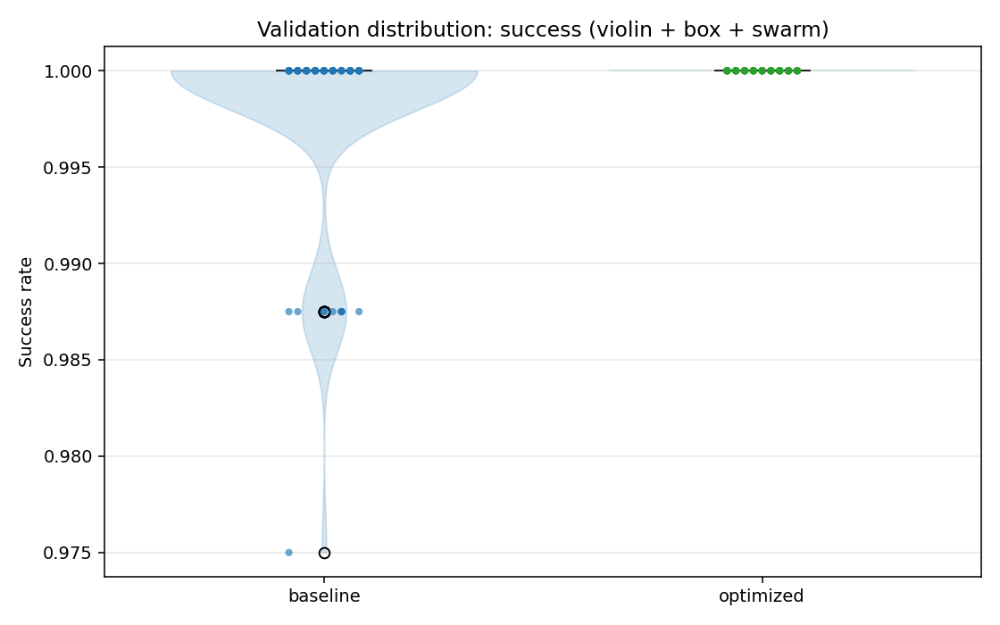
  - time_trace_plot: [`rs_validate_20260519T030706Z_job7101772_time_trace.png`](plots/rs_validate_20260519T030706Z_job7101772_time_trace.png)
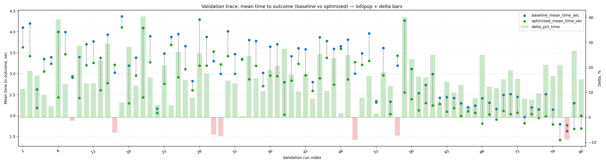
  - time_distribution_plot: [`rs_validate_20260519T030706Z_job7101772_time_distribution.png`](plots/rs_validate_20260519T030706Z_job7101772_time_distribution.png)
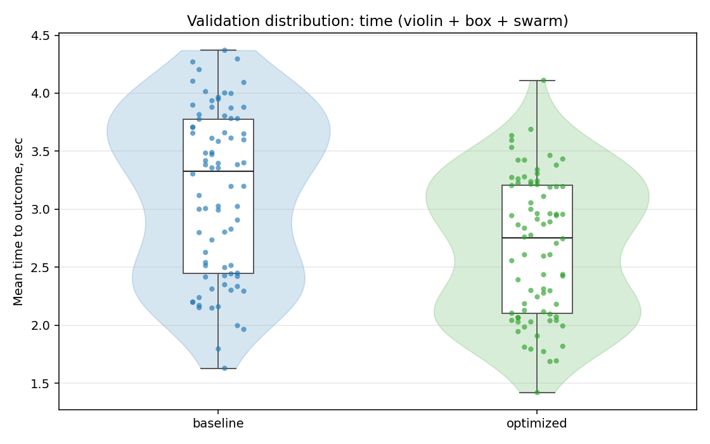
  - curves_trace_plot: [`rs_validate_20260519T030706Z_job7101772_curves_trace.png`](plots/rs_validate_20260519T030706Z_job7101772_curves_trace.png)
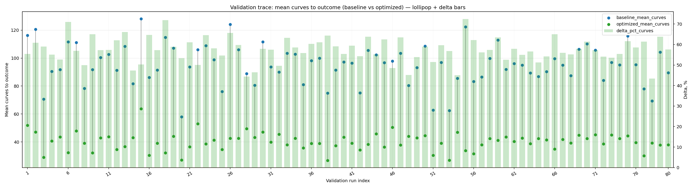
  - curves_distribution_plot: [`rs_validate_20260519T030706Z_job7101772_curves_distribution.png`](plots/rs_validate_20260519T030706Z_job7101772_curves_distribution.png)
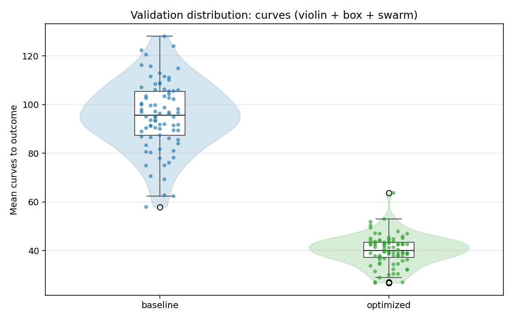

---
