# Отчёт по оптимизации: bo_optimize_20260519T115430Z_job7106005

## Метаданные
- метод: `bo`
- датасет: `data/numbers/20_dset_20260519T115357Z_job7105998/train.json`
- оптимум `(B1, B2)`: `(20510, 636495)`
- objective: `27463.64664638986`
- max_curves_per_n: `260`
- repeats_per_n: `8`
- границы: `B1[100.0, 1000000.0]`, `B2[10000.0, 100000000.0]`, `ratio_max=100000.0`

## Ключевые статистики
- `best_eval`: `123`
- `best_eval_fraction`: `0.5540540540540541`
- `eval_per_sec`: `0.012531897173293366`
- `evaluation_count`: `222`
- `improvement_percent`: `24.448630845611156`
- `max_plateau_evals`: `99`
- `median_plateau_evals`: `14.0`
- `new_best_count`: `5`
- `new_best_rate`: `0.02252252252252252`
- `p90_plateau_evals`: `94.5`
- `time_to_best_sec`: `13142.896497531037`
- `time_to_first_improvement_sec`: `53.75209118804196`
- `total_runtime_sec`: `17714.804634672997`

## Флаги внимания

| Флаг | Статус | Текущее значение | Порог | Что это значит | Что делать |
|---|---|---:|---:|---|---|
| `b1_hits_boundary` | ✅ ОК | `0.018018018018018018` | `> 0.10` | Большая доля оценок проходит близко к границам B1. | Расширить диапазон B1, если упор в границу повторяется. |
| `b2_hits_boundary` | ✅ ОК | `0.018018018018018018` | `> 0.10` | Большая доля оценок проходит близко к границам B2. | Расширить диапазон B2, если упор в границу повторяется. |
| `best_b1_on_boundary` | ✅ ОК | `20510.0` | `within 2% of log-range [100.0, 1000000.0]` | Лучший найденный B1 лежит на границе диапазона. | Проверить расширенный диапазон B1 вокруг текущей границы. |
| `best_b2_on_boundary` | ✅ ОК | `636495.0` | `within 2% of log-range [10000.0, 100000000.0]` | Лучший найденный B2 лежит на границе диапазона. | Проверить расширенный диапазон B2 вокруг текущей границы. |
| `best_ratio_on_boundary` | ✅ ОК | `31.03339834227206` | `within 2% of log-range up to ratio_max=100000.0` | Лучшее отношение B2/B1 находится у верхней границы ratio_max. | Увеличить ratio_max и перепроверить локальный поиск в новой области. |
| `late_best` | ✅ ОК | `0.7419159718988143` | `> 0.85` | Лучшее решение найдено слишком поздно относительно общего времени. | Усилить ранний поиск или пересмотреть бюджет/инициализацию. |
| `low_improvement` | ✅ ОК | `24.448630845611156` | `< 10%` | Итоговый прирост качества слишком мал. | Сузить границы поиска или изменить параметры метода. |
| `low_signal` | ⚠️ ВНИМАНИЕ | `0.02252252252252252` | `< 0.03` | Слишком низкая плотность новых best-событий (слабый сигнал оптимизации). | Перенастроить exploration и сделать переоценку top-k кандидатов. |
| `plateau_too_long` | ✅ ОК | `0.44594594594594594` | `> 0.50` | Слишком длинное плато: улучшений почти нет на большом участке запуска. | Увеличить exploration или добавить политику рестартов. |
| `ratio_hits_boundary` | ✅ ОК | `0.018018018018018018` | `> 0.10` | Большая доля оценок проходит близко к границе отношения B2/B1. | Увеличить ratio_max, если хорошие точки упираются в ограничение отношения B2/B1. |

## Графики
- [`bo_optimize_20260519T115430Z_job7106005_b1_b2_trajectory.png`](plots/bo_optimize_20260519T115430Z_job7106005_b1_b2_trajectory.png)
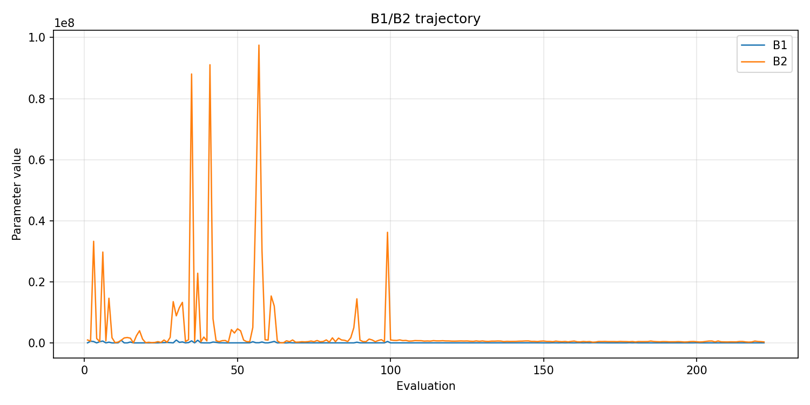
- [`bo_optimize_20260519T115430Z_job7106005_b1_ratio_heatmap.png`](plots/bo_optimize_20260519T115430Z_job7106005_b1_ratio_heatmap.png)
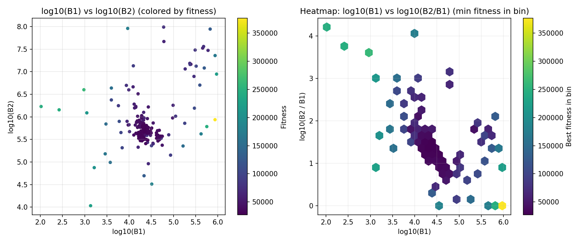
- [`bo_optimize_20260519T115430Z_job7106005_jump_plot.png`](plots/bo_optimize_20260519T115430Z_job7106005_jump_plot.png)
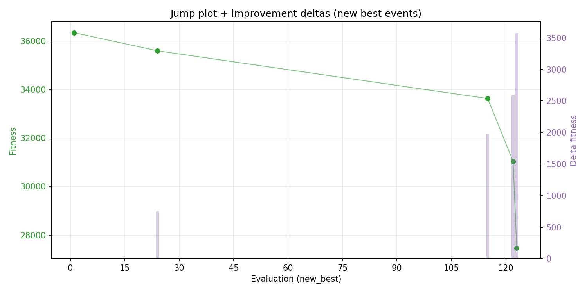
- [`bo_optimize_20260519T115430Z_job7106005_progress_by_phase.png`](plots/bo_optimize_20260519T115430Z_job7106005_progress_by_phase.png)
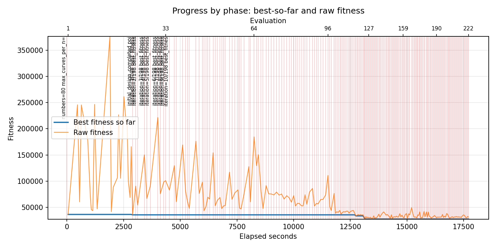
- [`bo_optimize_20260519T115430Z_job7106005_time_efficiency.png`](plots/bo_optimize_20260519T115430Z_job7106005_time_efficiency.png)
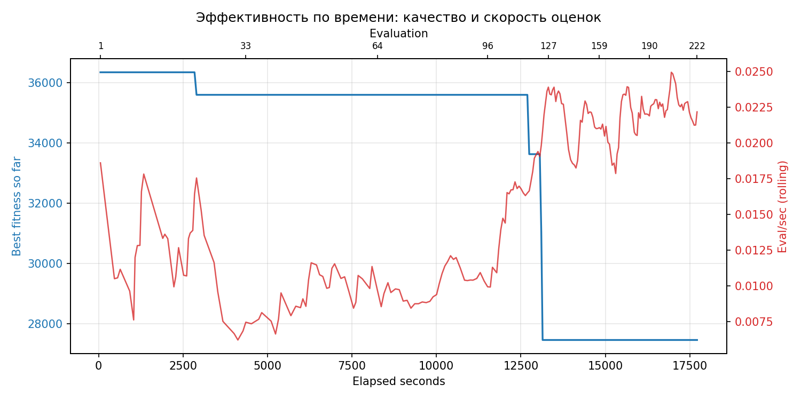

## Таблицы

## Validation runs

### Validation run `20260519T165016Z`
- validation file: [`bo_validate_20260519T165016Z_job7106006.json`](bo_validate_20260519T165016Z_job7106006.json)
- dataset: `data/numbers/20_dset_20260519T115357Z_job7105998/control.json`
- method: `bo`
- optimized params: `(B1, B2)=(20510, 636495)`
- baseline params: `(B1, B2)=(11000, 1900000)`
- max_curves_per_n: `600`
- repeats_per_n: `80`
- curve_timeout_sec: `None`
- workers: `56`
- seed: `1001`
- optimized_mean_score: `30325.187003824954`
- baseline_mean_score: `35138.36986640036`
- relative_improvement_pct: `13.697797822937188`
- optimized_mean_time_sec: `2.6163054191324955`
- baseline_mean_time_sec: `3.052885424140036`
- time_improvement_pct: `14.300569603935271`
- optimized_mean_curves: `83.24265625000001`
- baseline_mean_curves: `92.1903125`
- curves_improvement_pct: `9.705636099237644`
- optimized_mean_success_rate: `0.99875`
- baseline_mean_success_rate: `0.99765625`
- success_rate_delta_pp: `0.10937500000000044`
- trace plots:
  - score_trace_plot: [`bo_validate_20260519T165016Z_job7106006_score_trace.png`](plots/bo_validate_20260519T165016Z_job7106006_score_trace.png)
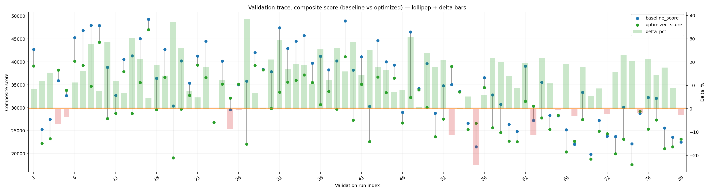
  - score_distribution_plot: [`bo_validate_20260519T165016Z_job7106006_score_distribution.png`](plots/bo_validate_20260519T165016Z_job7106006_score_distribution.png)
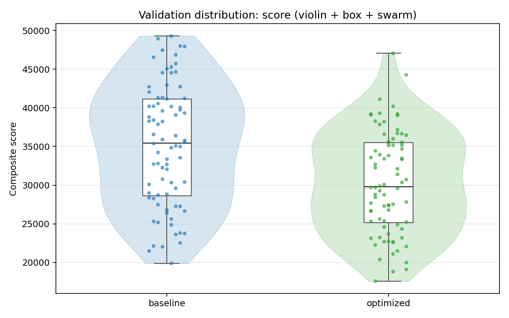
  - success_trace_plot: [`bo_validate_20260519T165016Z_job7106006_success_trace.png`](plots/bo_validate_20260519T165016Z_job7106006_success_trace.png)
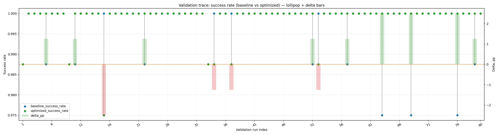
  - success_distribution_plot: [`bo_validate_20260519T165016Z_job7106006_success_distribution.png`](plots/bo_validate_20260519T165016Z_job7106006_success_distribution.png)
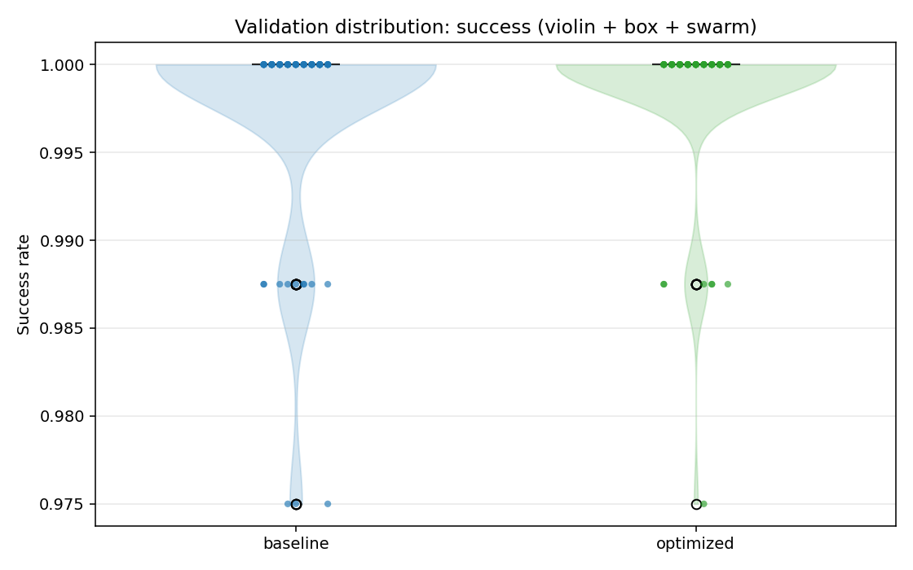
  - time_trace_plot: [`bo_validate_20260519T165016Z_job7106006_time_trace.png`](plots/bo_validate_20260519T165016Z_job7106006_time_trace.png)
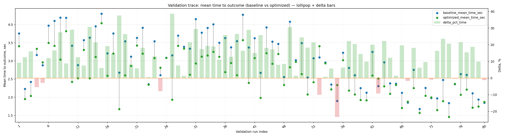
  - time_distribution_plot: [`bo_validate_20260519T165016Z_job7106006_time_distribution.png`](plots/bo_validate_20260519T165016Z_job7106006_time_distribution.png)
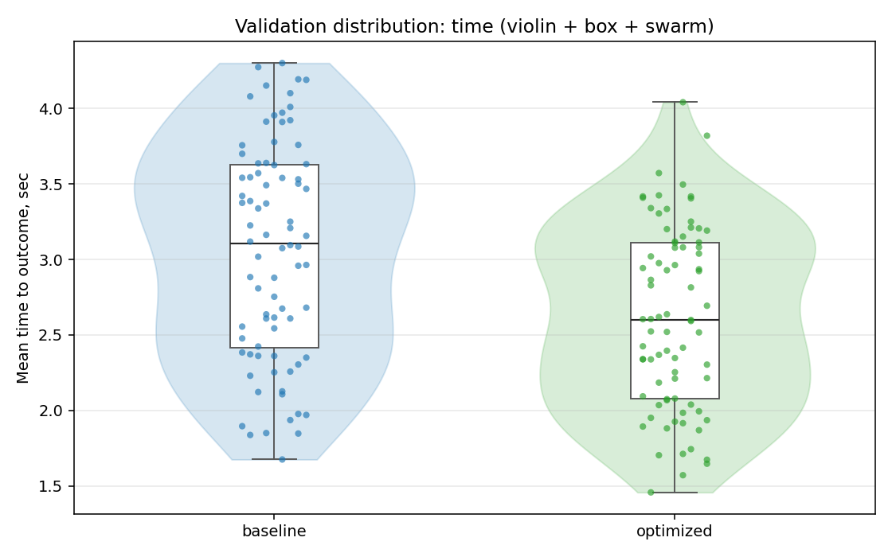
  - curves_trace_plot: [`bo_validate_20260519T165016Z_job7106006_curves_trace.png`](plots/bo_validate_20260519T165016Z_job7106006_curves_trace.png)
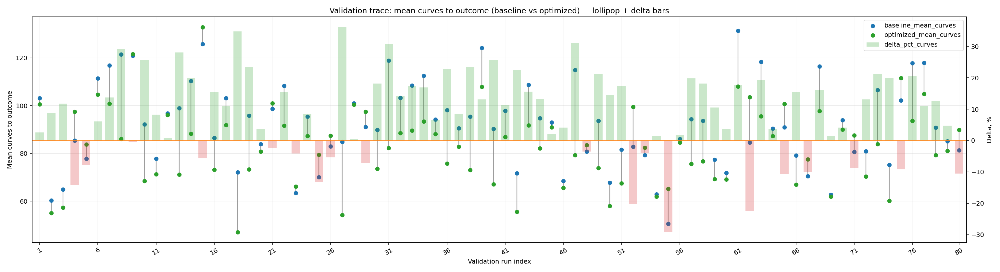
  - curves_distribution_plot: [`bo_validate_20260519T165016Z_job7106006_curves_distribution.png`](plots/bo_validate_20260519T165016Z_job7106006_curves_distribution.png)
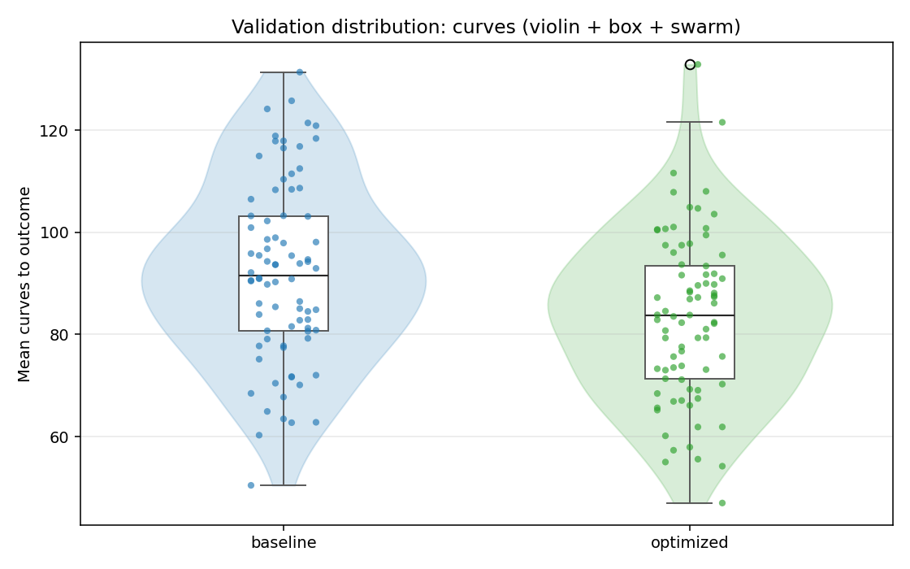

---
