# Отчёт по оптимизации: de_optimize_20260519T115430Z_job7105999

## Метаданные
- метод: `de`
- датасет: `data/numbers/20_dset_20260519T115357Z_job7105998/train.json`
- оптимум `(B1, B2)`: `(33716, 3003081)`
- objective: `25225.230302007258`
- max_curves_per_n: `260`
- repeats_per_n: `8`
- границы: `B1[100.0, 1000000.0]`, `B2[10000.0, 100000000.0]`, `ratio_max=100000.0`

## Ключевые статистики
- `best_eval`: `174`
- `best_eval_fraction`: `0.725`
- `eval_per_sec`: `0.012067118337759098`
- `evaluation_count`: `240`
- `improvement_percent`: `70.96212262157468`
- `max_plateau_evals`: `74`
- `median_plateau_evals`: `2.0`
- `new_best_count`: `12`
- `new_best_rate`: `0.05`
- `p90_plateau_evals`: `59.60000000000002`
- `time_to_best_sec`: `17039.390455671994`
- `time_to_first_improvement_sec`: `123.5356665099971`
- `total_runtime_sec`: `19888.765882269014`

## Флаги внимания

| Флаг | Статус | Текущее значение | Порог | Что это значит | Что делать |
|---|---|---:|---:|---|---|
| `b1_hits_boundary` | ✅ ОК | `0.008333333333333333` | `> 0.10` | Большая доля оценок проходит близко к границам B1. | Расширить диапазон B1, если упор в границу повторяется. |
| `b2_hits_boundary` | ✅ ОК | `0.004166666666666667` | `> 0.10` | Большая доля оценок проходит близко к границам B2. | Расширить диапазон B2, если упор в границу повторяется. |
| `best_b1_on_boundary` | ✅ ОК | `33716.0` | `within 2% of log-range [100.0, 1000000.0]` | Лучший найденный B1 лежит на границе диапазона. | Проверить расширенный диапазон B1 вокруг текущей границы. |
| `best_b2_on_boundary` | ✅ ОК | `3003081.0` | `within 2% of log-range [10000.0, 100000000.0]` | Лучший найденный B2 лежит на границе диапазона. | Проверить расширенный диапазон B2 вокруг текущей границы. |
| `best_ratio_on_boundary` | ✅ ОК | `89.06990746233242` | `within 2% of log-range up to ratio_max=100000.0` | Лучшее отношение B2/B1 находится у верхней границы ratio_max. | Увеличить ratio_max и перепроверить локальный поиск в новой области. |
| `late_best` | ⚠️ ВНИМАНИЕ | `0.856734427693311` | `> 0.85` | Лучшее решение найдено слишком поздно относительно общего времени. | Усилить ранний поиск или пересмотреть бюджет/инициализацию. |
| `low_improvement` | ✅ ОК | `70.96212262157468` | `< 10%` | Итоговый прирост качества слишком мал. | Сузить границы поиска или изменить параметры метода. |
| `low_signal` | ✅ ОК | `0.05` | `< 0.03` | Слишком низкая плотность новых best-событий (слабый сигнал оптимизации). | Перенастроить exploration и сделать переоценку top-k кандидатов. |
| `plateau_too_long` | ✅ ОК | `0.30833333333333335` | `> 0.50` | Слишком длинное плато: улучшений почти нет на большом участке запуска. | Увеличить exploration или добавить политику рестартов. |
| `ratio_hits_boundary` | ✅ ОК | `0.03333333333333333` | `> 0.10` | Большая доля оценок проходит близко к границе отношения B2/B1. | Увеличить ratio_max, если хорошие точки упираются в ограничение отношения B2/B1. |

## Графики
- [`de_optimize_20260519T115430Z_job7105999_b1_b2_trajectory.png`](plots/de_optimize_20260519T115430Z_job7105999_b1_b2_trajectory.png)
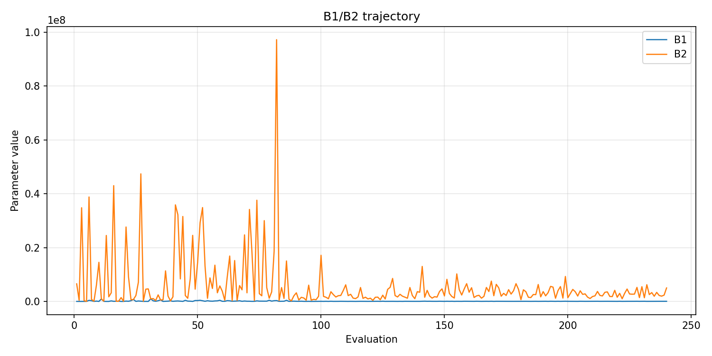
- [`de_optimize_20260519T115430Z_job7105999_b1_ratio_heatmap.png`](plots/de_optimize_20260519T115430Z_job7105999_b1_ratio_heatmap.png)
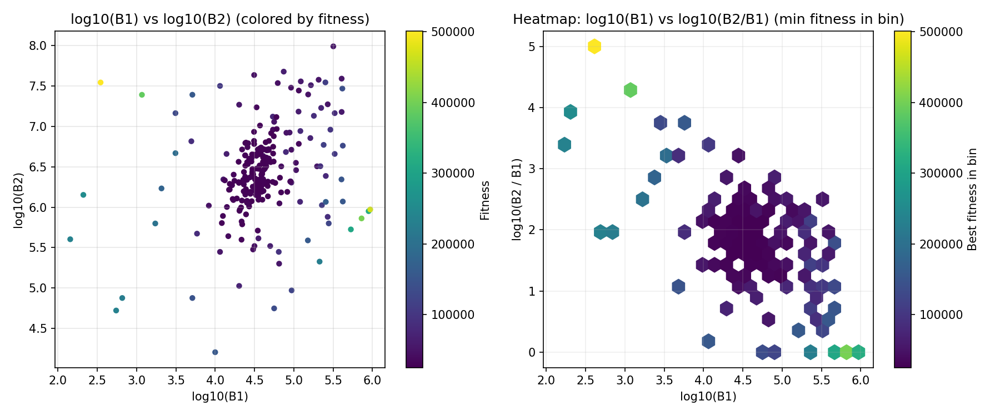
- [`de_optimize_20260519T115430Z_job7105999_jump_plot.png`](plots/de_optimize_20260519T115430Z_job7105999_jump_plot.png)
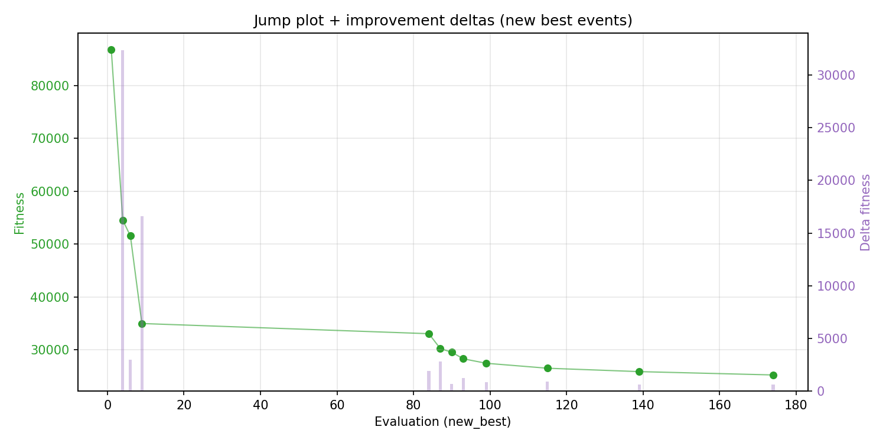
- [`de_optimize_20260519T115430Z_job7105999_progress_by_phase.png`](plots/de_optimize_20260519T115430Z_job7105999_progress_by_phase.png)
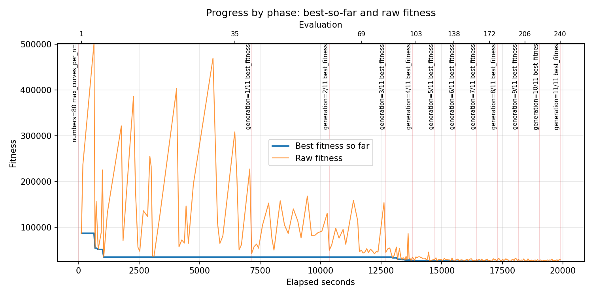
- [`de_optimize_20260519T115430Z_job7105999_time_efficiency.png`](plots/de_optimize_20260519T115430Z_job7105999_time_efficiency.png)
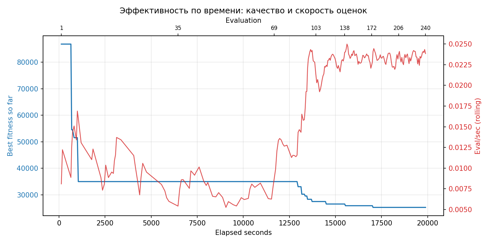

## Таблицы

## Validation runs

### Validation run `20260519T174715Z`
- validation file: [`de_validate_20260519T174715Z_job7106000.json`](de_validate_20260519T174715Z_job7106000.json)
- dataset: `data/numbers/20_dset_20260519T115357Z_job7105998/control.json`
- method: `de`
- optimized params: `(B1, B2)=(33716, 3003081)`
- baseline params: `(B1, B2)=(11000, 1900000)`
- max_curves_per_n: `600`
- repeats_per_n: `80`
- curve_timeout_sec: `None`
- workers: `56`
- seed: `1001`
- optimized_mean_score: `27545.18398847141`
- baseline_mean_score: `35475.726199091965`
- relative_improvement_pct: `22.354841071085797`
- optimized_mean_time_sec: `2.529383242597141`
- baseline_mean_time_sec: `3.0815226199091965`
- time_improvement_pct: `17.91774539459085`
- optimized_mean_curves: `45.02703125`
- baseline_mean_curves: `93.21000000000001`
- curves_improvement_pct: `51.69291787361872`
- optimized_mean_success_rate: `1.0`
- baseline_mean_success_rate: `0.99875`
- success_rate_delta_pp: `0.12499999999999734`
- trace plots:
  - score_trace_plot: [`de_validate_20260519T174715Z_job7106000_score_trace.png`](plots/de_validate_20260519T174715Z_job7106000_score_trace.png)
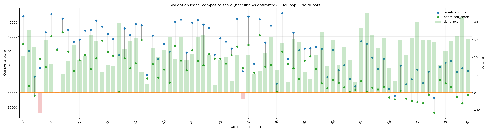
  - score_distribution_plot: [`de_validate_20260519T174715Z_job7106000_score_distribution.png`](plots/de_validate_20260519T174715Z_job7106000_score_distribution.png)
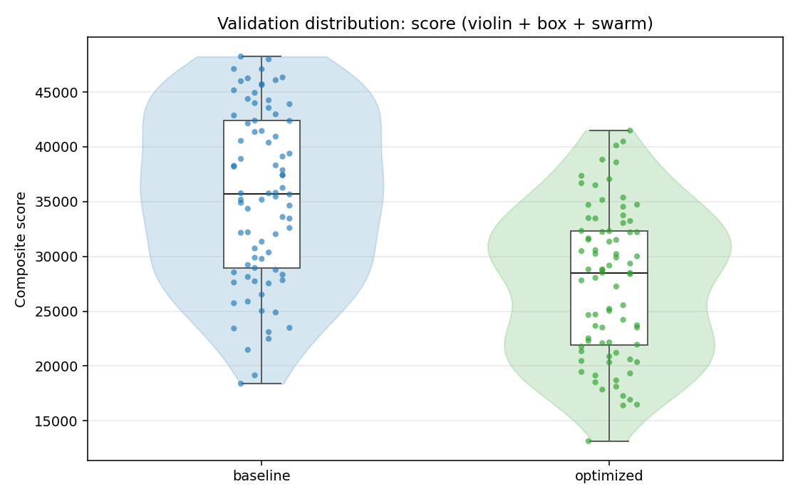
  - success_trace_plot: [`de_validate_20260519T174715Z_job7106000_success_trace.png`](plots/de_validate_20260519T174715Z_job7106000_success_trace.png)
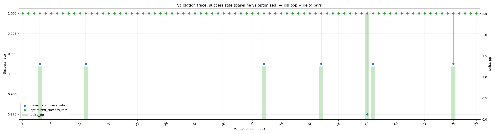
  - success_distribution_plot: [`de_validate_20260519T174715Z_job7106000_success_distribution.png`](plots/de_validate_20260519T174715Z_job7106000_success_distribution.png)
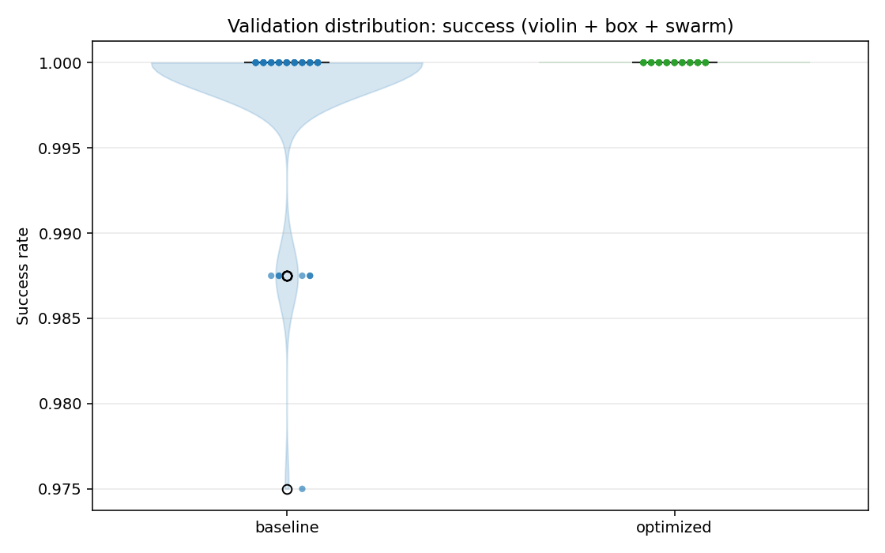
  - time_trace_plot: [`de_validate_20260519T174715Z_job7106000_time_trace.png`](plots/de_validate_20260519T174715Z_job7106000_time_trace.png)
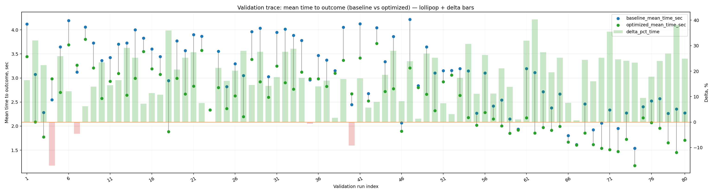
  - time_distribution_plot: [`de_validate_20260519T174715Z_job7106000_time_distribution.png`](plots/de_validate_20260519T174715Z_job7106000_time_distribution.png)
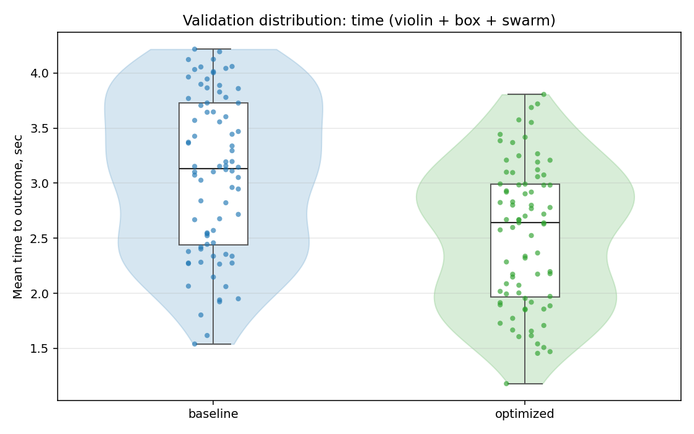
  - curves_trace_plot: [`de_validate_20260519T174715Z_job7106000_curves_trace.png`](plots/de_validate_20260519T174715Z_job7106000_curves_trace.png)
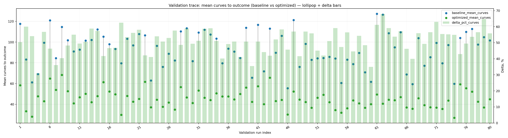
  - curves_distribution_plot: [`de_validate_20260519T174715Z_job7106000_curves_distribution.png`](plots/de_validate_20260519T174715Z_job7106000_curves_distribution.png)
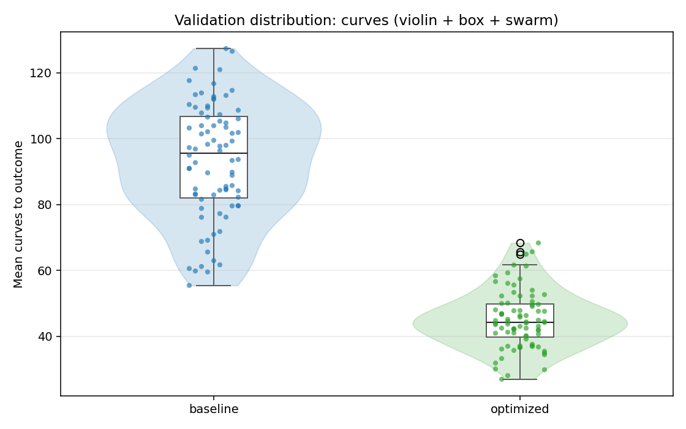

---
