# Отчёт по оптимизации: rs_optimize_20260519T115430Z_job7106001

## Метаданные
- метод: `rs`
- датасет: `data/numbers/20_dset_20260519T115357Z_job7105998/train.json`
- оптимум `(B1, B2)`: `(22985, 1273334)`
- objective: `27835.611381022536`
- max_curves_per_n: `260`
- repeats_per_n: `8`
- границы: `B1[100.0, 1000000.0]`, `B2[10000.0, 100000000.0]`, `ratio_max=100000.0`

## Ключевые статистики
- `best_eval`: `181`
- `best_eval_fraction`: `0.861904761904762`
- `eval_per_sec`: `0.008231163482991681`
- `evaluation_count`: `210`
- `improvement_percent`: `38.66207644934001`
- `max_plateau_evals`: `175`
- `median_plateau_evals`: `1.0`
- `new_best_count`: `4`
- `new_best_rate`: `0.01904761904761905`
- `p90_plateau_evals`: `116.60000000000001`
- `time_to_best_sec`: `23079.225203525042`
- `time_to_first_improvement_sec`: `70.15022597403731`
- `total_runtime_sec`: `25512.796633663005`

## Флаги внимания

| Флаг | Статус | Текущее значение | Порог | Что это значит | Что делать |
|---|---|---:|---:|---|---|
| `b1_hits_boundary` | ✅ ОК | `0.05238095238095238` | `> 0.10` | Большая доля оценок проходит близко к границам B1. | Расширить диапазон B1, если упор в границу повторяется. |
| `b2_hits_boundary` | ✅ ОК | `0.023809523809523808` | `> 0.10` | Большая доля оценок проходит близко к границам B2. | Расширить диапазон B2, если упор в границу повторяется. |
| `best_b1_on_boundary` | ✅ ОК | `22985.0` | `within 2% of log-range [100.0, 1000000.0]` | Лучший найденный B1 лежит на границе диапазона. | Проверить расширенный диапазон B1 вокруг текущей границы. |
| `best_b2_on_boundary` | ✅ ОК | `1273334.0` | `within 2% of log-range [10000.0, 100000000.0]` | Лучший найденный B2 лежит на границе диапазона. | Проверить расширенный диапазон B2 вокруг текущей границы. |
| `best_ratio_on_boundary` | ✅ ОК | `55.398477267783335` | `within 2% of log-range up to ratio_max=100000.0` | Лучшее отношение B2/B1 находится у верхней границы ratio_max. | Увеличить ratio_max и перепроверить локальный поиск в новой области. |
| `late_best` | ⚠️ ВНИМАНИЕ | `0.9046136938618884` | `> 0.85` | Лучшее решение найдено слишком поздно относительно общего времени. | Усилить ранний поиск или пересмотреть бюджет/инициализацию. |
| `low_improvement` | ✅ ОК | `38.66207644934001` | `< 10%` | Итоговый прирост качества слишком мал. | Сузить границы поиска или изменить параметры метода. |
| `low_signal` | ⚠️ ВНИМАНИЕ | `0.01904761904761905` | `< 0.03` | Слишком низкая плотность новых best-событий (слабый сигнал оптимизации). | Перенастроить exploration и сделать переоценку top-k кандидатов. |
| `plateau_too_long` | ⚠️ ВНИМАНИЕ | `0.8333333333333334` | `> 0.50` | Слишком длинное плато: улучшений почти нет на большом участке запуска. | Увеличить exploration или добавить политику рестартов. |
| `ratio_hits_boundary` | ✅ ОК | `0.07142857142857142` | `> 0.10` | Большая доля оценок проходит близко к границе отношения B2/B1. | Увеличить ratio_max, если хорошие точки упираются в ограничение отношения B2/B1. |

## Графики
- [`rs_optimize_20260519T115430Z_job7106001_b1_b2_trajectory.png`](plots/rs_optimize_20260519T115430Z_job7106001_b1_b2_trajectory.png)
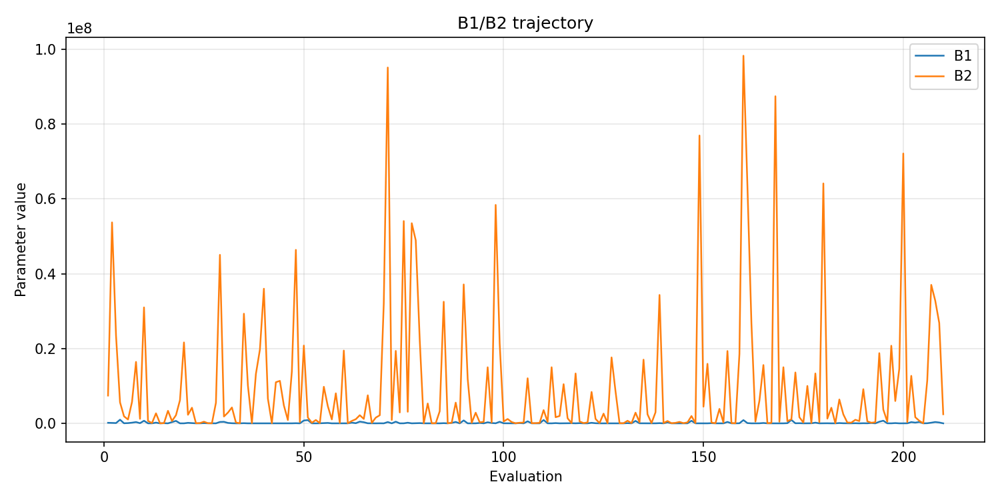
- [`rs_optimize_20260519T115430Z_job7106001_b1_ratio_heatmap.png`](plots/rs_optimize_20260519T115430Z_job7106001_b1_ratio_heatmap.png)
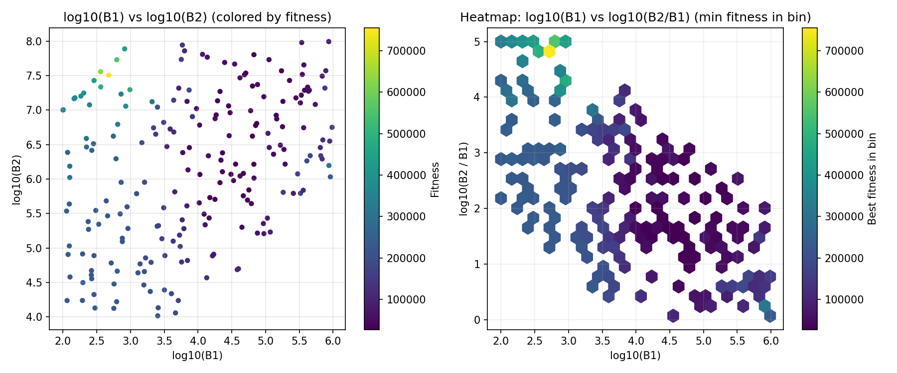
- [`rs_optimize_20260519T115430Z_job7106001_jump_plot.png`](plots/rs_optimize_20260519T115430Z_job7106001_jump_plot.png)
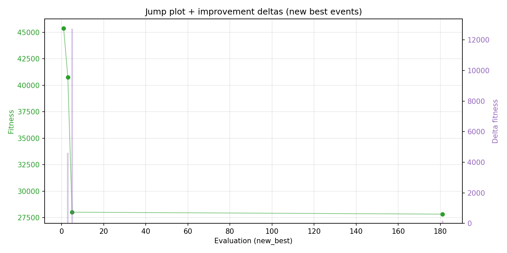
- [`rs_optimize_20260519T115430Z_job7106001_progress_by_phase.png`](plots/rs_optimize_20260519T115430Z_job7106001_progress_by_phase.png)
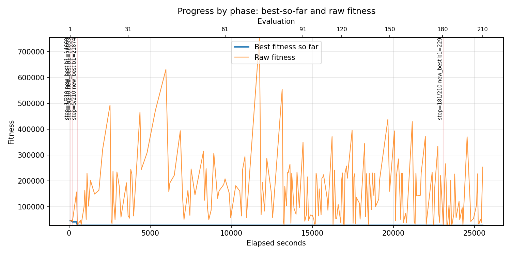
- [`rs_optimize_20260519T115430Z_job7106001_time_efficiency.png`](plots/rs_optimize_20260519T115430Z_job7106001_time_efficiency.png)
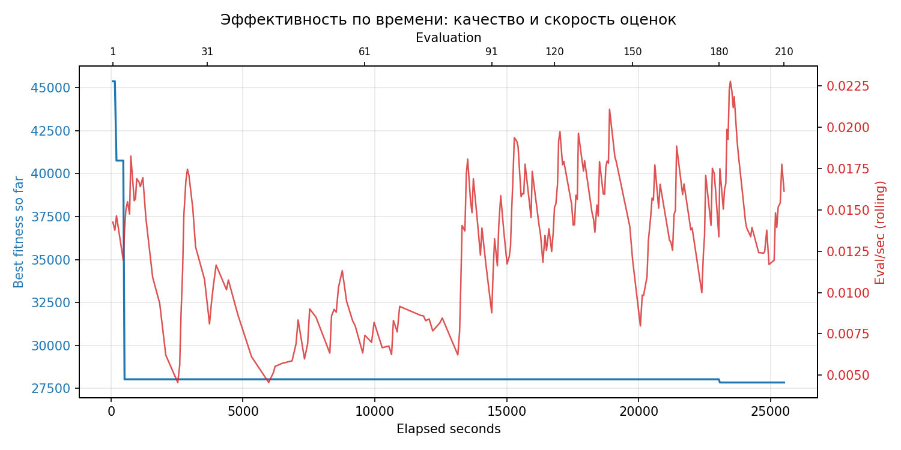

## Таблицы

## Validation runs

### Validation run `20260519T190012Z`
- validation file: [`rs_validate_20260519T190012Z_job7106002.json`](rs_validate_20260519T190012Z_job7106002.json)
- dataset: `data/numbers/20_dset_20260519T115357Z_job7105998/control.json`
- method: `rs`
- optimized params: `(B1, B2)=(22985, 1273334)`
- baseline params: `(B1, B2)=(11000, 1900000)`
- max_curves_per_n: `600`
- repeats_per_n: `80`
- curve_timeout_sec: `None`
- workers: `56`
- seed: `1001`
- optimized_mean_score: `28430.764812674788`
- baseline_mean_score: `35223.87242969287`
- relative_improvement_pct: `19.28552185900962`
- optimized_mean_time_sec: `2.5312678875174788`
- baseline_mean_time_sec: `3.060627086719287`
- time_improvement_pct: `17.295775806821112`
- optimized_mean_curves: `62.36171875`
- baseline_mean_curves: `92.35203125000001`
- curves_improvement_pct: `32.47390673932795`
- optimized_mean_success_rate: `1.0`
- baseline_mean_success_rate: `0.9978125`
- success_rate_delta_pp: `0.2187500000000009`
- trace plots:
  - score_trace_plot: [`rs_validate_20260519T190012Z_job7106002_score_trace.png`](plots/rs_validate_20260519T190012Z_job7106002_score_trace.png)
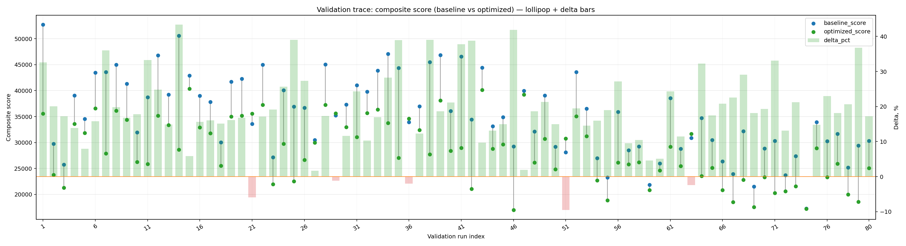
  - score_distribution_plot: [`rs_validate_20260519T190012Z_job7106002_score_distribution.png`](plots/rs_validate_20260519T190012Z_job7106002_score_distribution.png)
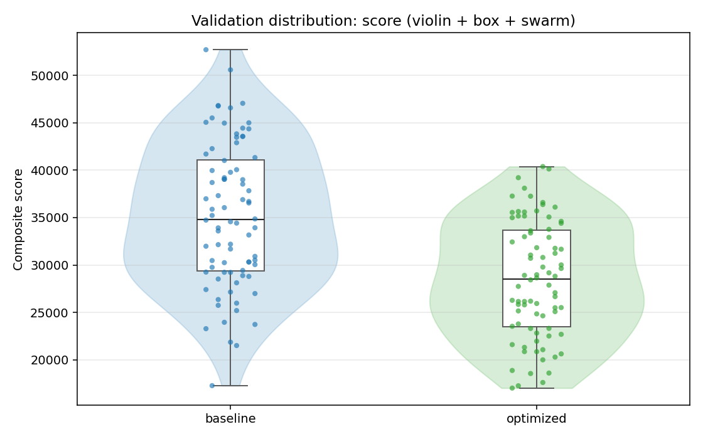
  - success_trace_plot: [`rs_validate_20260519T190012Z_job7106002_success_trace.png`](plots/rs_validate_20260519T190012Z_job7106002_success_trace.png)
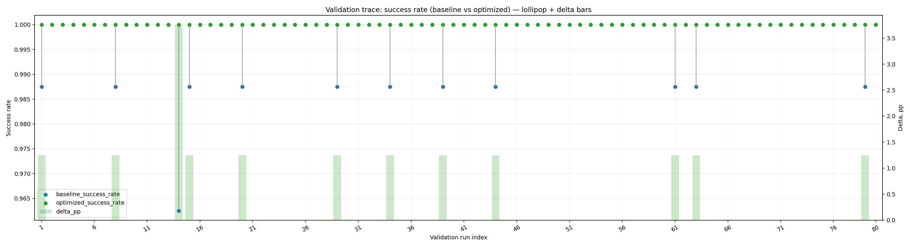
  - success_distribution_plot: [`rs_validate_20260519T190012Z_job7106002_success_distribution.png`](plots/rs_validate_20260519T190012Z_job7106002_success_distribution.png)
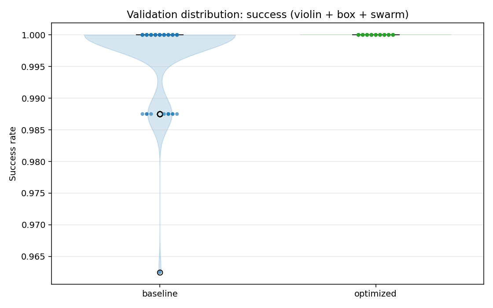
  - time_trace_plot: [`rs_validate_20260519T190012Z_job7106002_time_trace.png`](plots/rs_validate_20260519T190012Z_job7106002_time_trace.png)
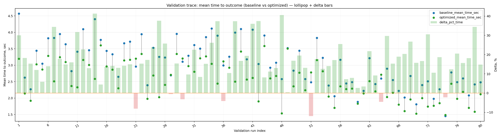
  - time_distribution_plot: [`rs_validate_20260519T190012Z_job7106002_time_distribution.png`](plots/rs_validate_20260519T190012Z_job7106002_time_distribution.png)
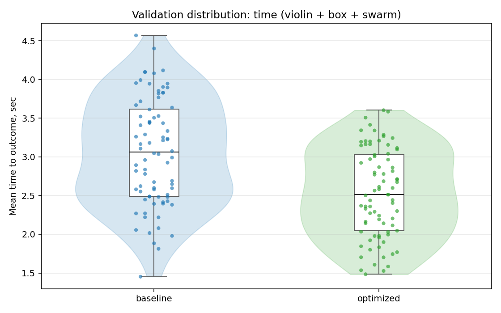
  - curves_trace_plot: [`rs_validate_20260519T190012Z_job7106002_curves_trace.png`](plots/rs_validate_20260519T190012Z_job7106002_curves_trace.png)
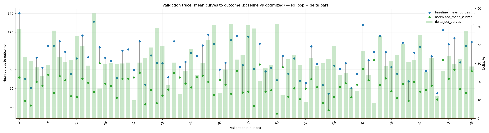
  - curves_distribution_plot: [`rs_validate_20260519T190012Z_job7106002_curves_distribution.png`](plots/rs_validate_20260519T190012Z_job7106002_curves_distribution.png)
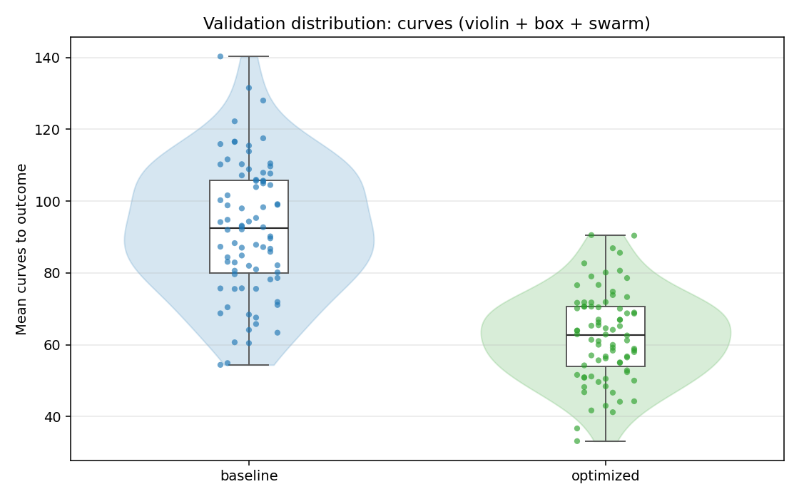

---
