# Отчёт по оптимизации: bo_optimize_20260522T000059Z_job7144095

## Метаданные
- метод: `bo`
- датасет: `data/numbers/25_dset_20260522T000030Z_job7144088/train.json`
- оптимум `(B1, B2)`: `(102179, 6015312)`
- objective: `225405.95694181934`
- max_curves_per_n: `500`
- repeats_per_n: `8`
- границы: `B1[5000.0, 500000.0]`, `B2[500000.0, 130000000.0]`, `ratio_max=1000000000.0`

## Ключевые статистики
- `best_eval`: `114`
- `best_eval_fraction`: `0.6627906976744186`
- `eval_per_sec`: `0.0024305583687496742`
- `evaluation_count`: `172`
- `improvement_percent`: `70.14387681117502`
- `max_plateau_evals`: `58`
- `median_plateau_evals`: `5.5`
- `new_best_count`: `11`
- `new_best_rate`: `0.06395348837209303`
- `p90_plateau_evals`: `38.00000000000001`
- `time_to_best_sec`: `48467.23390021699`
- `time_to_first_improvement_sec`: `895.0690359399887`
- `total_runtime_sec`: `70765.640918625`

## Флаги внимания

| Флаг | Статус | Текущее значение | Порог | Что это значит | Что делать |
|---|---|---:|---:|---|---|
| `b1_hits_boundary` | ✅ ОК | `0.01744186046511628` | `> 0.10` | Большая доля оценок проходит близко к границам B1. | Расширить диапазон B1, если упор в границу повторяется. |
| `b2_hits_boundary` | ✅ ОК | `0.029069767441860465` | `> 0.10` | Большая доля оценок проходит близко к границам B2. | Расширить диапазон B2, если упор в границу повторяется. |
| `best_b1_on_boundary` | ✅ ОК | `102179.0` | `within 2% of log-range [5000.0, 500000.0]` | Лучший найденный B1 лежит на границе диапазона. | Проверить расширенный диапазон B1 вокруг текущей границы. |
| `best_b2_on_boundary` | ✅ ОК | `6015312.0` | `within 2% of log-range [500000.0, 130000000.0]` | Лучший найденный B2 лежит на границе диапазона. | Проверить расширенный диапазон B2 вокруг текущей границы. |
| `best_ratio_on_boundary` | ✅ ОК | `58.87033539181241` | `within 2% of log-range up to ratio_max=1000000000.0` | Лучшее отношение B2/B1 находится у верхней границы ratio_max. | Увеличить ratio_max и перепроверить локальный поиск в новой области. |
| `late_best` | ✅ ОК | `0.6848978299504213` | `> 0.85` | Лучшее решение найдено слишком поздно относительно общего времени. | Усилить ранний поиск или пересмотреть бюджет/инициализацию. |
| `low_improvement` | ✅ ОК | `70.14387681117502` | `< 10%` | Итоговый прирост качества слишком мал. | Сузить границы поиска или изменить параметры метода. |
| `low_signal` | ✅ ОК | `0.06395348837209303` | `< 0.03` | Слишком низкая плотность новых best-событий (слабый сигнал оптимизации). | Перенастроить exploration и сделать переоценку top-k кандидатов. |
| `plateau_too_long` | ✅ ОК | `0.3372093023255814` | `> 0.50` | Слишком длинное плато: улучшений почти нет на большом участке запуска. | Увеличить exploration или добавить политику рестартов. |
| `ratio_hits_boundary` | ✅ ОК | `0.005813953488372093` | `> 0.10` | Большая доля оценок проходит близко к границе отношения B2/B1. | Увеличить ratio_max, если хорошие точки упираются в ограничение отношения B2/B1. |

## Графики
- [`bo_optimize_20260522T000059Z_job7144095_b1_b2_trajectory.png`](plots/bo_optimize_20260522T000059Z_job7144095_b1_b2_trajectory.png)
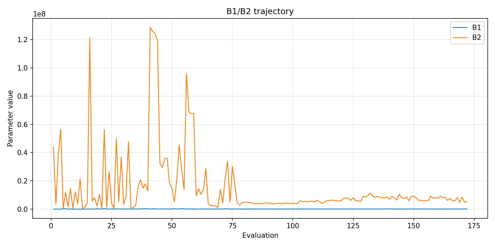
- [`bo_optimize_20260522T000059Z_job7144095_b1_ratio_heatmap.png`](plots/bo_optimize_20260522T000059Z_job7144095_b1_ratio_heatmap.png)
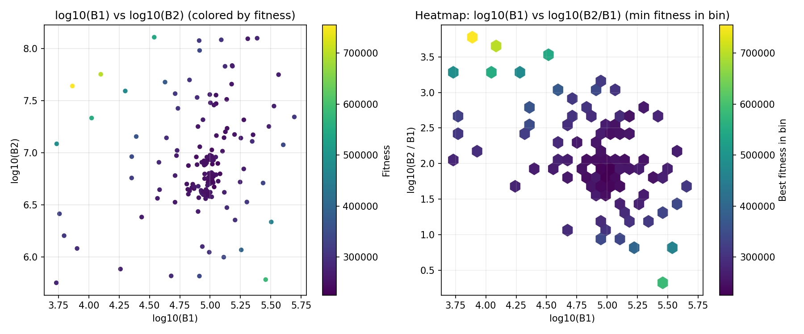
- [`bo_optimize_20260522T000059Z_job7144095_jump_plot.png`](plots/bo_optimize_20260522T000059Z_job7144095_jump_plot.png)
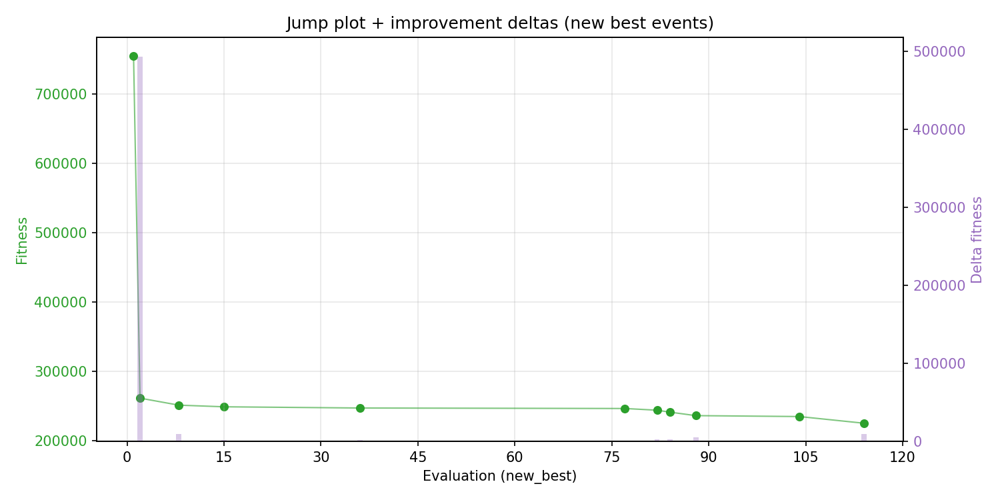
- [`bo_optimize_20260522T000059Z_job7144095_progress_by_phase.png`](plots/bo_optimize_20260522T000059Z_job7144095_progress_by_phase.png)
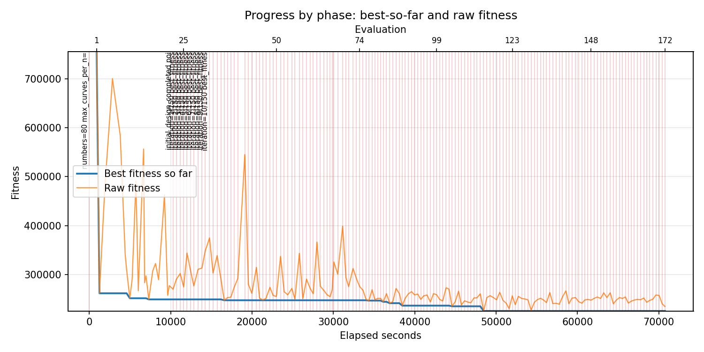
- [`bo_optimize_20260522T000059Z_job7144095_time_efficiency.png`](plots/bo_optimize_20260522T000059Z_job7144095_time_efficiency.png)
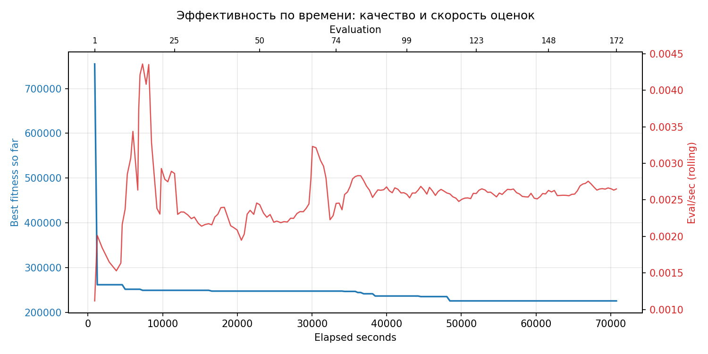

## Таблицы

## Validation runs

### Validation run `20260522T194045Z`
- validation file: [`bo_validate_20260522T194045Z_job7144096.json`](bo_validate_20260522T194045Z_job7144096.json)
- dataset: `data/numbers/25_dset_20260522T000030Z_job7144088/control.json`
- method: `bo`
- optimized params: `(B1, B2)=(102179, 6015312)`
- baseline params: `(B1, B2)=(50000, 13000000)`
- max_curves_per_n: `1000`
- repeats_per_n: `80`
- curve_timeout_sec: `None`
- workers: `56`
- seed: `666`
- optimized_mean_score: `260217.33361303684`
- baseline_mean_score: `324026.75782391406`
- relative_improvement_pct: `19.69264039778875`
- optimized_mean_time_sec: `25.078566173803683`
- baseline_mean_time_sec: `31.096188282391402`
- time_improvement_pct: `19.351639030289995`
- optimized_mean_curves: `188.63343749999999`
- baseline_mean_curves: `261.2975`
- curves_improvement_pct: `27.808939044575638`
- optimized_mean_success_rate: `0.994375`
- baseline_mean_success_rate: `0.9776562500000001`
- success_rate_delta_pp: `1.6718749999999893`
- trace plots:
  - score_trace_plot: [`bo_validate_20260522T194045Z_job7144096_score_trace.png`](plots/bo_validate_20260522T194045Z_job7144096_score_trace.png)
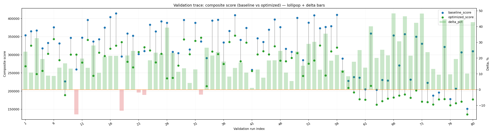
  - score_distribution_plot: [`bo_validate_20260522T194045Z_job7144096_score_distribution.png`](plots/bo_validate_20260522T194045Z_job7144096_score_distribution.png)
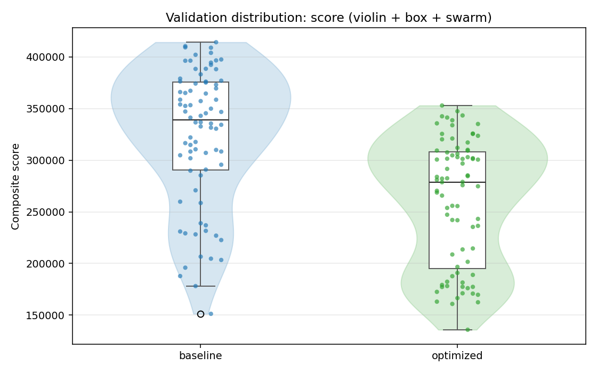
  - success_trace_plot: [`bo_validate_20260522T194045Z_job7144096_success_trace.png`](plots/bo_validate_20260522T194045Z_job7144096_success_trace.png)
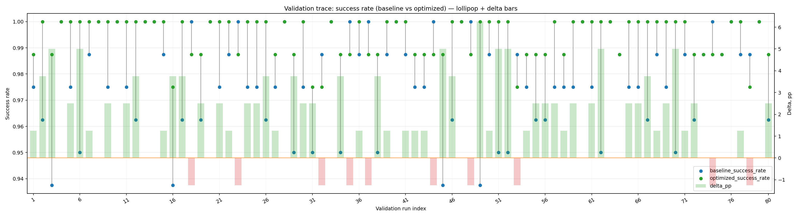
  - success_distribution_plot: [`bo_validate_20260522T194045Z_job7144096_success_distribution.png`](plots/bo_validate_20260522T194045Z_job7144096_success_distribution.png)
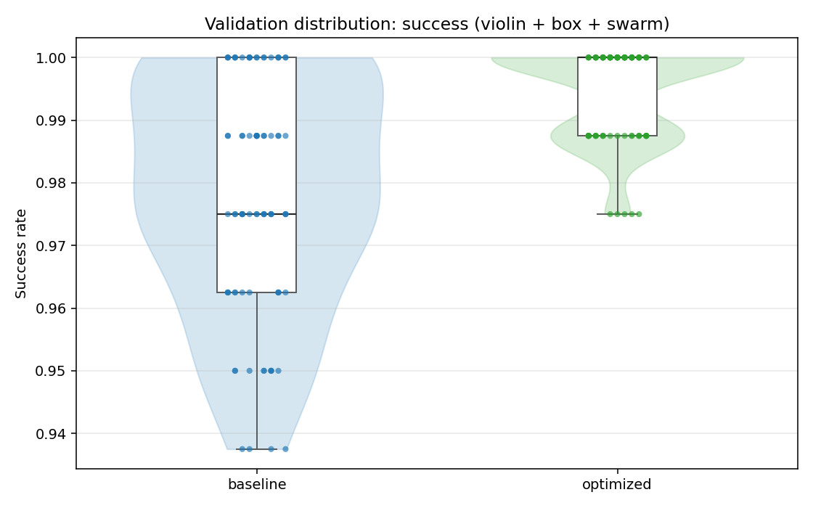
  - time_trace_plot: [`bo_validate_20260522T194045Z_job7144096_time_trace.png`](plots/bo_validate_20260522T194045Z_job7144096_time_trace.png)
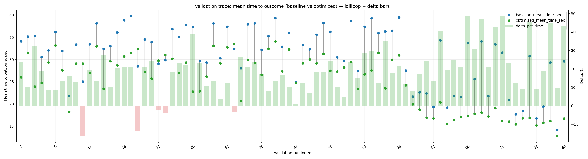
  - time_distribution_plot: [`bo_validate_20260522T194045Z_job7144096_time_distribution.png`](plots/bo_validate_20260522T194045Z_job7144096_time_distribution.png)
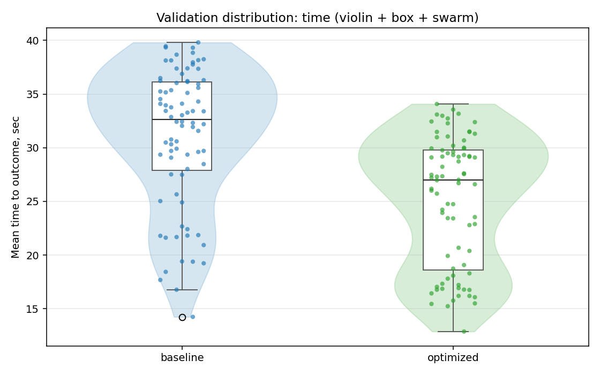
  - curves_trace_plot: [`bo_validate_20260522T194045Z_job7144096_curves_trace.png`](plots/bo_validate_20260522T194045Z_job7144096_curves_trace.png)
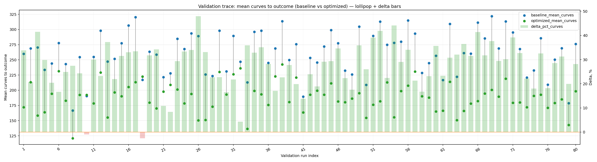
  - curves_distribution_plot: [`bo_validate_20260522T194045Z_job7144096_curves_distribution.png`](plots/bo_validate_20260522T194045Z_job7144096_curves_distribution.png)
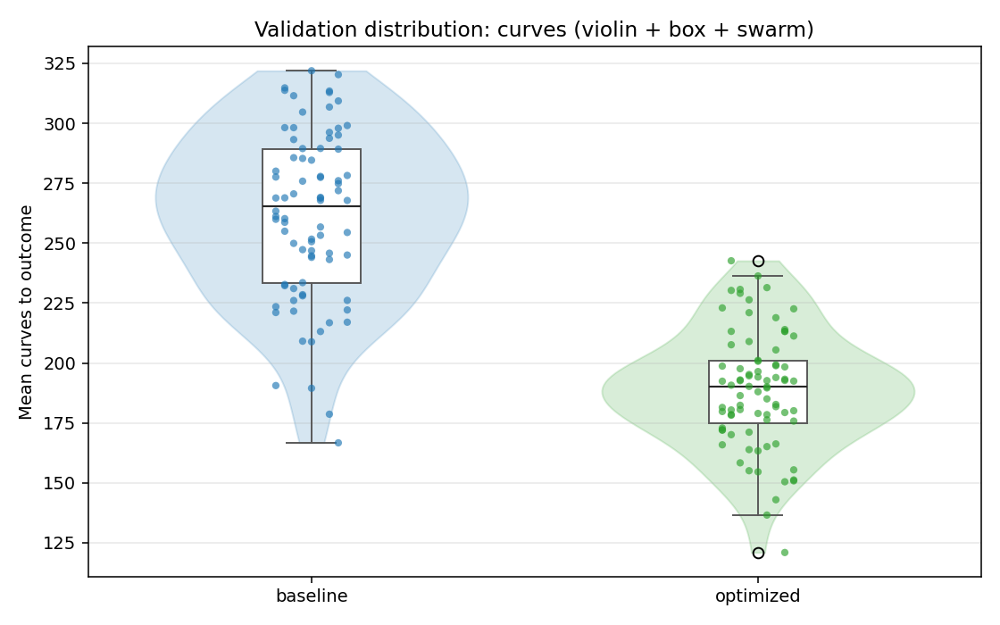

---
