# Отчёт по оптимизации: bo_optimize_20260523T054456Z_job7163004

## Метаданные
- метод: `bo`
- датасет: `data/numbers/25_dset_20260523T054447Z_job7162997/train.json`
- оптимум `(B1, B2)`: `(138544, 74611457)`
- objective: `138847.83595924973`
- max_curves_per_n: `320`
- repeats_per_n: `3`
- границы: `B1[5000.0, 500000.0]`, `B2[500000.0, 130000000.0]`, `ratio_max=1000000000.0`

## Ключевые статистики
- `best_eval`: `43`
- `best_eval_fraction`: `0.7818181818181819`
- `eval_per_sec`: `0.009166198454362262`
- `evaluation_count`: `55`
- `improvement_percent`: `27.182263389805293`
- `max_plateau_evals`: `17`
- `median_plateau_evals`: `8.5`
- `new_best_count`: `5`
- `new_best_rate`: `0.09090909090909091`
- `p90_plateau_evals`: `14.5`
- `time_to_best_sec`: `4667.137637712003`
- `time_to_first_improvement_sec`: `109.16807739100477`
- `total_runtime_sec`: `6000.311483194004`

## Флаги внимания

| Флаг | Статус | Текущее значение | Порог | Что это значит | Что делать |
|---|---|---:|---:|---|---|
| `b1_hits_boundary` | ✅ ОК | `0.0` | `> 0.10` | Большая доля оценок проходит близко к границам B1. | Расширить диапазон B1, если упор в границу повторяется. |
| `b2_hits_boundary` | ✅ ОК | `0.03636363636363636` | `> 0.10` | Большая доля оценок проходит близко к границам B2. | Расширить диапазон B2, если упор в границу повторяется. |
| `best_b1_on_boundary` | ✅ ОК | `138544.0` | `within 2% of log-range [5000.0, 500000.0]` | Лучший найденный B1 лежит на границе диапазона. | Проверить расширенный диапазон B1 вокруг текущей границы. |
| `best_b2_on_boundary` | ✅ ОК | `74611457.0` | `within 2% of log-range [500000.0, 130000000.0]` | Лучший найденный B2 лежит на границе диапазона. | Проверить расширенный диапазон B2 вокруг текущей границы. |
| `best_ratio_on_boundary` | ✅ ОК | `538.5397924125188` | `within 2% of log-range up to ratio_max=1000000000.0` | Лучшее отношение B2/B1 находится у верхней границы ratio_max. | Увеличить ratio_max и перепроверить локальный поиск в новой области. |
| `late_best` | ✅ ОК | `0.7778158935221904` | `> 0.85` | Лучшее решение найдено слишком поздно относительно общего времени. | Усилить ранний поиск или пересмотреть бюджет/инициализацию. |
| `low_improvement` | ✅ ОК | `27.182263389805293` | `< 10%` | Итоговый прирост качества слишком мал. | Сузить границы поиска или изменить параметры метода. |
| `low_signal` | ✅ ОК | `0.09090909090909091` | `< 0.03` | Слишком низкая плотность новых best-событий (слабый сигнал оптимизации). | Перенастроить exploration и сделать переоценку top-k кандидатов. |
| `plateau_too_long` | ✅ ОК | `0.3090909090909091` | `> 0.50` | Слишком длинное плато: улучшений почти нет на большом участке запуска. | Увеличить exploration или добавить политику рестартов. |
| `ratio_hits_boundary` | ✅ ОК | `0.01818181818181818` | `> 0.10` | Большая доля оценок проходит близко к границе отношения B2/B1. | Увеличить ratio_max, если хорошие точки упираются в ограничение отношения B2/B1. |

## Графики
- [`bo_optimize_20260523T054456Z_job7163004_b1_b2_trajectory.png`](plots/bo_optimize_20260523T054456Z_job7163004_b1_b2_trajectory.png)
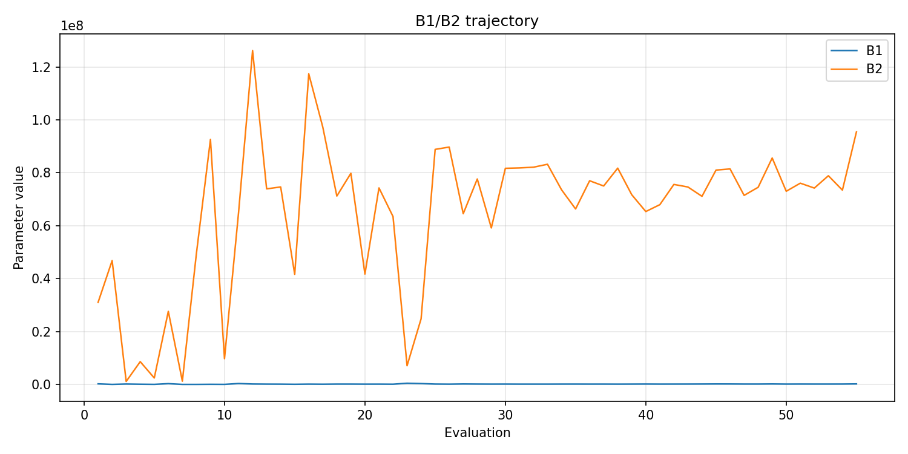
- [`bo_optimize_20260523T054456Z_job7163004_b1_ratio_heatmap.png`](plots/bo_optimize_20260523T054456Z_job7163004_b1_ratio_heatmap.png)
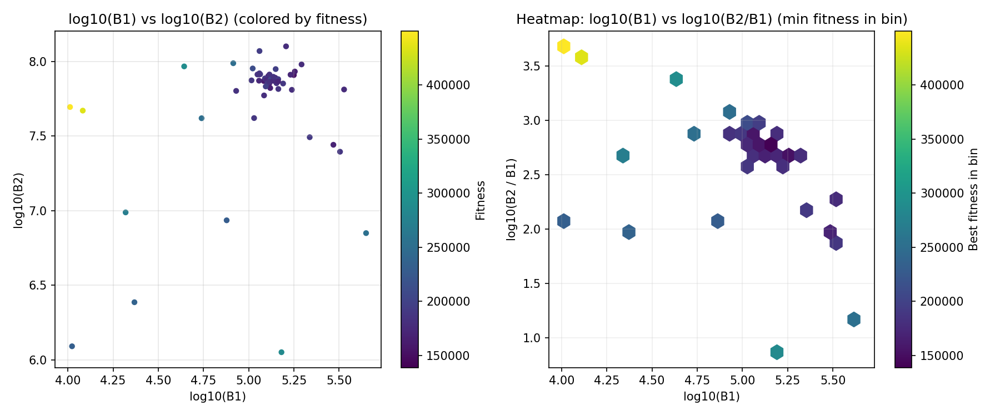
- [`bo_optimize_20260523T054456Z_job7163004_jump_plot.png`](plots/bo_optimize_20260523T054456Z_job7163004_jump_plot.png)
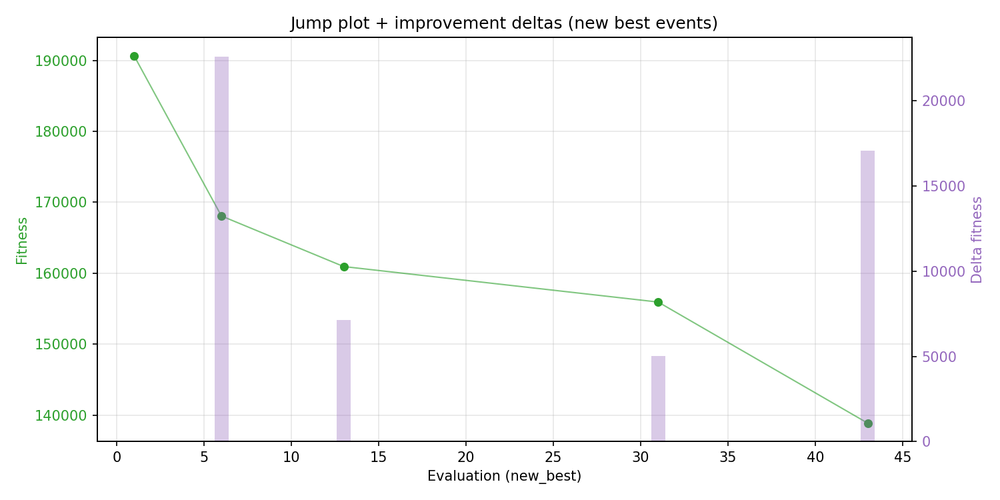
- [`bo_optimize_20260523T054456Z_job7163004_progress_by_phase.png`](plots/bo_optimize_20260523T054456Z_job7163004_progress_by_phase.png)
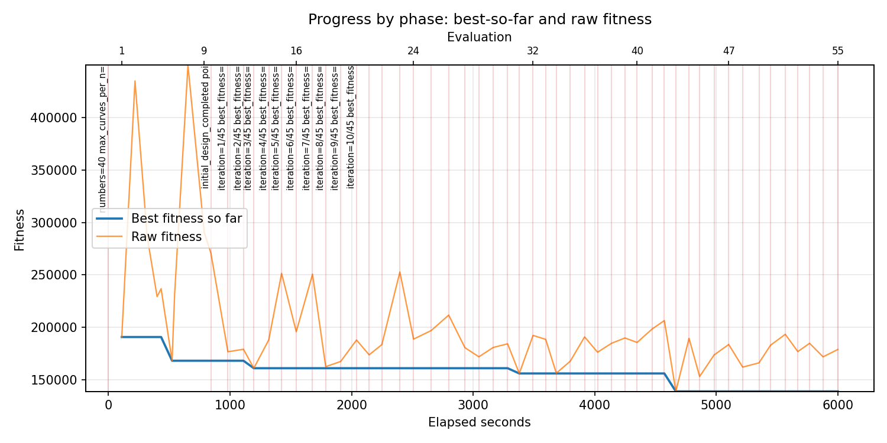
- [`bo_optimize_20260523T054456Z_job7163004_time_efficiency.png`](plots/bo_optimize_20260523T054456Z_job7163004_time_efficiency.png)
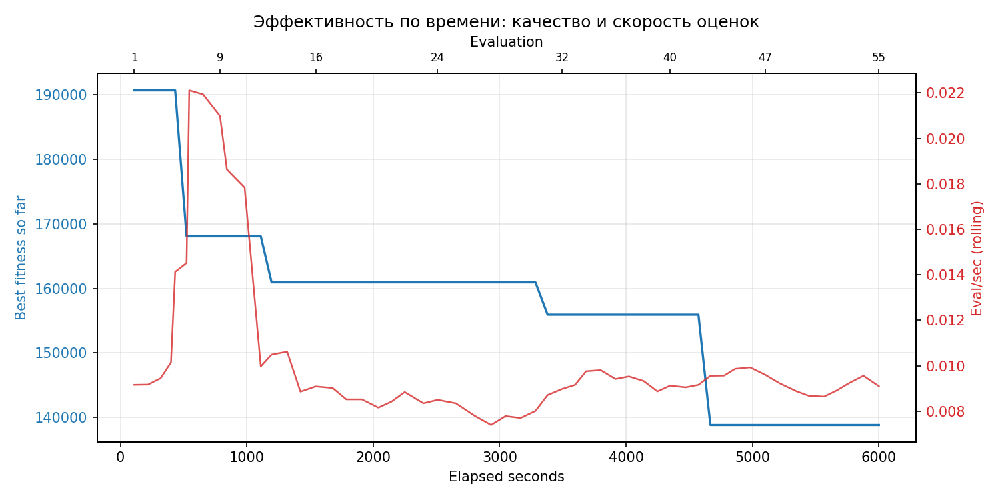

## Таблицы

## Validation runs

### Validation run `20260523T072518Z`
- validation file: [`bo_validate_20260523T072518Z_job7163005.json`](bo_validate_20260523T072518Z_job7163005.json)
- dataset: `data/numbers/25_dset_20260523T054447Z_job7162997/control.json`
- method: `bo`
- optimized params: `(B1, B2)=(138544, 74611457)`
- baseline params: `(B1, B2)=(50000, 13000000)`
- max_curves_per_n: `700`
- repeats_per_n: `30`
- curve_timeout_sec: `None`
- workers: `56`
- seed: `1729`
- optimized_mean_score: `211465.73095492748`
- baseline_mean_score: `231096.25386827867`
- relative_improvement_pct: `8.494522340695443`
- optimized_mean_time_sec: `20.70062309549275`
- baseline_mean_time_sec: `21.774875386827865`
- time_improvement_pct: `4.933448629446368`
- optimized_mean_curves: `89.19`
- baseline_mean_curves: `236.95`
- curves_improvement_pct: `62.35914749947247`
- optimized_mean_success_rate: `1.0`
- baseline_mean_success_rate: `0.9408333333333333`
- success_rate_delta_pp: `5.91666666666667`
- trace plots:
  - score_trace_plot: [`bo_validate_20260523T072518Z_job7163005_score_trace.png`](plots/bo_validate_20260523T072518Z_job7163005_score_trace.png)
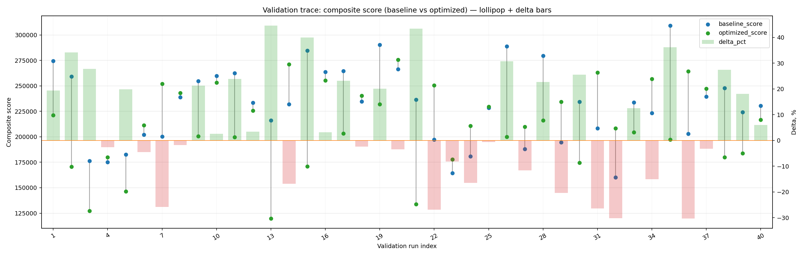
  - score_distribution_plot: [`bo_validate_20260523T072518Z_job7163005_score_distribution.png`](plots/bo_validate_20260523T072518Z_job7163005_score_distribution.png)
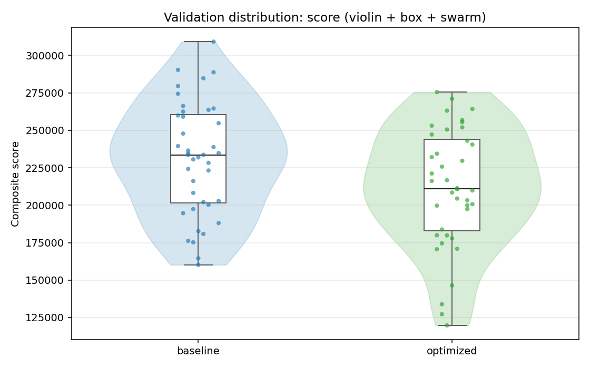
  - success_trace_plot: [`bo_validate_20260523T072518Z_job7163005_success_trace.png`](plots/bo_validate_20260523T072518Z_job7163005_success_trace.png)
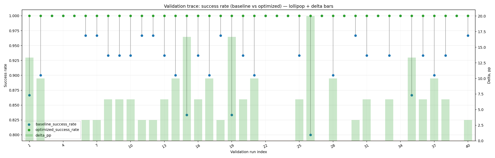
  - success_distribution_plot: [`bo_validate_20260523T072518Z_job7163005_success_distribution.png`](plots/bo_validate_20260523T072518Z_job7163005_success_distribution.png)
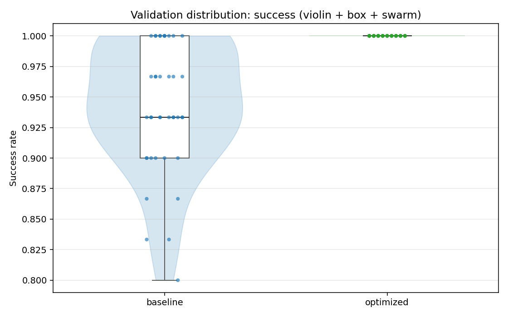
  - time_trace_plot: [`bo_validate_20260523T072518Z_job7163005_time_trace.png`](plots/bo_validate_20260523T072518Z_job7163005_time_trace.png)
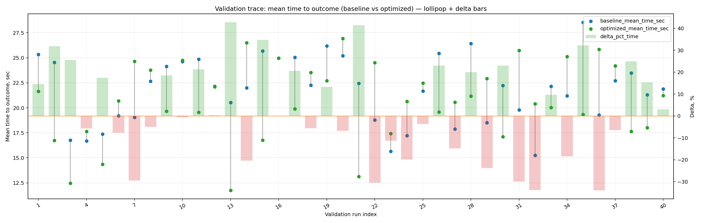
  - time_distribution_plot: [`bo_validate_20260523T072518Z_job7163005_time_distribution.png`](plots/bo_validate_20260523T072518Z_job7163005_time_distribution.png)
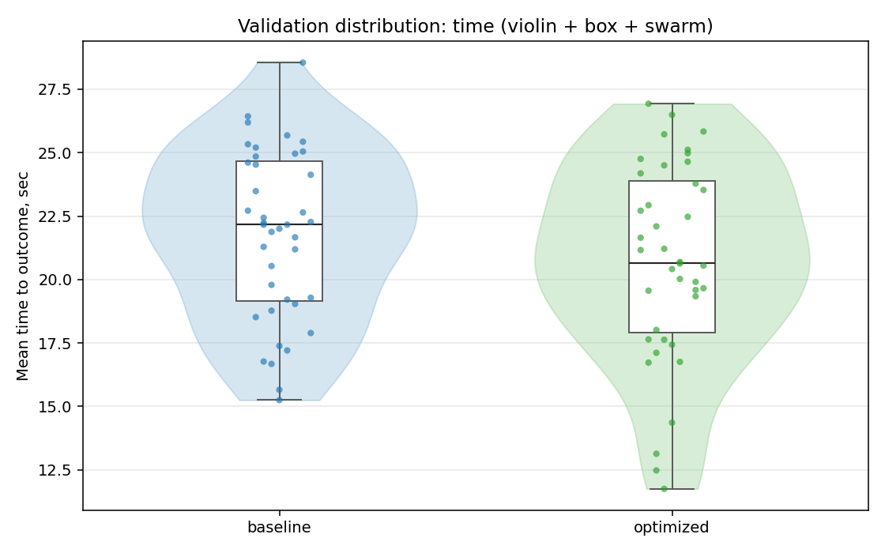
  - curves_trace_plot: [`bo_validate_20260523T072518Z_job7163005_curves_trace.png`](plots/bo_validate_20260523T072518Z_job7163005_curves_trace.png)
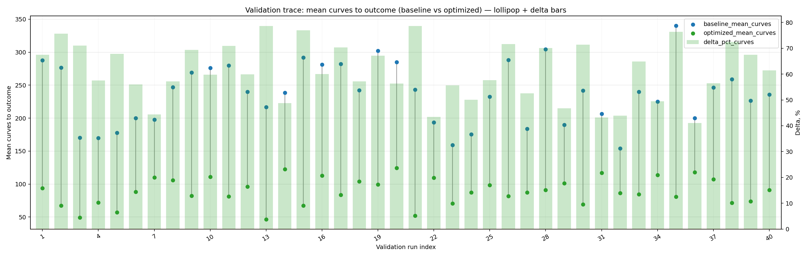
  - curves_distribution_plot: [`bo_validate_20260523T072518Z_job7163005_curves_distribution.png`](plots/bo_validate_20260523T072518Z_job7163005_curves_distribution.png)
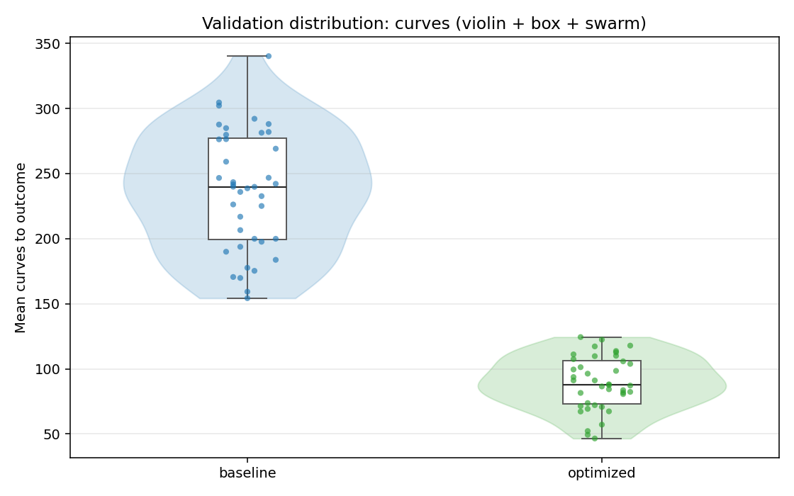

---
