# Отчёт по оптимизации: de_optimize_20260523T054456Z_job7162998

## Метаданные
- метод: `de`
- датасет: `data/numbers/25_dset_20260523T054447Z_job7162997/train.json`
- оптимум `(B1, B2)`: `(64522, 4539104)`
- objective: `145806.6701035873`
- max_curves_per_n: `320`
- repeats_per_n: `3`
- границы: `B1[5000.0, 500000.0]`, `B2[500000.0, 130000000.0]`, `ratio_max=1000000000.0`

## Ключевые статистики
- `best_eval`: `22`
- `best_eval_fraction`: `0.275`
- `eval_per_sec`: `0.01373344975202527`
- `evaluation_count`: `80`
- `improvement_percent`: `38.00761091754766`
- `max_plateau_evals`: `58`
- `median_plateau_evals`: `3.0`
- `new_best_count`: `6`
- `new_best_rate`: `0.075`
- `p90_plateau_evals`: `28.000000000000018`
- `time_to_best_sec`: `1710.2974826029968`
- `time_to_first_improvement_sec`: `17.265582588035613`
- `total_runtime_sec`: `5825.198109686025`

## Флаги внимания

| Флаг | Статус | Текущее значение | Порог | Что это значит | Что делать |
|---|---|---:|---:|---|---|
| `b1_hits_boundary` | ✅ ОК | `0.0` | `> 0.10` | Большая доля оценок проходит близко к границам B1. | Расширить диапазон B1, если упор в границу повторяется. |
| `b2_hits_boundary` | ✅ ОК | `0.0` | `> 0.10` | Большая доля оценок проходит близко к границам B2. | Расширить диапазон B2, если упор в границу повторяется. |
| `best_b1_on_boundary` | ✅ ОК | `64522.0` | `within 2% of log-range [5000.0, 500000.0]` | Лучший найденный B1 лежит на границе диапазона. | Проверить расширенный диапазон B1 вокруг текущей границы. |
| `best_b2_on_boundary` | ✅ ОК | `4539104.0` | `within 2% of log-range [500000.0, 130000000.0]` | Лучший найденный B2 лежит на границе диапазона. | Проверить расширенный диапазон B2 вокруг текущей границы. |
| `best_ratio_on_boundary` | ✅ ОК | `70.34971017637395` | `within 2% of log-range up to ratio_max=1000000000.0` | Лучшее отношение B2/B1 находится у верхней границы ratio_max. | Увеличить ratio_max и перепроверить локальный поиск в новой области. |
| `late_best` | ✅ ОК | `0.2936033162132542` | `> 0.85` | Лучшее решение найдено слишком поздно относительно общего времени. | Усилить ранний поиск или пересмотреть бюджет/инициализацию. |
| `low_improvement` | ✅ ОК | `38.00761091754766` | `< 10%` | Итоговый прирост качества слишком мал. | Сузить границы поиска или изменить параметры метода. |
| `low_signal` | ✅ ОК | `0.075` | `< 0.03` | Слишком низкая плотность новых best-событий (слабый сигнал оптимизации). | Перенастроить exploration и сделать переоценку top-k кандидатов. |
| `plateau_too_long` | ⚠️ ВНИМАНИЕ | `0.725` | `> 0.50` | Слишком длинное плато: улучшений почти нет на большом участке запуска. | Увеличить exploration или добавить политику рестартов. |
| `ratio_hits_boundary` | ✅ ОК | `0.0125` | `> 0.10` | Большая доля оценок проходит близко к границе отношения B2/B1. | Увеличить ratio_max, если хорошие точки упираются в ограничение отношения B2/B1. |

## Графики
- [`de_optimize_20260523T054456Z_job7162998_b1_b2_trajectory.png`](plots/de_optimize_20260523T054456Z_job7162998_b1_b2_trajectory.png)
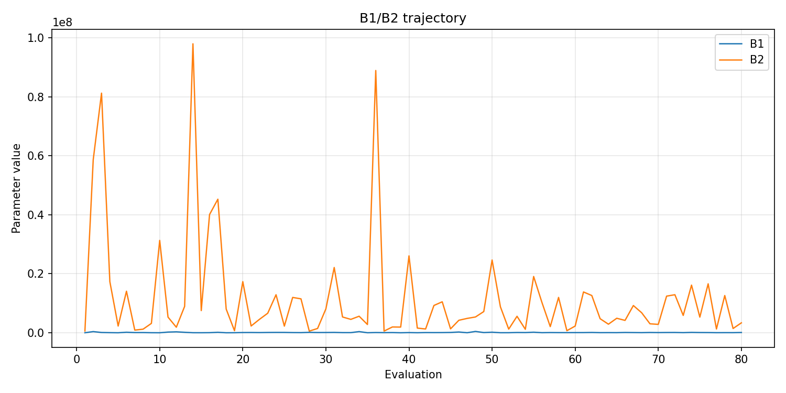
- [`de_optimize_20260523T054456Z_job7162998_b1_ratio_heatmap.png`](plots/de_optimize_20260523T054456Z_job7162998_b1_ratio_heatmap.png)
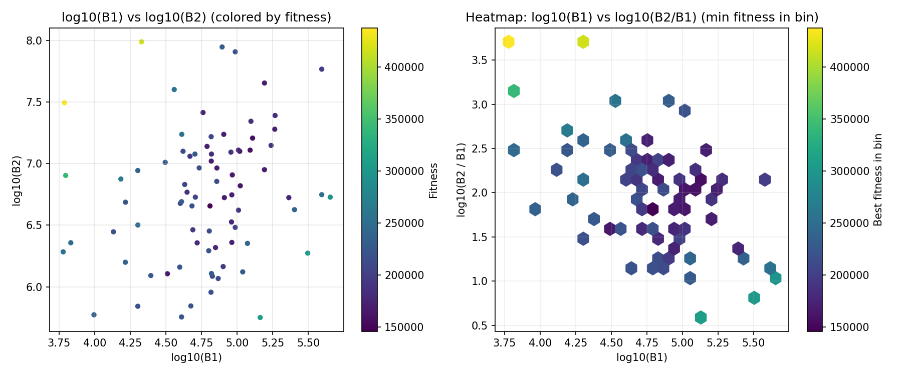
- [`de_optimize_20260523T054456Z_job7162998_jump_plot.png`](plots/de_optimize_20260523T054456Z_job7162998_jump_plot.png)
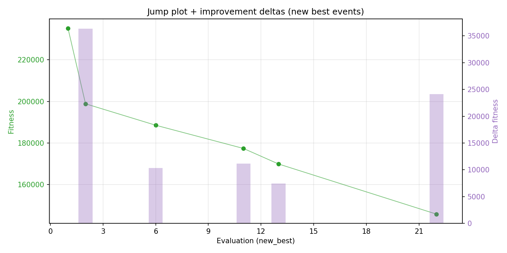
- [`de_optimize_20260523T054456Z_job7162998_progress_by_phase.png`](plots/de_optimize_20260523T054456Z_job7162998_progress_by_phase.png)
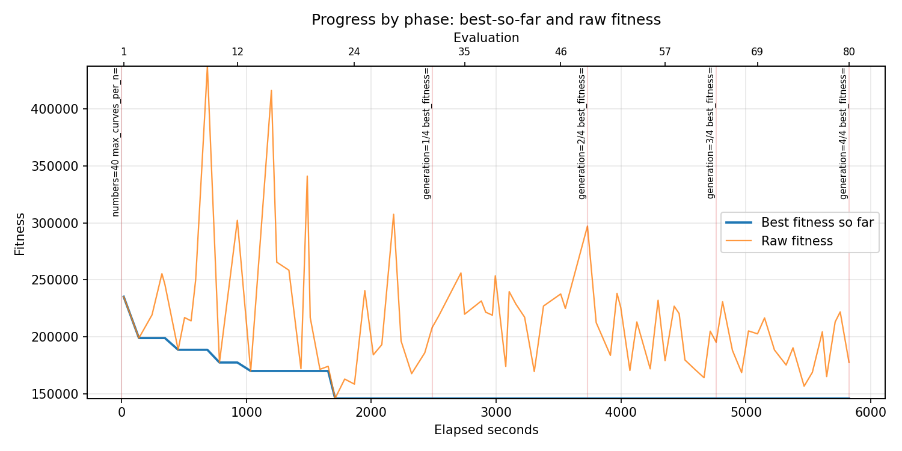
- [`de_optimize_20260523T054456Z_job7162998_time_efficiency.png`](plots/de_optimize_20260523T054456Z_job7162998_time_efficiency.png)
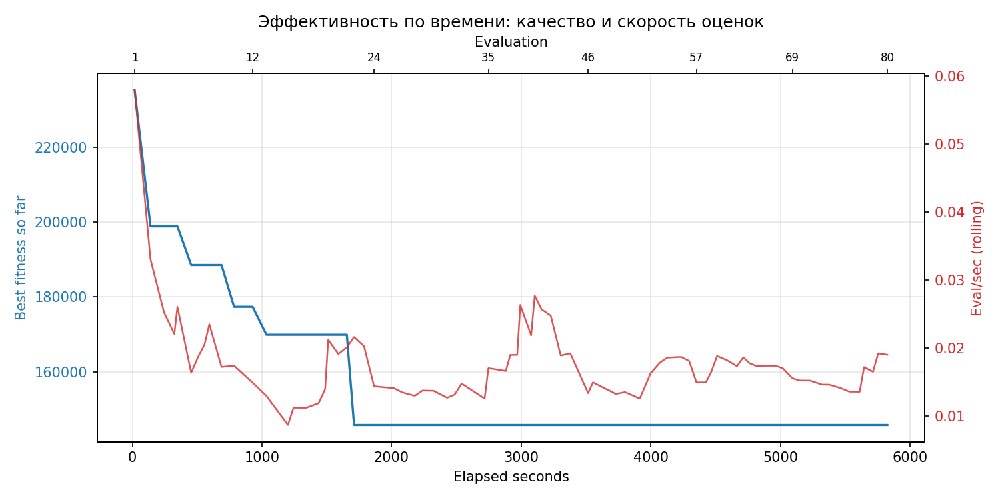

## Таблицы

## Validation runs

### Validation run `20260523T072228Z`
- validation file: [`de_validate_20260523T072228Z_job7162999.json`](de_validate_20260523T072228Z_job7162999.json)
- dataset: `data/numbers/25_dset_20260523T054447Z_job7162997/control.json`
- method: `de`
- optimized params: `(B1, B2)=(64522, 4539104)`
- baseline params: `(B1, B2)=(50000, 13000000)`
- max_curves_per_n: `700`
- repeats_per_n: `30`
- curve_timeout_sec: `None`
- workers: `56`
- seed: `1729`
- optimized_mean_score: `209136.71542808192`
- baseline_mean_score: `233036.93854742125`
- relative_improvement_pct: `10.255980561843765`
- optimized_mean_time_sec: `19.354809042808192`
- baseline_mean_time_sec: `21.821260521408792`
- time_improvement_pct: `11.302974345504788`
- optimized_mean_curves: `261.7725`
- baseline_mean_curves: `236.48666666666668`
- curves_improvement_pct: `-10.692287091590773`
- optimized_mean_success_rate: `0.9166666666666666`
- baseline_mean_success_rate: `0.9308333333333334`
- success_rate_delta_pp: `-1.4166666666666772`
- trace plots:
  - score_trace_plot: [`de_validate_20260523T072228Z_job7162999_score_trace.png`](plots/de_validate_20260523T072228Z_job7162999_score_trace.png)
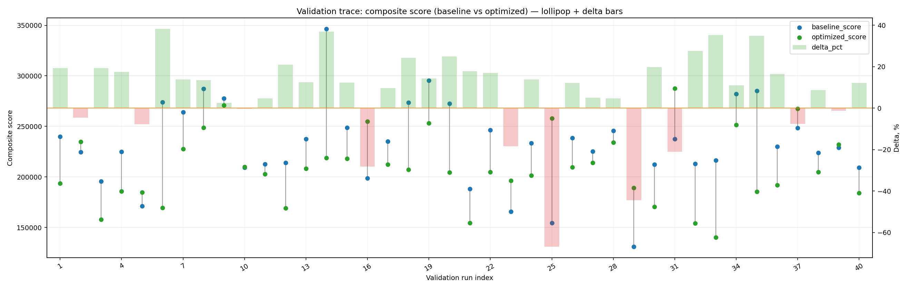
  - score_distribution_plot: [`de_validate_20260523T072228Z_job7162999_score_distribution.png`](plots/de_validate_20260523T072228Z_job7162999_score_distribution.png)
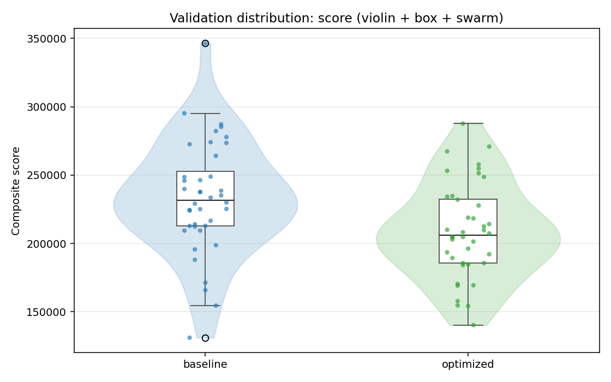
  - success_trace_plot: [`de_validate_20260523T072228Z_job7162999_success_trace.png`](plots/de_validate_20260523T072228Z_job7162999_success_trace.png)
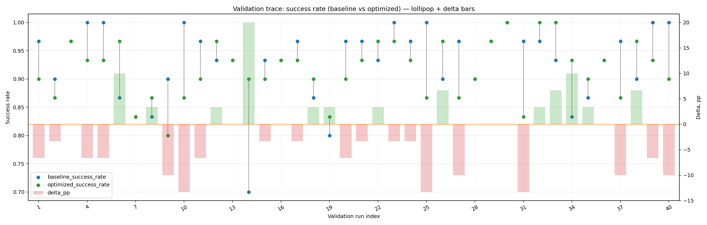
  - success_distribution_plot: [`de_validate_20260523T072228Z_job7162999_success_distribution.png`](plots/de_validate_20260523T072228Z_job7162999_success_distribution.png)
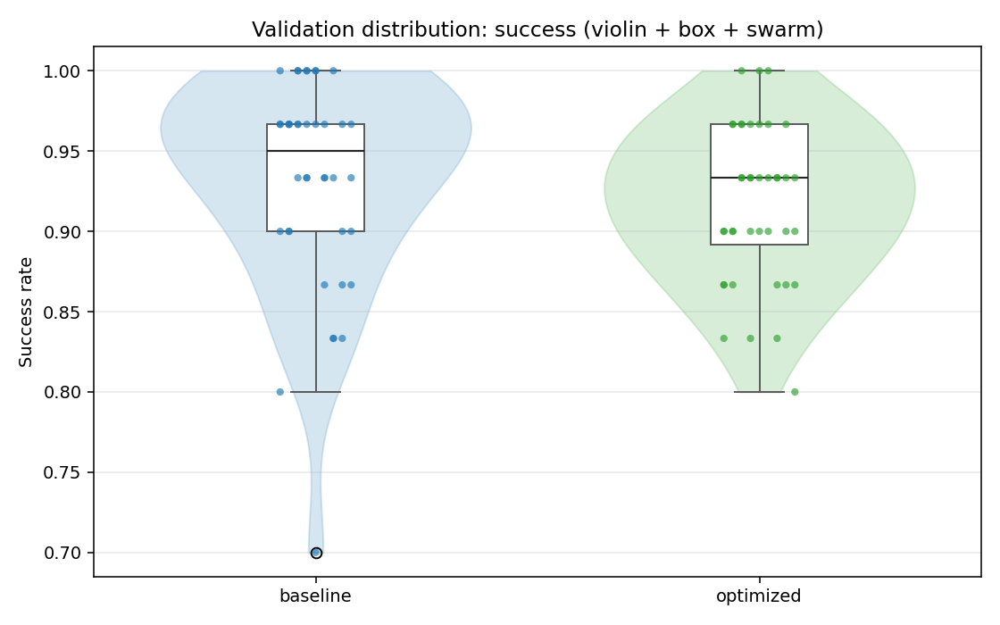
  - time_trace_plot: [`de_validate_20260523T072228Z_job7162999_time_trace.png`](plots/de_validate_20260523T072228Z_job7162999_time_trace.png)
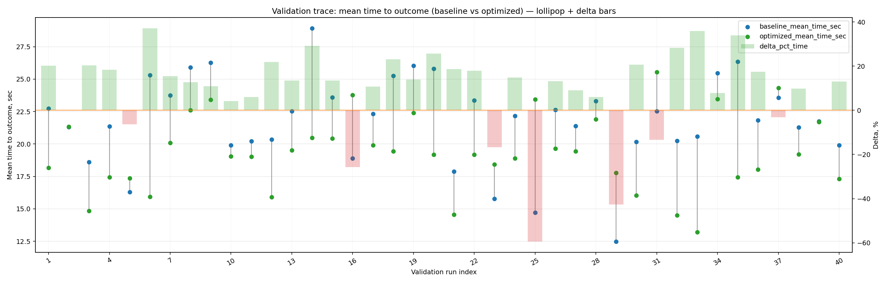
  - time_distribution_plot: [`de_validate_20260523T072228Z_job7162999_time_distribution.png`](plots/de_validate_20260523T072228Z_job7162999_time_distribution.png)
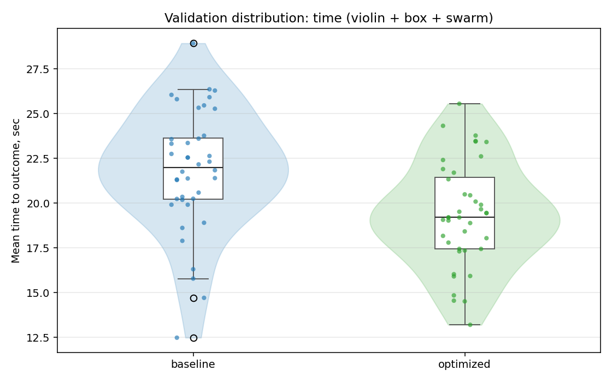
  - curves_trace_plot: [`de_validate_20260523T072228Z_job7162999_curves_trace.png`](plots/de_validate_20260523T072228Z_job7162999_curves_trace.png)
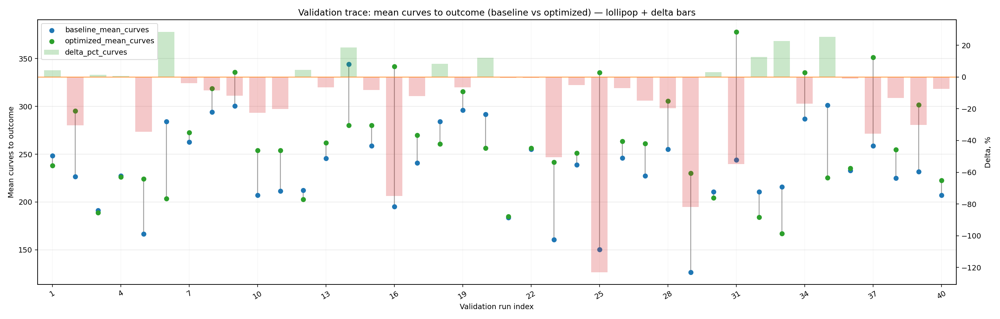
  - curves_distribution_plot: [`de_validate_20260523T072228Z_job7162999_curves_distribution.png`](plots/de_validate_20260523T072228Z_job7162999_curves_distribution.png)
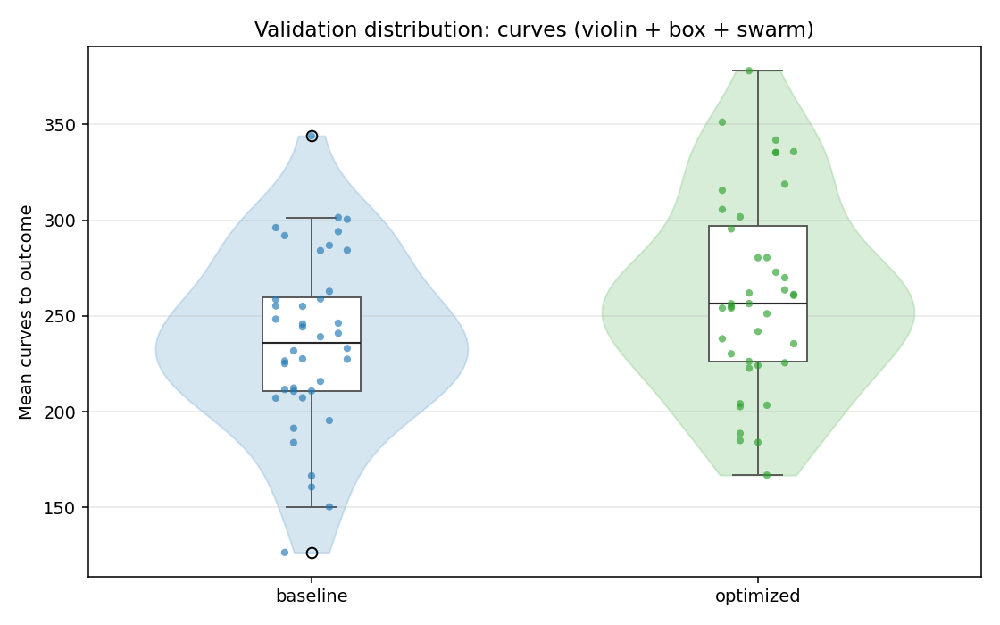

---
