# Отчёт по оптимизации: ga_optimize_20260523T054455Z_job7163006

## Метаданные
- метод: `ga`
- датасет: `data/numbers/25_dset_20260523T054447Z_job7162997/train.json`
- оптимум `(B1, B2)`: `(109460, 7339958)`
- objective: `137106.1855487436`
- max_curves_per_n: `320`
- repeats_per_n: `3`
- границы: `B1[5000.0, 500000.0]`, `B2[500000.0, 130000000.0]`, `ratio_max=1000000000.0`

## Ключевые статистики
- `best_eval`: `46`
- `best_eval_fraction`: `0.5`
- `eval_per_sec`: `0.01173553961024953`
- `evaluation_count`: `92`
- `improvement_percent`: `34.879532098897315`
- `max_plateau_evals`: `46`
- `median_plateau_evals`: `11.0`
- `new_best_count`: `4`
- `new_best_rate`: `0.043478260869565216`
- `p90_plateau_evals`: `32.0`
- `time_to_best_sec`: `4124.188836488989`
- `time_to_first_improvement_sec`: `1259.0821703779802`
- `total_runtime_sec`: `7839.440383199981`

## Флаги внимания

| Флаг | Статус | Текущее значение | Порог | Что это значит | Что делать |
|---|---|---:|---:|---|---|
| `b1_hits_boundary` | ✅ ОК | `0.010869565217391304` | `> 0.10` | Большая доля оценок проходит близко к границам B1. | Расширить диапазон B1, если упор в границу повторяется. |
| `b2_hits_boundary` | ✅ ОК | `0.0` | `> 0.10` | Большая доля оценок проходит близко к границам B2. | Расширить диапазон B2, если упор в границу повторяется. |
| `best_b1_on_boundary` | ✅ ОК | `109460.0` | `within 2% of log-range [5000.0, 500000.0]` | Лучший найденный B1 лежит на границе диапазона. | Проверить расширенный диапазон B1 вокруг текущей границы. |
| `best_b2_on_boundary` | ✅ ОК | `7339958.0` | `within 2% of log-range [500000.0, 130000000.0]` | Лучший найденный B2 лежит на границе диапазона. | Проверить расширенный диапазон B2 вокруг текущей границы. |
| `best_ratio_on_boundary` | ✅ ОК | `67.0560752786406` | `within 2% of log-range up to ratio_max=1000000000.0` | Лучшее отношение B2/B1 находится у верхней границы ratio_max. | Увеличить ratio_max и перепроверить локальный поиск в новой области. |
| `late_best` | ✅ ОК | `0.5260820460255272` | `> 0.85` | Лучшее решение найдено слишком поздно относительно общего времени. | Усилить ранний поиск или пересмотреть бюджет/инициализацию. |
| `low_improvement` | ✅ ОК | `34.879532098897315` | `< 10%` | Итоговый прирост качества слишком мал. | Сузить границы поиска или изменить параметры метода. |
| `low_signal` | ✅ ОК | `0.043478260869565216` | `< 0.03` | Слишком низкая плотность новых best-событий (слабый сигнал оптимизации). | Перенастроить exploration и сделать переоценку top-k кандидатов. |
| `plateau_too_long` | ✅ ОК | `0.5` | `> 0.50` | Слишком длинное плато: улучшений почти нет на большом участке запуска. | Увеличить exploration или добавить политику рестартов. |
| `ratio_hits_boundary` | ✅ ОК | `0.010869565217391304` | `> 0.10` | Большая доля оценок проходит близко к границе отношения B2/B1. | Увеличить ratio_max, если хорошие точки упираются в ограничение отношения B2/B1. |

## Графики
- [`ga_optimize_20260523T054455Z_job7163006_b1_b2_trajectory.png`](plots/ga_optimize_20260523T054455Z_job7163006_b1_b2_trajectory.png)
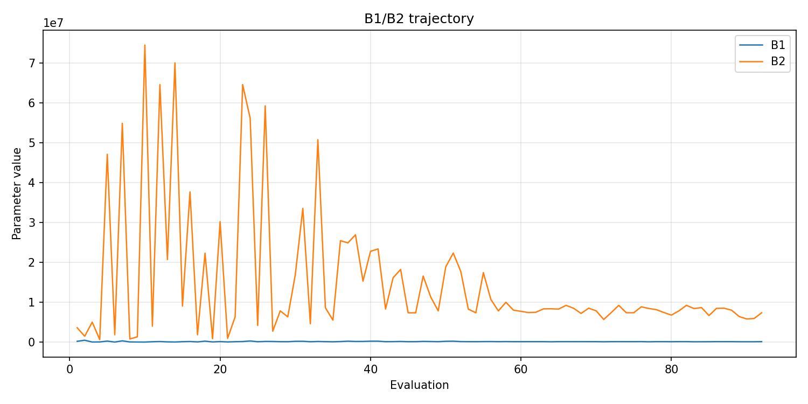
- [`ga_optimize_20260523T054455Z_job7163006_b1_ratio_heatmap.png`](plots/ga_optimize_20260523T054455Z_job7163006_b1_ratio_heatmap.png)
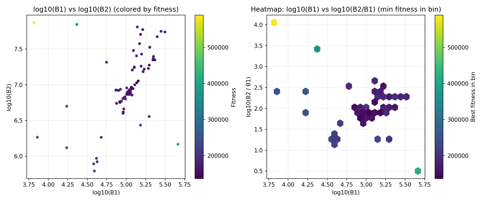
- [`ga_optimize_20260523T054455Z_job7163006_jump_plot.png`](plots/ga_optimize_20260523T054455Z_job7163006_jump_plot.png)
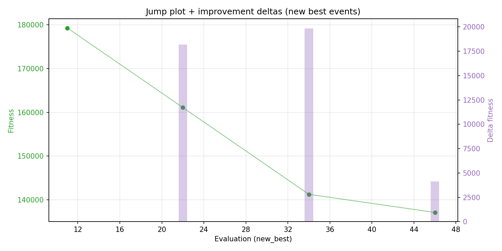
- [`ga_optimize_20260523T054455Z_job7163006_progress_by_phase.png`](plots/ga_optimize_20260523T054455Z_job7163006_progress_by_phase.png)
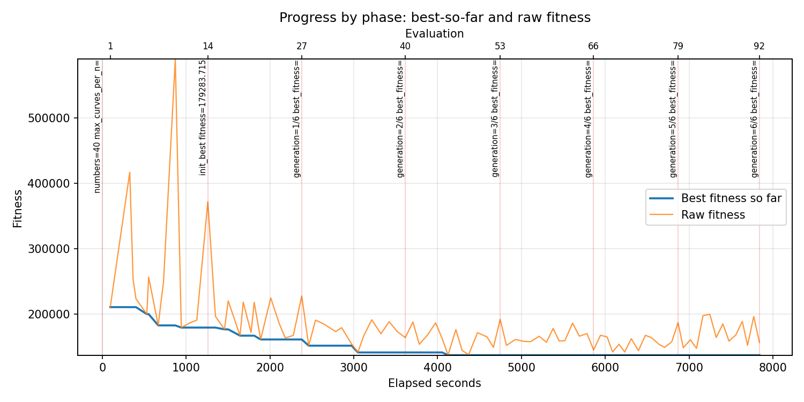
- [`ga_optimize_20260523T054455Z_job7163006_time_efficiency.png`](plots/ga_optimize_20260523T054455Z_job7163006_time_efficiency.png)
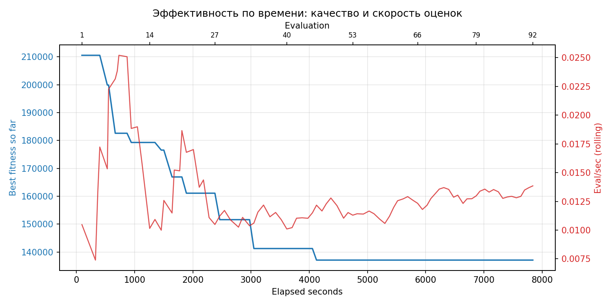

## Таблицы

## Validation runs

### Validation run `20260523T075601Z`
- validation file: [`ga_validate_20260523T075601Z_job7163007.json`](ga_validate_20260523T075601Z_job7163007.json)
- dataset: `data/numbers/25_dset_20260523T054447Z_job7162997/control.json`
- method: `ga`
- optimized params: `(B1, B2)=(109460, 7339958)`
- baseline params: `(B1, B2)=(50000, 13000000)`
- max_curves_per_n: `700`
- repeats_per_n: `30`
- curve_timeout_sec: `None`
- workers: `56`
- seed: `1729`
- optimized_mean_score: `226471.9266053821`
- baseline_mean_score: `267812.3441423296`
- relative_improvement_pct: `15.436337585311982`
- optimized_mean_time_sec: `21.810559327204878`
- baseline_mean_time_sec: `25.52734691423296`
- time_improvement_pct: `14.560023019688586`
- optimized_mean_curves: `167.32666666666665`
- baseline_mean_curves: `230.7775`
- curves_improvement_pct: `27.494375895974844`
- optimized_mean_success_rate: `0.9891666666666667`
- baseline_mean_success_rate: `0.9475`
- success_rate_delta_pp: `4.166666666666674`
- trace plots:
  - score_trace_plot: [`ga_validate_20260523T075601Z_job7163007_score_trace.png`](plots/ga_validate_20260523T075601Z_job7163007_score_trace.png)
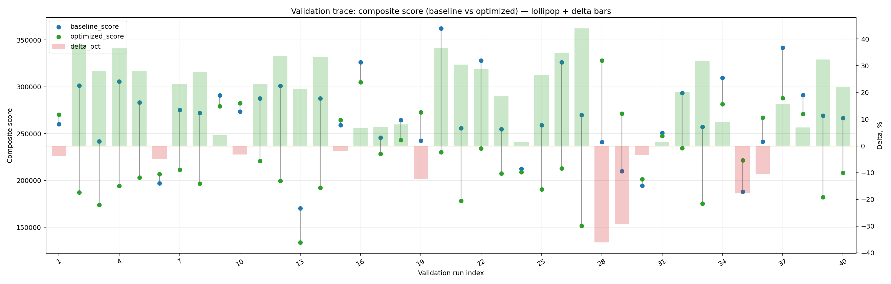
  - score_distribution_plot: [`ga_validate_20260523T075601Z_job7163007_score_distribution.png`](plots/ga_validate_20260523T075601Z_job7163007_score_distribution.png)
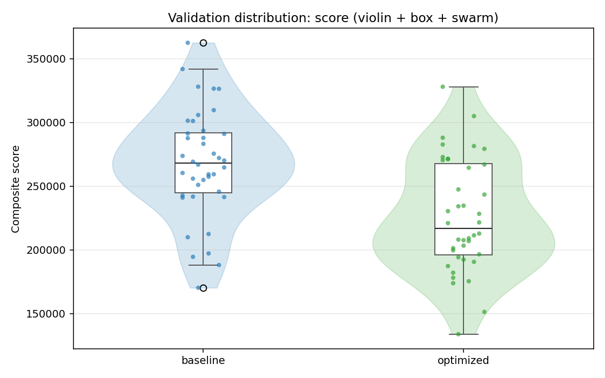
  - success_trace_plot: [`ga_validate_20260523T075601Z_job7163007_success_trace.png`](plots/ga_validate_20260523T075601Z_job7163007_success_trace.png)
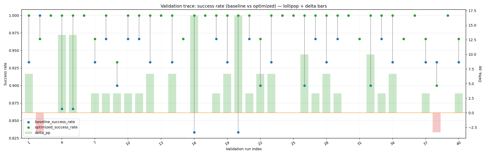
  - success_distribution_plot: [`ga_validate_20260523T075601Z_job7163007_success_distribution.png`](plots/ga_validate_20260523T075601Z_job7163007_success_distribution.png)
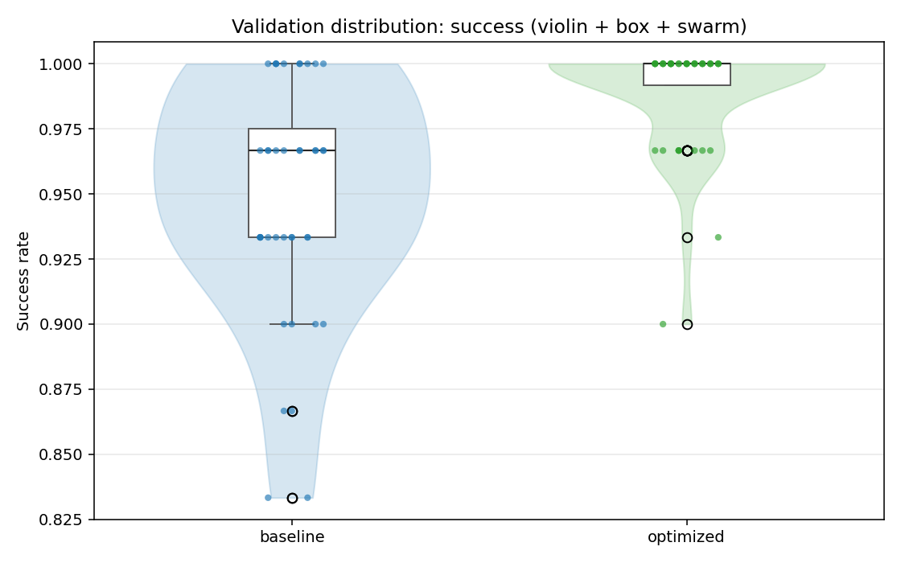
  - time_trace_plot: [`ga_validate_20260523T075601Z_job7163007_time_trace.png`](plots/ga_validate_20260523T075601Z_job7163007_time_trace.png)
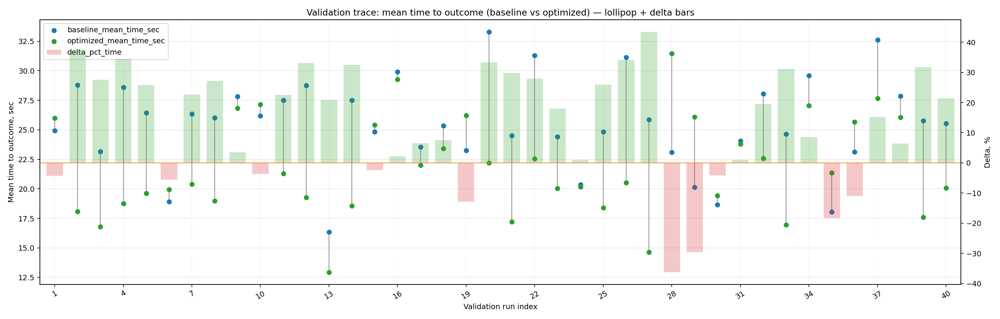
  - time_distribution_plot: [`ga_validate_20260523T075601Z_job7163007_time_distribution.png`](plots/ga_validate_20260523T075601Z_job7163007_time_distribution.png)
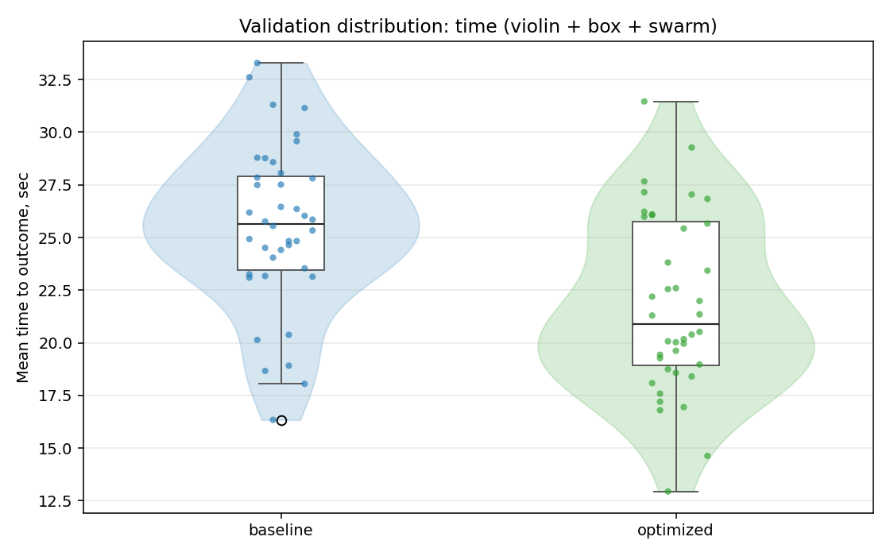
  - curves_trace_plot: [`ga_validate_20260523T075601Z_job7163007_curves_trace.png`](plots/ga_validate_20260523T075601Z_job7163007_curves_trace.png)
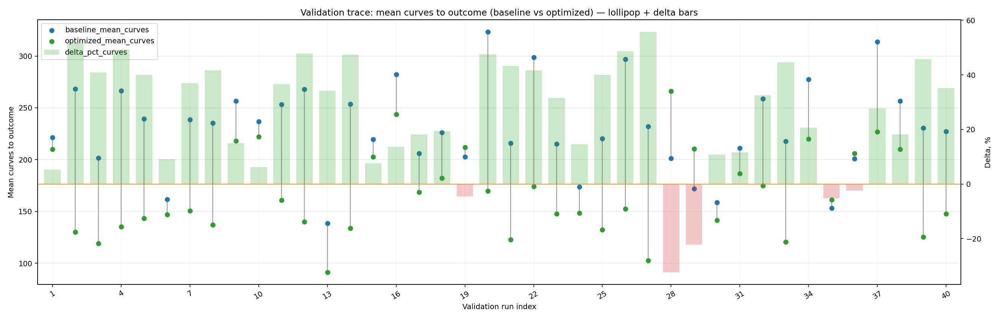
  - curves_distribution_plot: [`ga_validate_20260523T075601Z_job7163007_curves_distribution.png`](plots/ga_validate_20260523T075601Z_job7163007_curves_distribution.png)
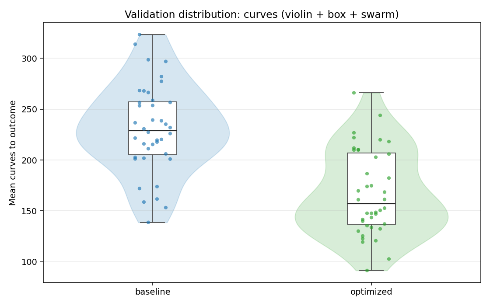

---
