# Отчёт по оптимизации: pso_optimize_20260523T054455Z_job7163002

## Метаданные
- метод: `pso`
- датасет: `data/numbers/25_dset_20260523T054447Z_job7162997/train.json`
- оптимум `(B1, B2)`: `(148870, 36290964)`
- objective: `123410.28848627987`
- max_curves_per_n: `320`
- repeats_per_n: `3`
- границы: `B1[5000.0, 500000.0]`, `B2[500000.0, 130000000.0]`, `ratio_max=1000000000.0`

## Ключевые статистики
- `best_eval`: `55`
- `best_eval_fraction`: `0.6547619047619048`
- `eval_per_sec`: `0.010884981220636013`
- `evaluation_count`: `84`
- `improvement_percent`: `28.615356782860594`
- `max_plateau_evals`: `31`
- `median_plateau_evals`: `14.0`
- `new_best_count`: `4`
- `new_best_rate`: `0.047619047619047616`
- `p90_plateau_evals`: `30.2`
- `time_to_best_sec`: `4633.022290952998`
- `time_to_first_improvement_sec`: `953.1918581889986`
- `total_runtime_sec`: `7717.060760937995`

## Флаги внимания

| Флаг | Статус | Текущее значение | Порог | Что это значит | Что делать |
|---|---|---:|---:|---|---|
| `b1_hits_boundary` | ✅ ОК | `0.047619047619047616` | `> 0.10` | Большая доля оценок проходит близко к границам B1. | Расширить диапазон B1, если упор в границу повторяется. |
| `b2_hits_boundary` | ✅ ОК | `0.011904761904761904` | `> 0.10` | Большая доля оценок проходит близко к границам B2. | Расширить диапазон B2, если упор в границу повторяется. |
| `best_b1_on_boundary` | ✅ ОК | `148870.0` | `within 2% of log-range [5000.0, 500000.0]` | Лучший найденный B1 лежит на границе диапазона. | Проверить расширенный диапазон B1 вокруг текущей границы. |
| `best_b2_on_boundary` | ✅ ОК | `36290964.0` | `within 2% of log-range [500000.0, 130000000.0]` | Лучший найденный B2 лежит на границе диапазона. | Проверить расширенный диапазон B2 вокруг текущей границы. |
| `best_ratio_on_boundary` | ✅ ОК | `243.77620742930074` | `within 2% of log-range up to ratio_max=1000000000.0` | Лучшее отношение B2/B1 находится у верхней границы ratio_max. | Увеличить ratio_max и перепроверить локальный поиск в новой области. |
| `late_best` | ✅ ОК | `0.6003609968194501` | `> 0.85` | Лучшее решение найдено слишком поздно относительно общего времени. | Усилить ранний поиск или пересмотреть бюджет/инициализацию. |
| `low_improvement` | ✅ ОК | `28.615356782860594` | `< 10%` | Итоговый прирост качества слишком мал. | Сузить границы поиска или изменить параметры метода. |
| `low_signal` | ✅ ОК | `0.047619047619047616` | `< 0.03` | Слишком низкая плотность новых best-событий (слабый сигнал оптимизации). | Перенастроить exploration и сделать переоценку top-k кандидатов. |
| `plateau_too_long` | ✅ ОК | `0.36904761904761907` | `> 0.50` | Слишком длинное плато: улучшений почти нет на большом участке запуска. | Увеличить exploration или добавить политику рестартов. |
| `ratio_hits_boundary` | ✅ ОК | `0.011904761904761904` | `> 0.10` | Большая доля оценок проходит близко к границе отношения B2/B1. | Увеличить ratio_max, если хорошие точки упираются в ограничение отношения B2/B1. |

## Графики
- [`pso_optimize_20260523T054455Z_job7163002_b1_b2_trajectory.png`](plots/pso_optimize_20260523T054455Z_job7163002_b1_b2_trajectory.png)
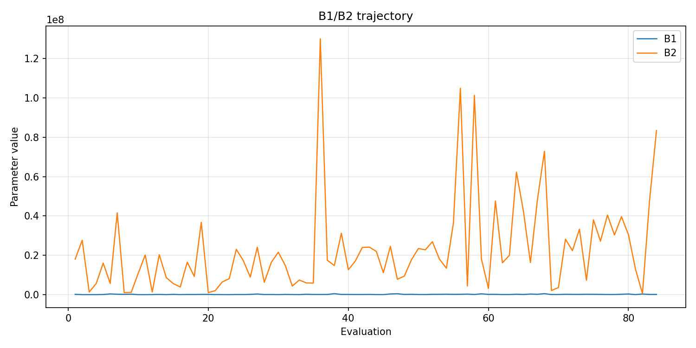
- [`pso_optimize_20260523T054455Z_job7163002_b1_ratio_heatmap.png`](plots/pso_optimize_20260523T054455Z_job7163002_b1_ratio_heatmap.png)
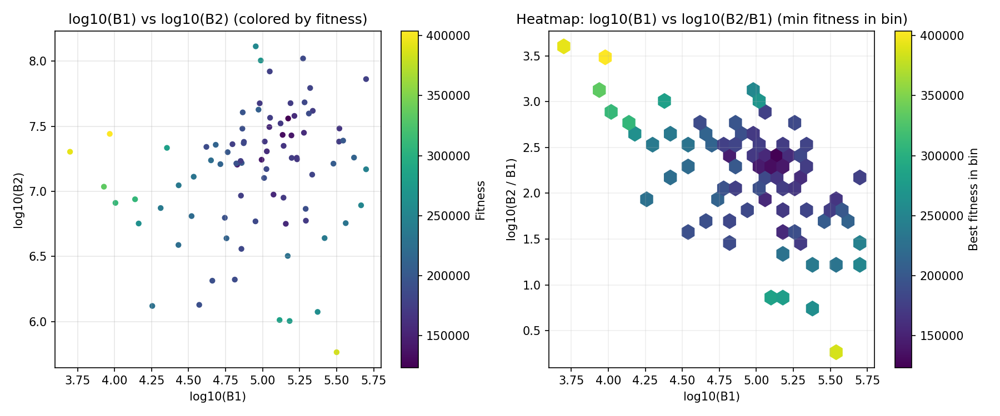
- [`pso_optimize_20260523T054455Z_job7163002_jump_plot.png`](plots/pso_optimize_20260523T054455Z_job7163002_jump_plot.png)
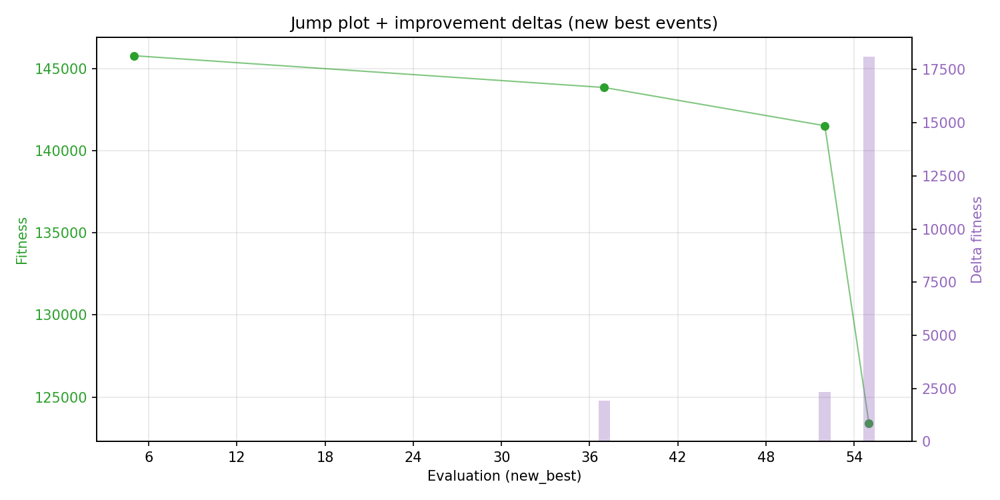
- [`pso_optimize_20260523T054455Z_job7163002_progress_by_phase.png`](plots/pso_optimize_20260523T054455Z_job7163002_progress_by_phase.png)
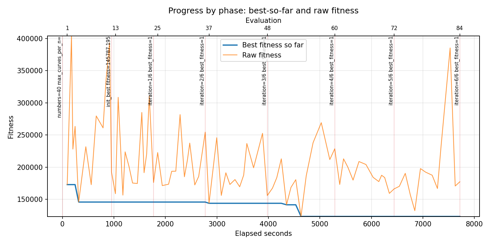
- [`pso_optimize_20260523T054455Z_job7163002_time_efficiency.png`](plots/pso_optimize_20260523T054455Z_job7163002_time_efficiency.png)
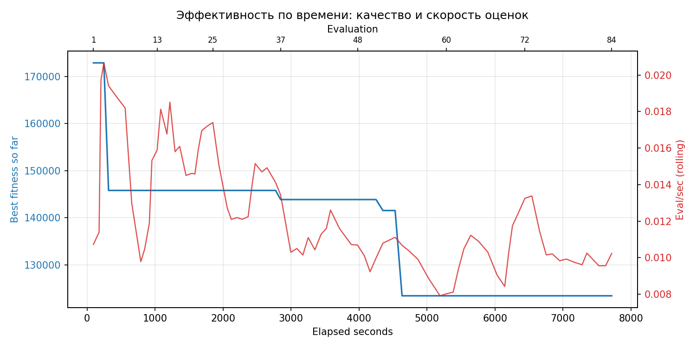

## Таблицы

## Validation runs

### Validation run `20260523T075401Z`
- validation file: [`pso_validate_20260523T075401Z_job7163003.json`](pso_validate_20260523T075401Z_job7163003.json)
- dataset: `data/numbers/25_dset_20260523T054447Z_job7162997/control.json`
- method: `pso`
- optimized params: `(B1, B2)=(148870, 36290964)`
- baseline params: `(B1, B2)=(50000, 13000000)`
- max_curves_per_n: `700`
- repeats_per_n: `30`
- curve_timeout_sec: `None`
- workers: `56`
- seed: `1729`
- optimized_mean_score: `198917.31849644263`
- baseline_mean_score: `242850.87149567428`
- relative_improvement_pct: `18.090753691206828`
- optimized_mean_time_sec: `19.389427682977598`
- baseline_mean_time_sec: `22.821824649567425`
- time_improvement_pct: `15.039976072442949`
- optimized_mean_curves: `100.46083333333334`
- baseline_mean_curves: `245.98583333333335`
- curves_improvement_pct: `59.15991097048272`
- optimized_mean_success_rate: `1.0`
- baseline_mean_success_rate: `0.925`
- success_rate_delta_pp: `7.499999999999996`
- trace plots:
  - score_trace_plot: [`pso_validate_20260523T075401Z_job7163003_score_trace.png`](plots/pso_validate_20260523T075401Z_job7163003_score_trace.png)
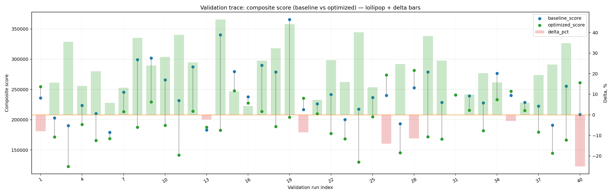
  - score_distribution_plot: [`pso_validate_20260523T075401Z_job7163003_score_distribution.png`](plots/pso_validate_20260523T075401Z_job7163003_score_distribution.png)
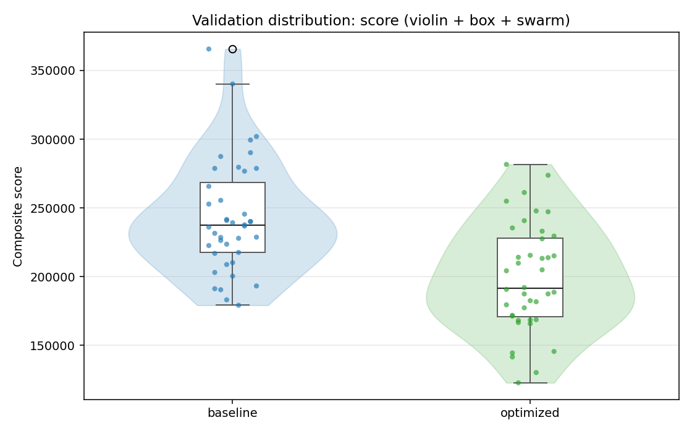
  - success_trace_plot: [`pso_validate_20260523T075401Z_job7163003_success_trace.png`](plots/pso_validate_20260523T075401Z_job7163003_success_trace.png)
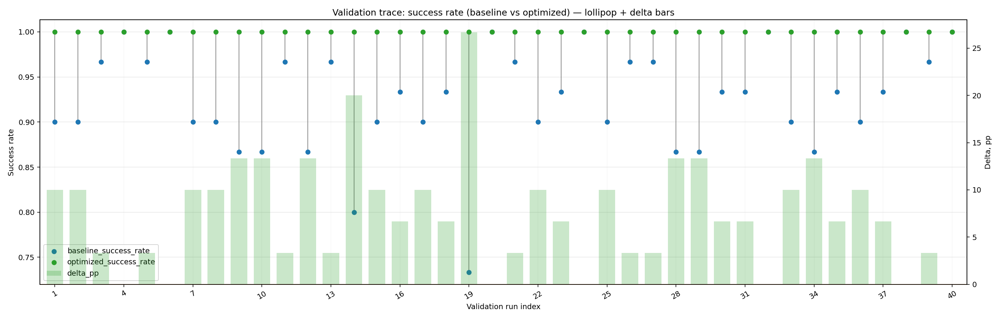
  - success_distribution_plot: [`pso_validate_20260523T075401Z_job7163003_success_distribution.png`](plots/pso_validate_20260523T075401Z_job7163003_success_distribution.png)
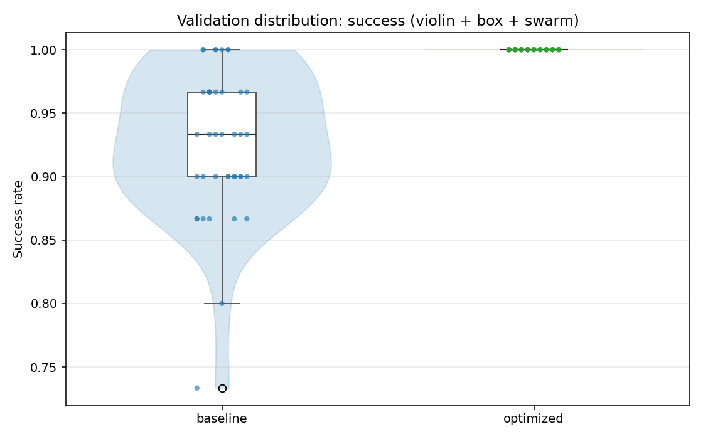
  - time_trace_plot: [`pso_validate_20260523T075401Z_job7163003_time_trace.png`](plots/pso_validate_20260523T075401Z_job7163003_time_trace.png)
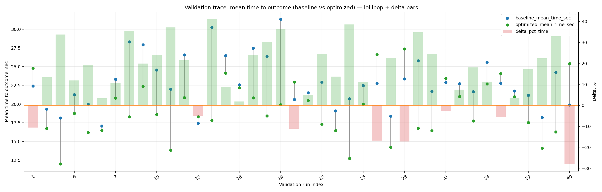
  - time_distribution_plot: [`pso_validate_20260523T075401Z_job7163003_time_distribution.png`](plots/pso_validate_20260523T075401Z_job7163003_time_distribution.png)
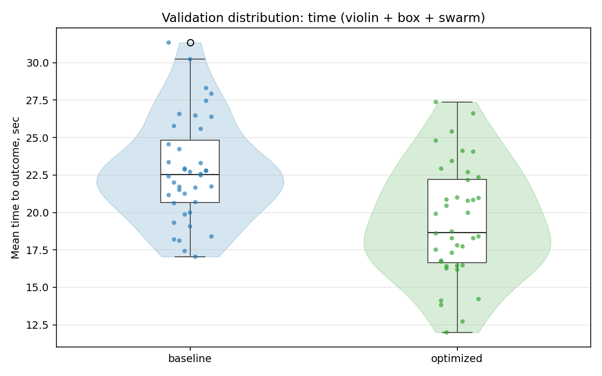
  - curves_trace_plot: [`pso_validate_20260523T075401Z_job7163003_curves_trace.png`](plots/pso_validate_20260523T075401Z_job7163003_curves_trace.png)
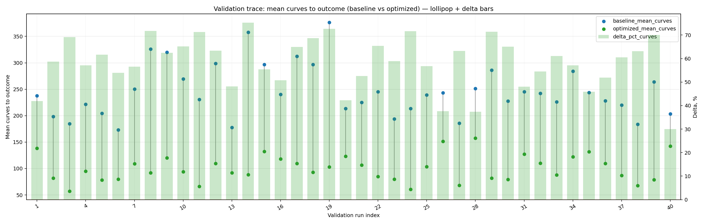
  - curves_distribution_plot: [`pso_validate_20260523T075401Z_job7163003_curves_distribution.png`](plots/pso_validate_20260523T075401Z_job7163003_curves_distribution.png)
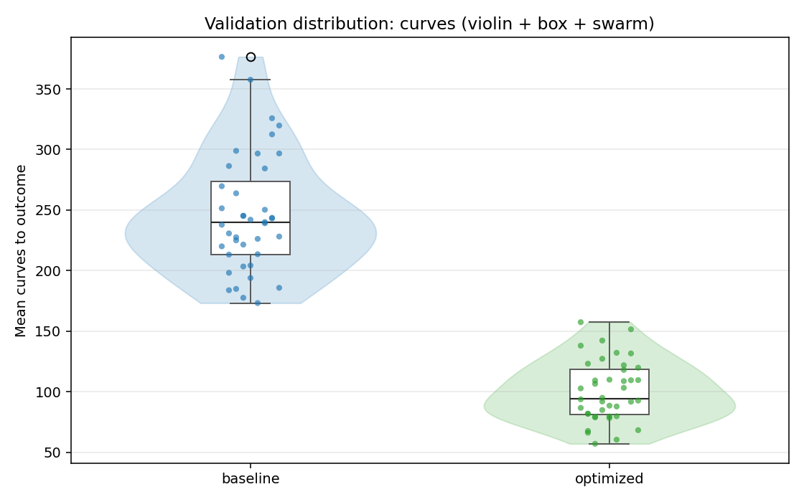

---
