# Отчёт по оптимизации: rs_optimize_20260523T054456Z_job7163000

## Метаданные
- метод: `rs`
- датасет: `data/numbers/25_dset_20260523T054447Z_job7162997/train.json`
- оптимум `(B1, B2)`: `(172652, 44739605)`
- objective: `133182.80267110773`
- max_curves_per_n: `320`
- repeats_per_n: `3`
- границы: `B1[5000.0, 500000.0]`, `B2[500000.0, 130000000.0]`, `ratio_max=1000000000.0`

## Ключевые статистики
- `best_eval`: `20`
- `best_eval_fraction`: `0.3333333333333333`
- `eval_per_sec`: `0.01034787462303299`
- `evaluation_count`: `60`
- `improvement_percent`: `35.0428594735248`
- `max_plateau_evals`: `40`
- `median_plateau_evals`: `6.0`
- `new_best_count`: `4`
- `new_best_rate`: `0.06666666666666667`
- `p90_plateau_evals`: `27.6`
- `time_to_best_sec`: `1638.283017570997`
- `time_to_first_improvement_sec`: `59.27717856998788`
- `total_runtime_sec`: `5798.292131066992`

## Флаги внимания

| Флаг | Статус | Текущее значение | Порог | Что это значит | Что делать |
|---|---|---:|---:|---|---|
| `b1_hits_boundary` | ✅ ОК | `0.0` | `> 0.10` | Большая доля оценок проходит близко к границам B1. | Расширить диапазон B1, если упор в границу повторяется. |
| `b2_hits_boundary` | ✅ ОК | `0.05` | `> 0.10` | Большая доля оценок проходит близко к границам B2. | Расширить диапазон B2, если упор в границу повторяется. |
| `best_b1_on_boundary` | ✅ ОК | `172652.0` | `within 2% of log-range [5000.0, 500000.0]` | Лучший найденный B1 лежит на границе диапазона. | Проверить расширенный диапазон B1 вокруг текущей границы. |
| `best_b2_on_boundary` | ✅ ОК | `44739605.0` | `within 2% of log-range [500000.0, 130000000.0]` | Лучший найденный B2 лежит на границе диапазона. | Проверить расширенный диапазон B2 вокруг текущей границы. |
| `best_ratio_on_boundary` | ✅ ОК | `259.13169265343004` | `within 2% of log-range up to ratio_max=1000000000.0` | Лучшее отношение B2/B1 находится у верхней границы ratio_max. | Увеличить ratio_max и перепроверить локальный поиск в новой области. |
| `late_best` | ✅ ОК | `0.28254578771448047` | `> 0.85` | Лучшее решение найдено слишком поздно относительно общего времени. | Усилить ранний поиск или пересмотреть бюджет/инициализацию. |
| `low_improvement` | ✅ ОК | `35.0428594735248` | `< 10%` | Итоговый прирост качества слишком мал. | Сузить границы поиска или изменить параметры метода. |
| `low_signal` | ✅ ОК | `0.06666666666666667` | `< 0.03` | Слишком низкая плотность новых best-событий (слабый сигнал оптимизации). | Перенастроить exploration и сделать переоценку top-k кандидатов. |
| `plateau_too_long` | ⚠️ ВНИМАНИЕ | `0.6666666666666666` | `> 0.50` | Слишком длинное плато: улучшений почти нет на большом участке запуска. | Увеличить exploration или добавить политику рестартов. |
| `ratio_hits_boundary` | ✅ ОК | `0.06666666666666667` | `> 0.10` | Большая доля оценок проходит близко к границе отношения B2/B1. | Увеличить ratio_max, если хорошие точки упираются в ограничение отношения B2/B1. |

## Графики
- [`rs_optimize_20260523T054456Z_job7163000_b1_b2_trajectory.png`](plots/rs_optimize_20260523T054456Z_job7163000_b1_b2_trajectory.png)
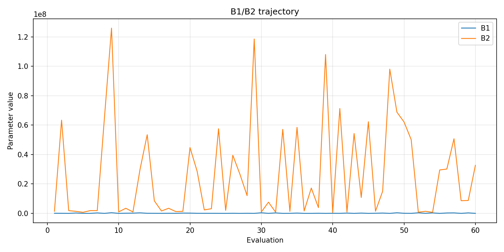
- [`rs_optimize_20260523T054456Z_job7163000_b1_ratio_heatmap.png`](plots/rs_optimize_20260523T054456Z_job7163000_b1_ratio_heatmap.png)
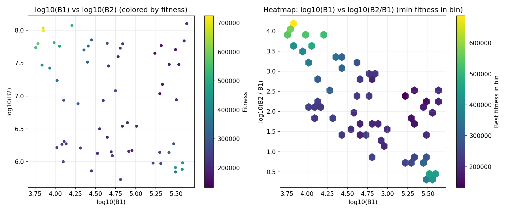
- [`rs_optimize_20260523T054456Z_job7163000_jump_plot.png`](plots/rs_optimize_20260523T054456Z_job7163000_jump_plot.png)
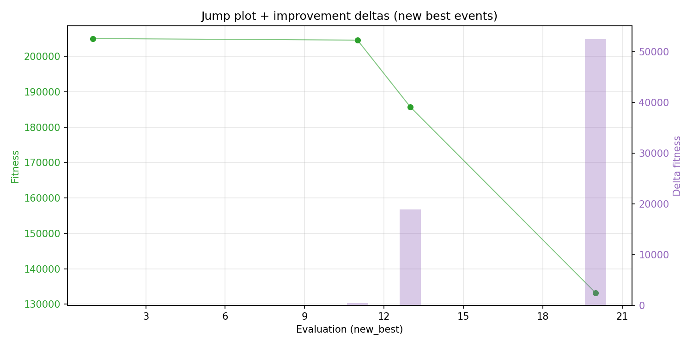
- [`rs_optimize_20260523T054456Z_job7163000_progress_by_phase.png`](plots/rs_optimize_20260523T054456Z_job7163000_progress_by_phase.png)
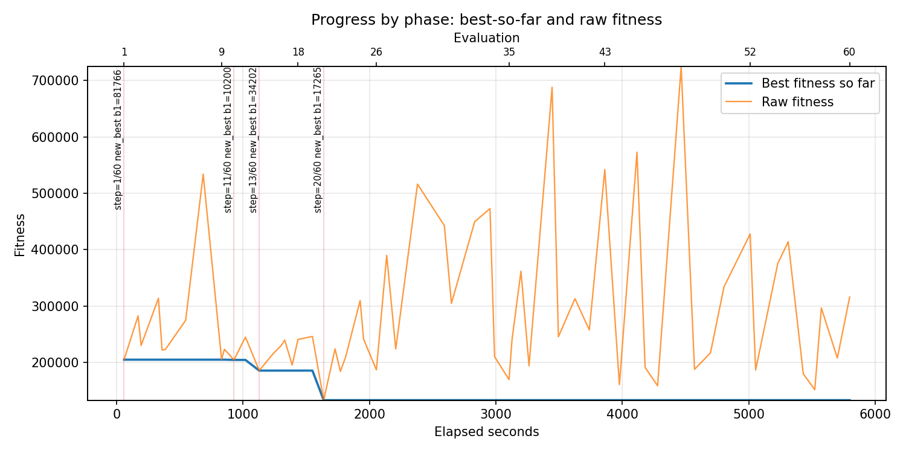
- [`rs_optimize_20260523T054456Z_job7163000_time_efficiency.png`](plots/rs_optimize_20260523T054456Z_job7163000_time_efficiency.png)
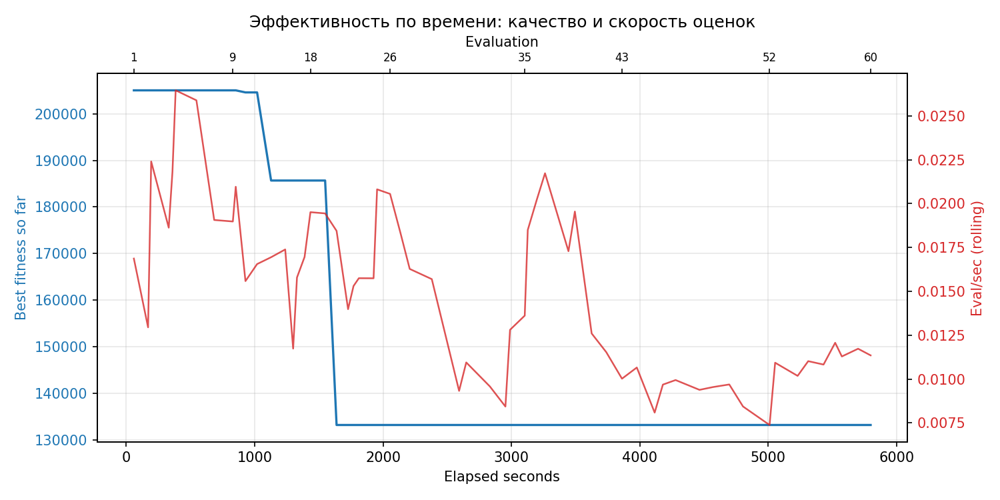

## Таблицы

## Validation runs

### Validation run `20260523T072200Z`
- validation file: [`rs_validate_20260523T072200Z_job7163001.json`](rs_validate_20260523T072200Z_job7163001.json)
- dataset: `data/numbers/25_dset_20260523T054447Z_job7162997/control.json`
- method: `rs`
- optimized params: `(B1, B2)=(172652, 44739605)`
- baseline params: `(B1, B2)=(50000, 13000000)`
- max_curves_per_n: `700`
- repeats_per_n: `30`
- curve_timeout_sec: `None`
- workers: `56`
- seed: `1729`
- optimized_mean_score: `238350.99030222377`
- baseline_mean_score: `280471.66947426356`
- relative_improvement_pct: `15.017801709168646`
- optimized_mean_time_sec: `23.399986530222378`
- baseline_mean_time_sec: `26.620137780759688`
- time_improvement_pct: `12.096673867949502`
- optimized_mean_curves: `87.02250000000001`
- baseline_mean_curves: `242.0725`
- curves_improvement_pct: `64.05105908353902`
- optimized_mean_success_rate: `0.9991666666666668`
- baseline_mean_success_rate: `0.9324999999999999`
- success_rate_delta_pp: `6.666666666666687`
- trace plots:
  - score_trace_plot: [`rs_validate_20260523T072200Z_job7163001_score_trace.png`](plots/rs_validate_20260523T072200Z_job7163001_score_trace.png)
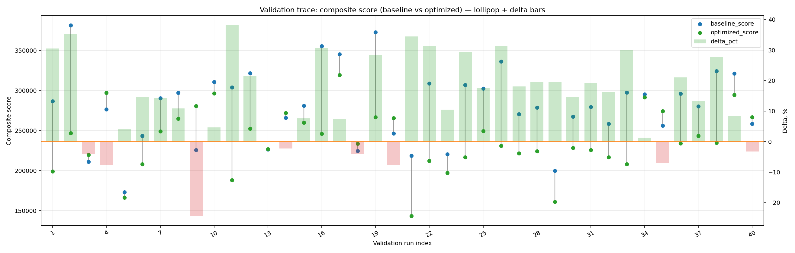
  - score_distribution_plot: [`rs_validate_20260523T072200Z_job7163001_score_distribution.png`](plots/rs_validate_20260523T072200Z_job7163001_score_distribution.png)
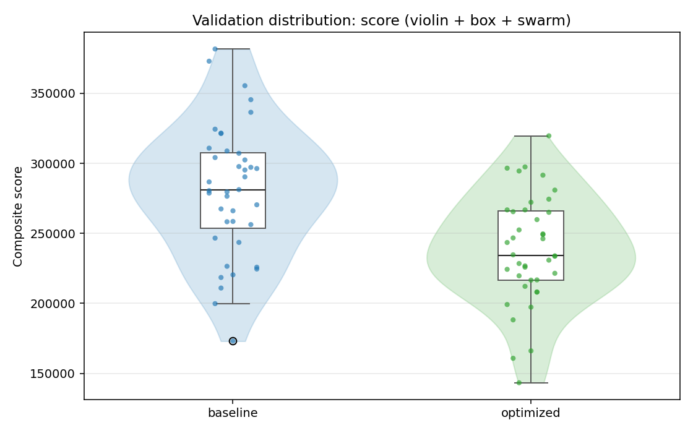
  - success_trace_plot: [`rs_validate_20260523T072200Z_job7163001_success_trace.png`](plots/rs_validate_20260523T072200Z_job7163001_success_trace.png)
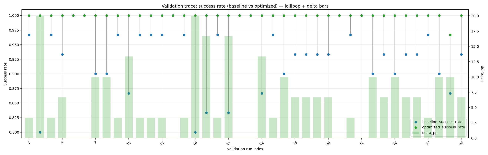
  - success_distribution_plot: [`rs_validate_20260523T072200Z_job7163001_success_distribution.png`](plots/rs_validate_20260523T072200Z_job7163001_success_distribution.png)
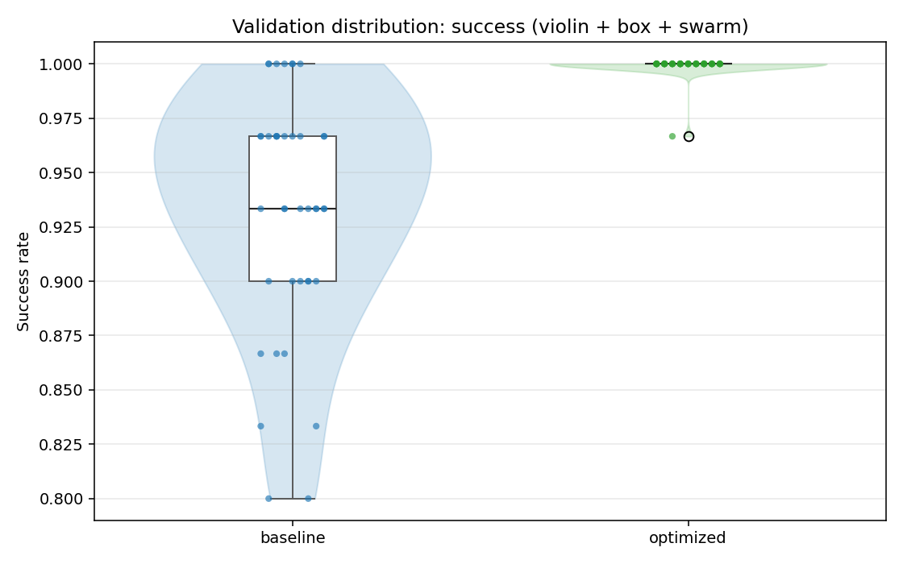
  - time_trace_plot: [`rs_validate_20260523T072200Z_job7163001_time_trace.png`](plots/rs_validate_20260523T072200Z_job7163001_time_trace.png)
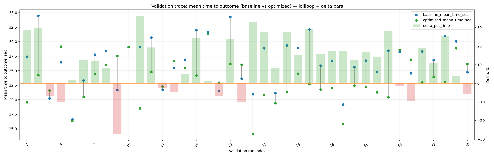
  - time_distribution_plot: [`rs_validate_20260523T072200Z_job7163001_time_distribution.png`](plots/rs_validate_20260523T072200Z_job7163001_time_distribution.png)
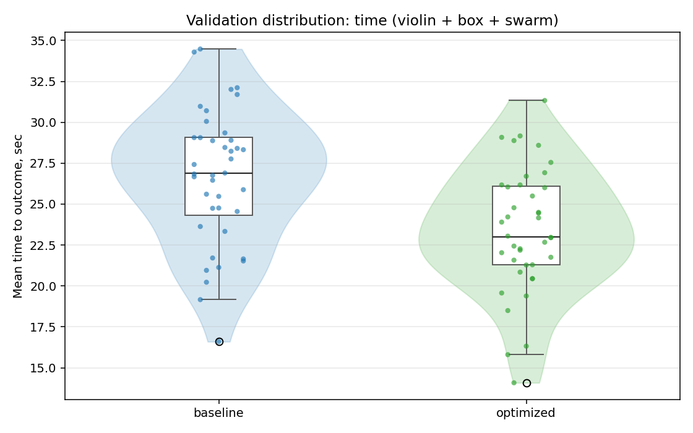
  - curves_trace_plot: [`rs_validate_20260523T072200Z_job7163001_curves_trace.png`](plots/rs_validate_20260523T072200Z_job7163001_curves_trace.png)
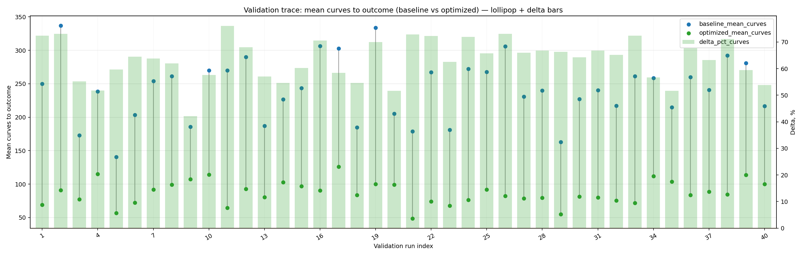
  - curves_distribution_plot: [`rs_validate_20260523T072200Z_job7163001_curves_distribution.png`](plots/rs_validate_20260523T072200Z_job7163001_curves_distribution.png)
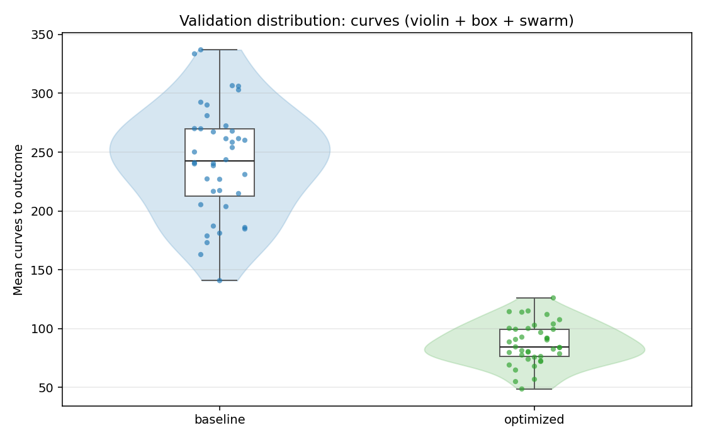

---
