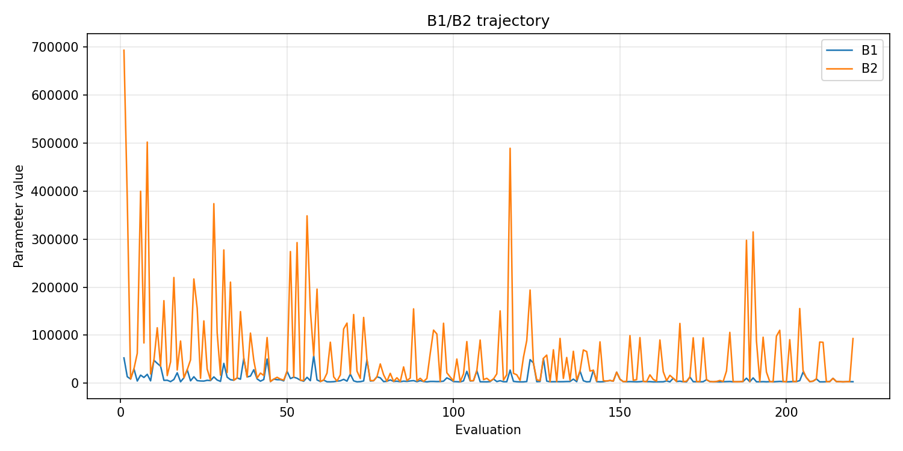
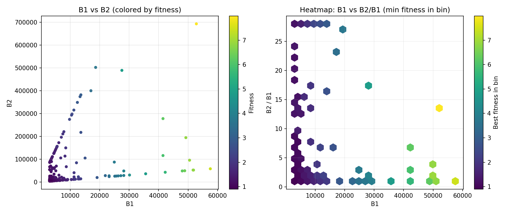
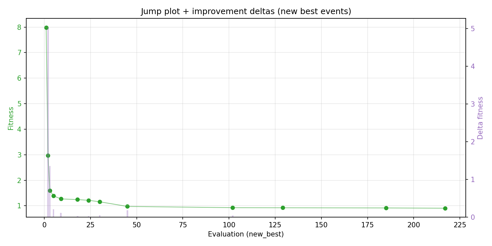
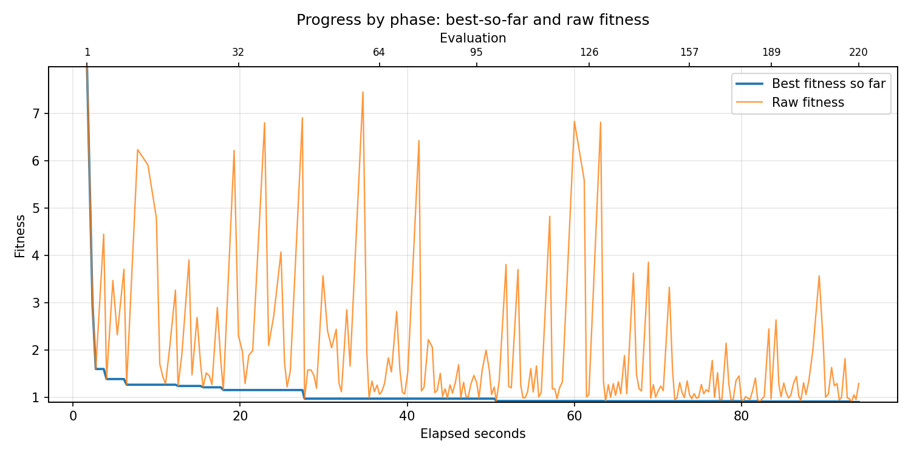
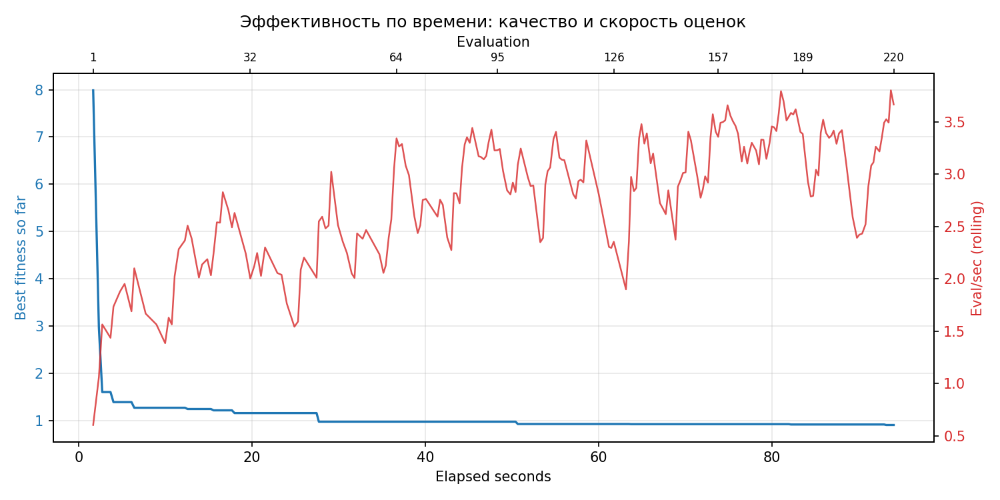

# Отчёт по оптимизации: de_optimize_20260409T120004Z

## Метаданные
- метод: `de`
- датасет: `data/numbers/30_dset_20260409T115651Z/train.json`
- оптимум `(B1, B2)`: `(3119, 3119)`
- objective: `0.9048912509460934`
- curves_per_n: `12`
- границы: `B1[3000.0, 60000.0]`, `B2[3000.0, 1200000.0]`, `ratio_max=28.0`

## Ключевые статистики
- `best_eval`: `217`
- `best_eval_fraction`: `0.9863636363636363`
- `eval_per_sec`: `2.3390156532787962`
- `evaluation_count`: `220`
- `improvement_percent`: `88.67035675234679`
- `max_plateau_evals`: `56`
- `median_plateau_evals`: `5.0`
- `new_best_count`: `13`
- `new_best_rate`: `0.05909090909090909`
- `p90_plateau_evals`: `47.800000000000026`
- `time_to_best_sec`: `93.19572346098721`
- `time_to_first_improvement_sec`: `1.6606897769961506`
- `total_runtime_sec`: `94.05665998498444`

## Флаги внимания

| Флаг | Статус | Текущее значение | Порог | Что это значит | Что делать |
|---|---|---:|---:|---|---|
| `b1_hits_boundary` | ⚠️ ВНИМАНИЕ | `0.1318181818181818` | `> 0.10` | Большая доля оценок проходит близко к границам B1. | Расширить диапазон B1, если упор в границу повторяется. |
| `b2_hits_boundary` | ✅ ОК | `0.045454545454545456` | `> 0.10` | Большая доля оценок проходит близко к границам B2. | Расширить диапазон B2, если упор в границу повторяется. |
| `best_b1_on_boundary` | ⚠️ ВНИМАНИЕ | `3119.0` | `within 2% of log-range [3000.0, 60000.0]` | Лучший найденный B1 лежит на границе диапазона. | Проверить расширенный диапазон B1 вокруг текущей границы. |
| `best_b2_on_boundary` | ⚠️ ВНИМАНИЕ | `3119.0` | `within 2% of log-range [3000.0, 1200000.0]` | Лучший найденный B2 лежит на границе диапазона. | Проверить расширенный диапазон B2 вокруг текущей границы. |
| `best_ratio_on_boundary` | ✅ ОК | `1.0` | `within 2% of log-range up to ratio_max=28.0` | Лучшее отношение B2/B1 находится у верхней границы ratio_max. | Увеличить ratio_max и перепроверить локальный поиск в новой области. |
| `late_best` | ⚠️ ВНИМАНИЕ | `0.9908466181540503` | `> 0.85` | Лучшее решение найдено слишком поздно относительно общего времени. | Усилить ранний поиск или пересмотреть бюджет/инициализацию. |
| `low_improvement` | ✅ ОК | `88.67035675234679` | `< 10%` | Итоговый прирост качества слишком мал. | Сузить границы поиска или изменить параметры метода. |
| `low_signal` | ✅ ОК | `0.05909090909090909` | `< 0.03` | Слишком низкая плотность новых best-событий (слабый сигнал оптимизации). | Перенастроить exploration и сделать переоценку top-k кандидатов. |
| `plateau_too_long` | ✅ ОК | `0.2545454545454545` | `> 0.50` | Слишком длинное плато: улучшений почти нет на большом участке запуска. | Увеличить exploration или добавить политику рестартов. |
| `ratio_hits_boundary` | ⚠️ ВНИМАНИЕ | `0.5227272727272727` | `> 0.10` | Большая доля оценок проходит близко к границе отношения B2/B1. | Увеличить ratio_max, если хорошие точки упираются в ограничение отношения B2/B1. |

## Графики
- [`de_optimize_20260409T120004Z_b1_b2_trajectory.png`](plots/de_optimize_20260409T120004Z_b1_b2_trajectory.png)

- [`de_optimize_20260409T120004Z_b1_ratio_heatmap.png`](plots/de_optimize_20260409T120004Z_b1_ratio_heatmap.png)

- [`de_optimize_20260409T120004Z_jump_plot.png`](plots/de_optimize_20260409T120004Z_jump_plot.png)

- [`de_optimize_20260409T120004Z_progress_by_phase.png`](plots/de_optimize_20260409T120004Z_progress_by_phase.png)

- [`de_optimize_20260409T120004Z_time_efficiency.png`](plots/de_optimize_20260409T120004Z_time_efficiency.png)

## Таблицы

